# 软件详细设计说明书

> 本文档是《软件概要设计说明书》的补充，结合当前 `VideoPlayer` 项目代码、数据库模型和接口实现编写，用于指导后续编码完善、联调、测试和课程答辩。

[TOC]

## 1 引言

### 1.1 编写目的

本文档用于对观澜视频平台进行软件详细设计说明。在《软件概要设计说明书》的总体架构、模块划分和接口约定基础上，本文进一步细化系统结构、子系统流程、功能模块输入输出、核心处理算法、前后端界面、异常处理、安全设计和测试计划。

本文档的主要目的如下：

1. 为前端页面开发、后端接口实现、数据库访问和第三方服务接入提供可执行的模块级设计依据。
2. 统一项目成员对模块边界、状态流转、接口数据、异常处理和测试范围的理解。
3. 为课程评审、答辩演示和后续维护提供一份能映射到当前代码实现的设计说明。

本文档预期读者包括项目开发团队成员、课程指导教师、项目评审人员以及后续维护人员。

### 1.2 背景

a. 待开发软件系统的名称：

观澜视频平台（VideoPlayer）。

b. 项目相关方：

| 类别 | 内容 |
| --- | --- |
| 任务提出者 | 软件工程基础课程组 |
| 开发者 | AI说的都队，五人项目小组 |
| 使用者 | 游客、普通用户、管理员 |
| 运行环境 | 本地开发环境、远程演示服务器、主流浏览器客户端 |

观澜视频平台定位为 Web 端在线视频与直播网站。系统采用前后端分离架构，前端基于 Vue 3、TypeScript、Vue Router、Pinia 和 Element Plus 构建单页面应用，后端基于 NestJS、TypeScript 和 Prisma ORM 构建模块化服务，数据库采用 MySQL 8，媒体存储采用 MinIO 并支持本地存储降级，媒体处理使用 FFmpeg，直播能力对接 SRS 并提供 WebRTC/SSE 兼容链路，AI 能力用于视频摘要、视频问答和评论区 @grok 回复。

### 1.3 术语表

| 术语 | 定义 |
| --- | --- |
| API | Application Programming Interface，应用程序接口，本文主要指前后端 REST 接口 |
| SPA | Single Page Application，单页面应用 |
| REST | Representational State Transfer，基于 HTTP 的接口设计风格 |
| DTO | Data Transfer Object，接口输入输出对象 |
| ORM | Object-Relational Mapping，对象关系映射 |
| Prisma | Node.js/TypeScript ORM 框架，本系统用于访问 MySQL |
| Mock Token | 课程演示级令牌，格式为 `mock-token-{userId}-{sessionNonce}` |
| Session Nonce | 登录会话随机串，用于使旧 token 在重置密码或重新登录后失效 |
| MinIO | 对象存储服务，用于存储视频原文件、封面、转码文件和录播文件 |
| FFmpeg/FFprobe | 音视频处理工具，用于视频时长探测、封面抽帧和转码 |
| SRS | Simple Realtime Server，直播推流与播放服务 |
| WebRTC | 浏览器实时音视频通信技术 |
| SSE | Server-Sent Events，服务器向浏览器单向推送事件的机制 |
| Agent | 平台治理和内容理解相关的智能辅助能力 |
| Grok Bot | 评论区智能回复机器人账号，用户评论中出现 `@grok` 时触发 |
| Qwen | 多模态 AI 模型服务，用于视频帧摘要和问答 |
| 弹幕 | 与视频时间轴绑定的短文本互动内容 |
| 礼物币 | 系统内模拟资产，可通过每日领取获得并对视频投币 |

### 1.4 参考文档

1. 《软件概要设计说明书.pdf》，项目团队编写，2026年5月。
2. `VideoPlayer/README.md`。
3. `VideoPlayer/docs/软件需求规格说明书-V1.md`。
4. `VideoPlayer/docs/软件概要设计说明书-V1.md`。
5. `VideoPlayer/docs/API文档-V1.md`。
6. `VideoPlayer/docs/数据库设计-V1.md`。
7. `VideoPlayer/backend/prisma/schema.prisma`。
8. `VideoPlayer/backend/src/app.module.ts`。
9. `VideoPlayer/frontend/src/router/index.ts`。

## 2 系统结构设计及子系统划分

### 2.1 总体结构

系统采用浏览器/服务器（B/S）架构和前后端分离设计。整体结构如下：

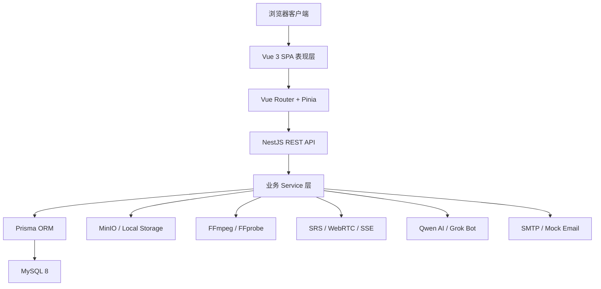

后端根模块 `AppModule` 注册以下业务模块：

| 模块 | 职责 |
| --- | --- |
| `AuthModule` | 注册、登录、管理员入口、重置密码、当前用户识别 |
| `CaptchaModule` | 图形验证码生成与校验 |
| `EmailModule` | 邮箱验证码发送、校验和 SMTP/mock 降级 |
| `UserModule` | 用户主页、资料维护、头像上传、账号注销、推荐画像 |
| `VideoModule` | 视频上传、草稿、审核提交、播放详情、点赞收藏投币、弹幕、观看历史 |
| `SearchModule` | 推荐流、分区流、热门榜、全局搜索、搜索建议 |
| `CommentModule` | 评论树、回复、评论通知、@grok 触发 |
| `CommentAiModule` | @grok 任务入队、轮询、重试和机器人回复 |
| `FollowModule` | 关注、取关、粉丝列表、关注流、粉丝趋势 |
| `NotificationModule` | 通知列表、未读数、单条已读、全部已读 |
| `MessageModule` | 站内私信、会话列表、未读统计、隐私控制 |
| `LiveModule` | 直播间、WebRTC/SRS、SSE 信令、直播聊天、录播保存 |
| `CreatorModule` | 创作者工作台、作品列表、播放趋势、粉丝趋势 |
| `AdminModule` | 视频审核、文本治理、举报处理、后台看板 |
| `ReportModule` | 视频、评论、弹幕举报创建 |
| `GiftModule` | 礼物币钱包、每日领取、投币流水 |
| `AiModule` | 视频摘要和视频问答 |
| `StorageModule` | MinIO 对象存储与本地文件存储降级 |
| `PrismaModule` | 数据库连接与 Prisma Client |

### 2.2 子系统划分

系统划分为八个子系统：

1. 用户认证与资料子系统。
2. 视频内容与媒体处理子系统。
3. 内容分发与搜索子系统。
4. 社区互动与通知子系统。
5. 直播与录播子系统。
6. 创作者中心与用户关系子系统。
7. 平台治理与管理员后台子系统。
8. AI 辅助与外部服务子系统。

### 2.3 用户认证与资料子系统

#### 2.3.1 职责说明

该子系统负责用户注册、登录、管理员密钥入口、邮箱验证码、图形验证码、密码重置、当前用户识别、资料维护、头像上传、账号注销和私信隐私设置。

#### 2.3.2 活动图

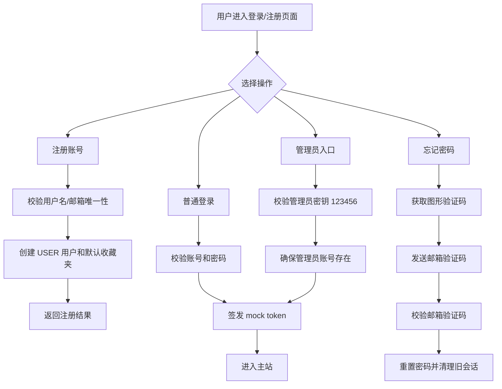

#### 2.3.3 顺序图

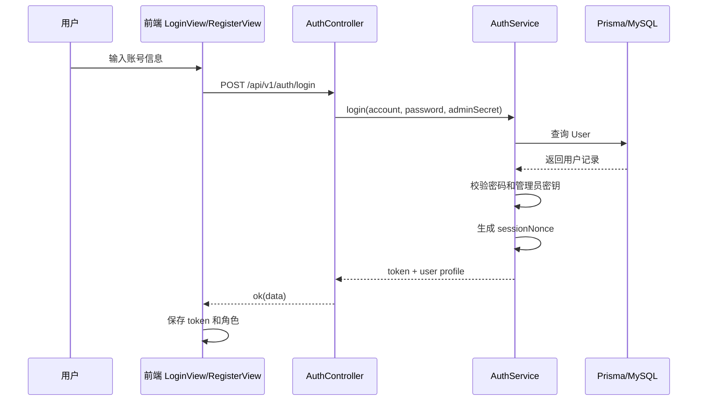

### 2.4 视频内容与媒体处理子系统

#### 2.4.1 职责说明

该子系统负责视频文件上传、封面上传、草稿创建、媒体处理、视频更新、删除、撤回审核、提交审核、视频详情、相关推荐、播放统计、观看进度、点赞、收藏、收藏夹、投币和视频弹幕。

#### 2.4.2 活动图

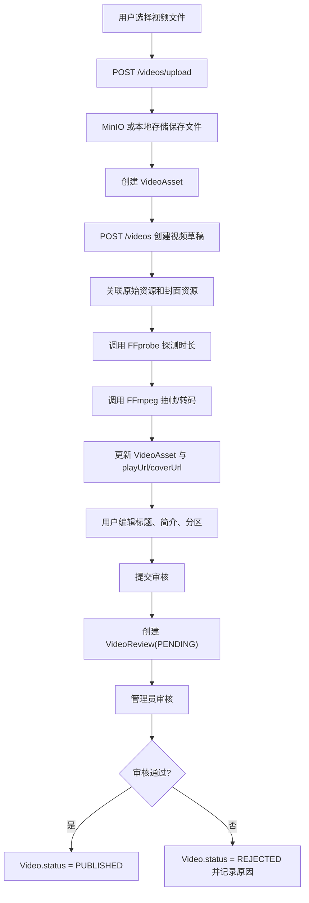

#### 2.4.3 顺序图

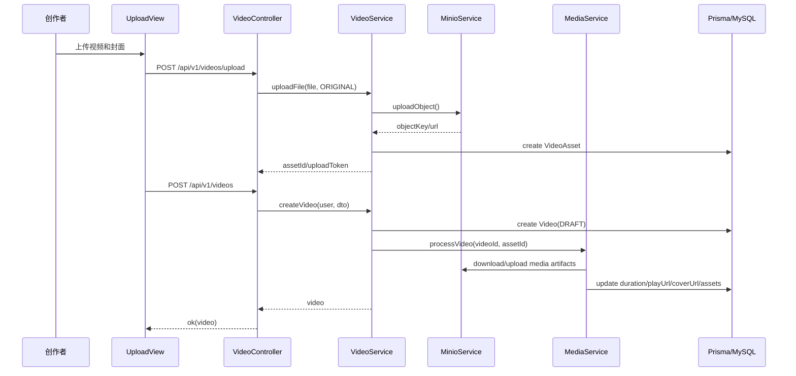

### 2.5 内容分发与搜索子系统

#### 2.5.1 职责说明

该子系统负责首页推荐流、分区列表、热门榜单、全局搜索、搜索热词和搜索联想。当前实现采用规则推荐算法，不引入训练型推荐系统。

#### 2.5.2 活动图

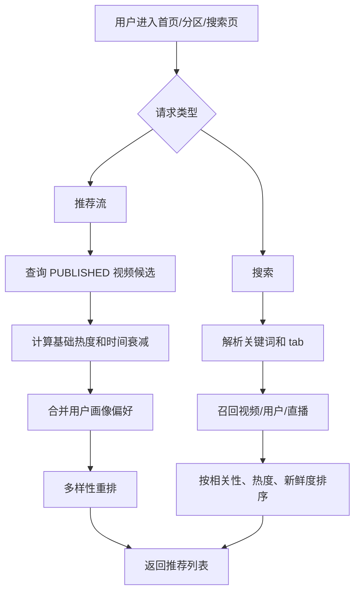

#### 2.5.3 顺序图

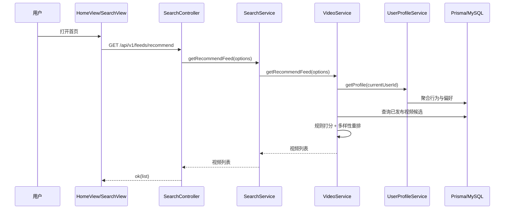

### 2.6 社区互动与通知子系统

#### 2.6.1 职责说明

该子系统负责评论、二级回复、弹幕、点赞、收藏、投币、关注通知、评论通知、回复通知、系统通知、站内私信和 @grok 评论区智能回复。

#### 2.6.2 活动图

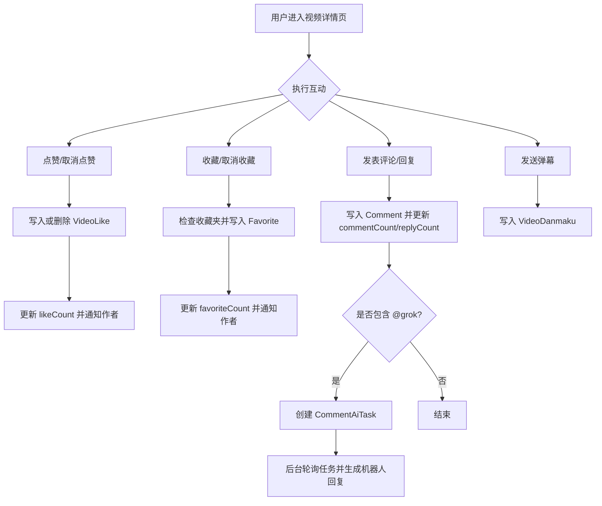

#### 2.6.3 顺序图

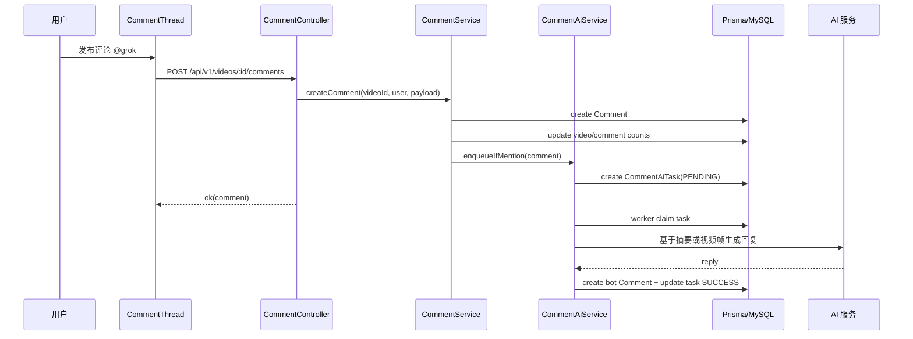

### 2.7 直播与录播子系统

#### 2.7.1 职责说明

该子系统负责创建直播间、开播、停播、直播房间列表、WebRTC/SRS SDP 交换、SSE 信令、观众管理、直播聊天、帧预览、录播文件保存和录播转视频稿件。

直播状态当前保存在后端进程内存中，系统重启后直播间状态不保证恢复。录播若保存为视频稿件，则会通过视频子系统落库。

#### 2.7.2 活动图

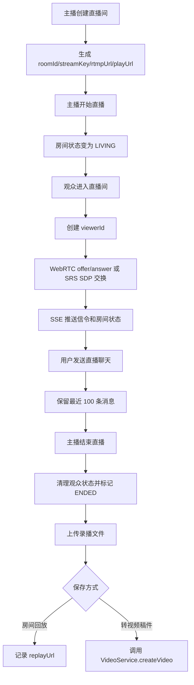

#### 2.7.3 顺序图

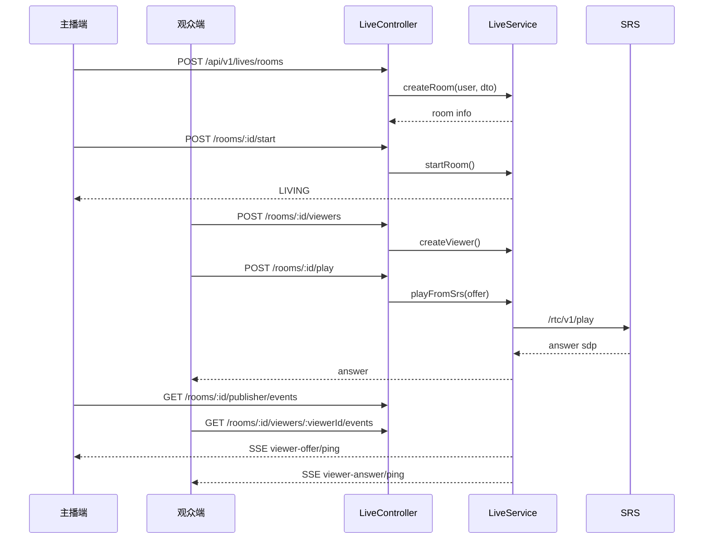

### 2.8 创作者中心与用户关系子系统

#### 2.8.1 职责说明

该子系统负责用户主页、关注/取关、粉丝列表、关注列表、关注流、创作者工作台、作品状态统计、播放趋势和粉丝趋势。

#### 2.8.2 活动图

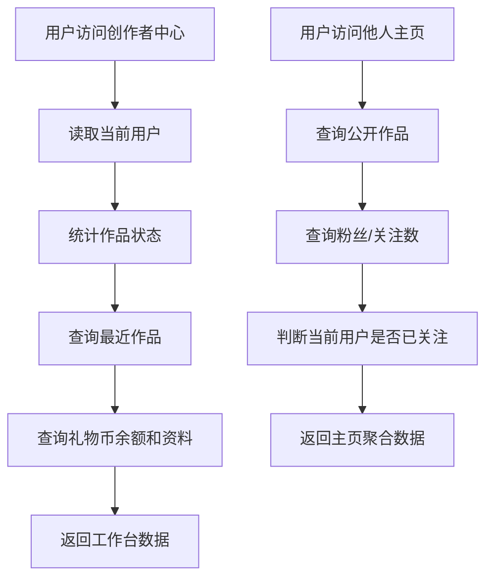

#### 2.8.3 顺序图

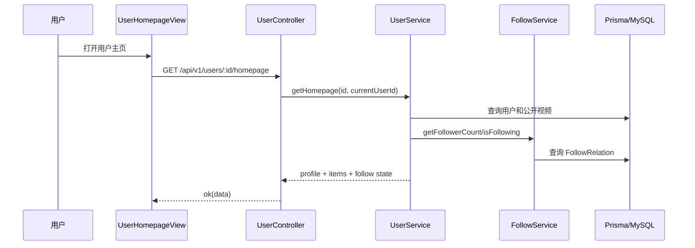

### 2.9 平台治理与管理员后台子系统

#### 2.9.1 职责说明

该子系统负责视频审核、评论/弹幕文本治理、举报处理、后台统计看板和 Agent 预审入口。管理员能力需要登录且角色为 `ADMIN`，普通用户和游客不能访问管理接口。

#### 2.9.2 活动图

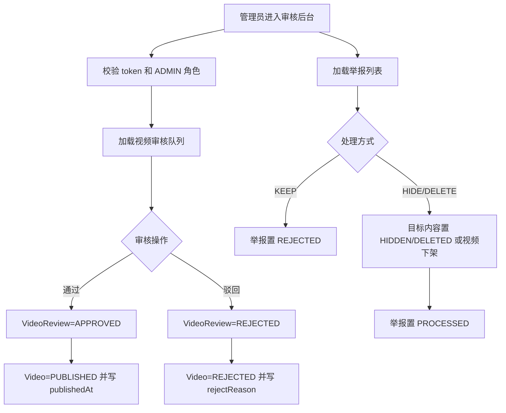

#### 2.9.3 顺序图

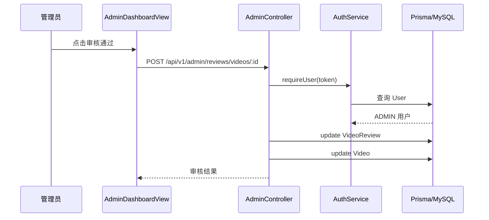

### 2.10 AI 辅助与外部服务子系统

#### 2.10.1 职责说明

该子系统负责视频摘要、视频问答、评论区 @grok 自动回复、邮箱服务、验证码服务、对象存储、媒体处理和 SRS 直播服务的统一接入。

#### 2.10.2 活动图

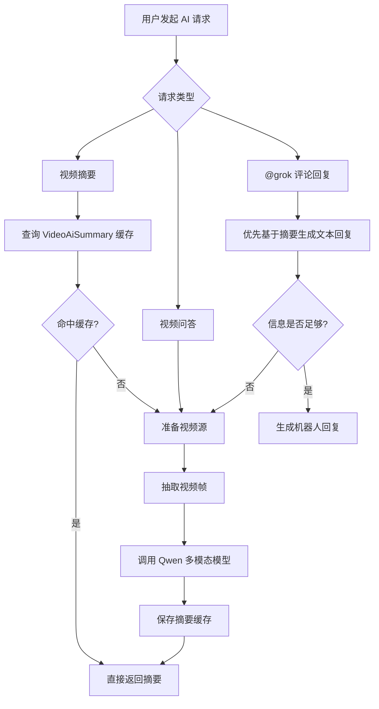

#### 2.10.3 顺序图

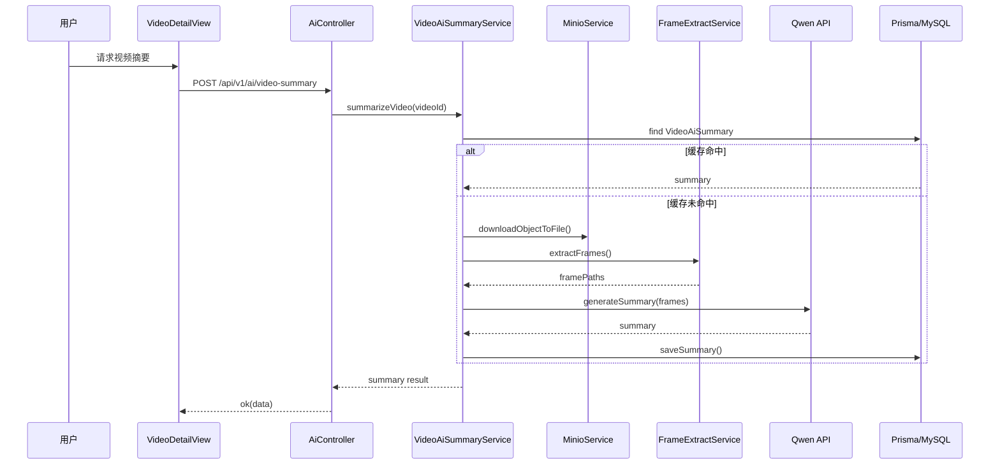

## 3 功能模块设计

### 3.1 模块清单

| 模块编号 | 模块名称 | 所属子系统 | 主要代码位置 |
| --- | --- | --- | --- |
| AUTH-01 | 注册、登录与会话 | 用户认证与资料 | `backend/src/modules/auth` |
| AUTH-02 | 图形验证码与邮箱验证码 | 用户认证与资料 | `captcha`, `email` |
| USER-01 | 资料维护、头像和账号注销 | 用户认证与资料 | `backend/src/modules/user` |
| USER-02 | 推荐画像构建 | 内容分发与搜索 | `user-profile.service.ts` |
| VID-01 | 文件上传与资源入库 | 视频内容与媒体处理 | `video.service.ts`, `minio.service.ts` |
| VID-02 | 草稿创建、编辑和删除 | 视频内容与媒体处理 | `video.service.ts` |
| VID-03 | 媒体处理 | 视频内容与媒体处理 | `media.service.ts` |
| VID-04 | 审核提交与审核记录 | 视频内容与媒体处理 | `video.service.ts`, `admin.controller.ts` |
| VID-05 | 视频详情、播放和观看进度 | 视频内容与媒体处理 | `video.service.ts` |
| VID-06 | 点赞、收藏夹、投币和弹幕 | 社区互动与通知 | `video.service.ts` |
| COM-01 | 评论树与回复 | 社区互动与通知 | `comment.service.ts` |
| COM-02 | @grok 评论智能回复 | AI 辅助与外部服务 | `comment-ai.service.ts` |
| DIST-01 | 首页推荐和分区流 | 内容分发与搜索 | `search.service.ts`, `video.service.ts` |
| DIST-02 | 全局搜索、热词和联想 | 内容分发与搜索 | `search.service.ts` |
| FOL-01 | 关注关系和关注流 | 创作者中心与用户关系 | `follow.service.ts` |
| NOTI-01 | 通知中心 | 社区互动与通知 | `notification.controller.ts` |
| MSG-01 | 站内私信 | 社区互动与通知 | `message.service.ts` |
| LIVE-01 | 直播间与实时信令 | 直播与录播 | `live.service.ts` |
| LIVE-02 | 直播聊天与录播保存 | 直播与录播 | `live.service.ts` |
| CRE-01 | 创作者工作台 | 创作者中心与用户关系 | `creator.controller.ts` |
| ADMIN-01 | 视频审核 | 平台治理与管理员后台 | `admin.controller.ts` |
| ADMIN-02 | 举报和文本治理 | 平台治理与管理员后台 | `admin.controller.ts`, `report.service.ts` |
| AI-01 | 视频摘要与视频问答 | AI 辅助与外部服务 | `ai`, `frame-extract` |
| GIFT-01 | 礼物币钱包与每日领取 | 社区互动与通知 | `gift.service.ts` |

### 3.2 AUTH-01 注册、登录与会话

| 项目 | 设计内容 |
| --- | --- |
| 模块编号 | AUTH-01 |
| 模块名称 | 注册、登录与会话 |
| 输入 | `username`, `email`, `password`, `nickname`, `account`, `adminSecret` |
| 处理 | 注册时检查用户名和邮箱唯一性，创建 `User` 和默认收藏夹；登录时按用户名或邮箱查询用户，校验密码；管理员登录要求 `adminSecret = 123456`；登录成功后生成 `mock-token-{userId}-{sessionNonce}` |
| 算法描述 | `sessionNonce` 使用 `randomUUID()` 生成并保存在后端内存 `activeSessionNonceByUserId`，每个用户只保留一个当前有效 nonce；解析 token 后必须与内存 nonce 一致 |
| 输出 | token、用户 ID、角色、昵称、邮箱、简介 |
| 异常 | 账号或密码为空返回认证失败；用户名或邮箱重复返回认证失败；管理员未提供密钥返回认证失败；token 不存在或 nonce 不匹配视为未登录 |

### 3.3 AUTH-02 图形验证码与邮箱验证码

| 项目 | 设计内容 |
| --- | --- |
| 模块编号 | AUTH-02 |
| 模块名称 | 图形验证码与邮箱验证码 |
| 输入 | `captchaId`, `captchaCode`, `email`, `username`, `code` |
| 处理 | 图形验证码生成 6 位字符并保存到内存 Map，有效期 5 分钟；邮箱验证码生成 6 位数字，默认有效期 300 秒；重置密码时先校验图形验证码，再校验用户名和邮箱匹配关系 |
| 算法描述 | 图形验证码使用 SVG data URL，字符集排除易混淆字符；验证码校验后立即删除，防止重复使用；邮箱验证码每个邮箱最多保留最近 5 条未过期记录 |
| 输出 | 图形验证码 ID 和图片 data URL；邮箱验证码发送结果；验证码校验结果 |
| 异常 | 图形验证码过期或不匹配返回错误；邮箱格式错误返回参数错误；SMTP 配置不完整时降级到 mock 日志模式 |

### 3.4 USER-01 资料维护、头像和账号注销

| 项目 | 设计内容 |
| --- | --- |
| 模块编号 | USER-01 |
| 模块名称 | 用户资料维护 |
| 输入 | 昵称、头像文件、简介、邮箱、私信隐私、注销密码 |
| 处理 | 头像上传到对象存储并更新 `avatarUrl`；资料更新时过滤未传字段；邮箱更新时校验唯一性；注销账号时校验密码并在事务中删除或清理相关数据 |
| 算法描述 | 注销逻辑先解除审核、举报、通知中的外键引用，再删除私信、观看记录、偏好、收藏、关注、评论、弹幕、视频资源等叶子记录，最后删除用户 |
| 输出 | 更新后的用户资料；注销成功状态 |
| 异常 | 邮箱重复返回参数错误；密码验证失败返回未授权；用户不存在返回 404 |

### 3.5 USER-02 推荐画像构建

| 项目 | 设计内容 |
| --- | --- |
| 模块编号 | USER-02 |
| 模块名称 | 推荐画像构建 |
| 输入 | 用户观看、点赞、收藏、评论、弹幕、关注、创作数据 |
| 处理 | 汇总用户行为，计算分区偏好、创作者偏好、活跃度、观看者/创作者倾向，并写入 `UserProfileSummary`、`UserCategoryPreference`、`UserCreatorPreference` |
| 算法描述 | 不同行为设置不同权重；观看、互动和关注累积分区与创作者得分；按得分排序保留主要偏好；冷启动用户 `isColdStart = true` |
| 输出 | 推荐画像 DTO，包括活跃等级、偏好列表和冷启动状态 |
| 异常 | 用户不存在返回 404；画像数据缺失时自动构建 |

### 3.6 VID-01 文件上传与资源入库

| 项目 | 设计内容 |
| --- | --- |
| 模块编号 | VID-01 |
| 模块名称 | 文件上传与资源入库 |
| 输入 | `multipart/form-data` 文件，`assetType=ORIGINAL/COVER/RECORDING` |
| 处理 | 按日期生成对象路径；通过 MinIO 上传对象；若 MinIO 不可用则降级到本地 `storage/`；写入 `VideoAsset` |
| 算法描述 | 文件名经 NFKD 归一化后只保留 ASCII 字母、数字、下划线和连字符，前缀加入时间戳，降低冲突风险 |
| 输出 | `assetId`, `uploadToken`, `url`, `objectKey`, `assetType` |
| 异常 | 未登录返回未授权；文件为空返回参数错误；存储失败返回服务错误或本地降级 |

### 3.7 VID-02 草稿创建、编辑和删除

| 项目 | 设计内容 |
| --- | --- |
| 模块编号 | VID-02 |
| 模块名称 | 草稿创建、编辑和删除 |
| 输入 | `assetId/uploadToken`, `title`, `description`, `category`, `coverUrl/coverAssetId` |
| 处理 | 创建视频草稿，状态为 `DRAFT`；关联原始资源和封面资源；编辑时允许作者或管理员操作；删除时清理评论、弹幕、举报、收藏、点赞、审核、资源和视频记录 |
| 算法描述 | 若编辑 `PENDING_REVIEW` 或 `PUBLISHED` 视频，则回退为 `DRAFT`，清空提交和发布时间，并删除未处理审核记录 |
| 输出 | 视频对象、删除成功状态 |
| 异常 | 资源不存在返回 404；非作者操作返回无权限；非法状态返回无权限或状态冲突 |

### 3.8 VID-03 媒体处理

| 项目 | 设计内容 |
| --- | --- |
| 模块编号 | VID-03 |
| 模块名称 | 媒体处理 |
| 输入 | `videoId`, 原始 `VideoAsset`, 可选封面资源 |
| 处理 | 检测 FFmpeg/FFprobe；下载原视频到临时目录；探测视频时长；无手动封面时抽帧生成封面；转码输出 MP4；上传封面和转码文件；更新 `durationSeconds`, `coverUrl`, `playUrl`, `VideoAsset` |
| 算法描述 | 优先使用环境变量 `FFMPEG_PATH` 和 `FFPROBE_PATH`，再探测常见路径；抽帧优先取 1 秒位置，失败时取第一帧；转码使用 H.264/AAC |
| 输出 | 媒体资源记录和更新后的视频播放地址 |
| 异常 | FFmpeg 不存在或处理失败时记录日志并跳过媒体处理，不阻断草稿创建；对象下载失败返回资源错误 |

### 3.9 VID-04 审核提交与审核记录

| 项目 | 设计内容 |
| --- | --- |
| 模块编号 | VID-04 |
| 模块名称 | 审核提交与审核记录 |
| 输入 | 视频 ID、当前用户 |
| 处理 | 校验视频存在且为作者或管理员；仅 `DRAFT` 和 `REJECTED` 状态可提交；更新视频为 `PENDING_REVIEW`；创建 `VideoReview(PENDING)` |
| 算法描述 | 审核状态机为 `DRAFT -> PENDING_REVIEW -> PUBLISHED/REJECTED`，被驳回后可修改并重新提交 |
| 输出 | `videoId`, `reviewId`, `status` |
| 异常 | 视频不存在返回 404；非作者提交返回无权限；状态不允许提交返回无权限 |

### 3.10 VID-05 视频详情、播放和观看进度

| 项目 | 设计内容 |
| --- | --- |
| 模块编号 | VID-05 |
| 模块名称 | 视频详情、播放和观看进度 |
| 输入 | 视频 ID、可选当前用户、播放事件、观看时长、当前播放进度 |
| 处理 | 查询视频、作者、媒体资源、点赞/收藏状态；播放时增加 `playCount`；登录用户写入 `UserVideoWatch`；上报观看进度时更新总观看时长、最近观看比例、最大观看比例和完播次数 |
| 算法描述 | 观看进度按 `currentTimeSeconds / videoDurationSeconds` 计算比例，超过完播阈值且此前未达到时增加完播计数；播放量按进入播放接口递增 |
| 输出 | 视频详情 DTO、播放计数、观看记录 |
| 异常 | 未发布视频对非作者不可见；视频不存在返回 404；观看参数非法由 DTO 校验拦截 |

### 3.11 VID-06 点赞、收藏夹、投币和弹幕

| 项目 | 设计内容 |
| --- | --- |
| 模块编号 | VID-06 |
| 模块名称 | 点赞、收藏夹、投币和弹幕 |
| 输入 | 视频 ID、用户 ID、收藏夹 ID、投币数量、弹幕内容、时间偏移、颜色 |
| 处理 | 点赞和收藏使用唯一约束防重复；收藏前确保默认收藏夹存在；投币时检查余额和单视频累计上限；弹幕写入 `VideoDanmaku` 并按时间轴查询 |
| 算法描述 | 投币数量限制为 1 到 5，每个用户对单个视频最多累计 5 个；事务中同时扣减余额、更新 `VideoCoinContribution`、增加 `coinCount`、写入 `CoinTransaction` |
| 输出 | 点赞状态、收藏状态、投币结果、弹幕列表或弹幕对象 |
| 异常 | 未登录返回未授权；余额不足返回参数错误；超出投币上限返回参数错误；收藏夹不存在返回 404 |

### 3.12 COM-01 评论树与回复

| 项目 | 设计内容 |
| --- | --- |
| 模块编号 | COM-01 |
| 模块名称 | 评论树与回复 |
| 输入 | 视频 ID、评论内容、可选 `parentId/rootId` |
| 处理 | 仅允许对已发布视频评论；回复时校验父评论存在；写入评论；更新视频评论数和父评论回复数；通知视频作者或被回复用户 |
| 算法描述 | 查询评论时先获取 `status=NORMAL` 的扁平评论列表，再根据 `parentId` 构建树形结构；一级评论 `parentId=null`，回复节点归入父节点 `replies` |
| 输出 | 评论树、创建后的评论对象 |
| 异常 | 视频未发布或不存在返回 404；父评论不存在返回 404；内容超长由 DTO 校验处理 |

### 3.13 COM-02 @grok 评论智能回复

| 项目 | 设计内容 |
| --- | --- |
| 模块编号 | COM-02 |
| 模块名称 | @grok 评论智能回复 |
| 输入 | 评论 ID、视频 ID、请求用户 ID、评论内容 |
| 处理 | 检测评论中是否包含 `@grok`；抽取问题；进行频率限制；创建 `CommentAiTask(PENDING)`；后台 worker 轮询并抢占任务；生成回复后以机器人用户身份创建回复评论 |
| 算法描述 | 若已有视频摘要，优先基于摘要调用文本模型回复；若摘要不足，则调用视频帧问答；对非视频相关问题和个人运势类问题返回限制性说明；失败任务按最大次数和延迟重试 |
| 输出 | 入队状态、机器人回复评论、任务状态 |
| 异常 | 机器人自身评论不触发任务；重复任务由唯一约束忽略；AI 调用失败记录 `FAILED` 和错误信息 |

### 3.14 DIST-01 首页推荐和分区流

| 项目 | 设计内容 |
| --- | --- |
| 模块编号 | DIST-01 |
| 模块名称 | 首页推荐和分区流 |
| 输入 | `page`, `pageSize`, `categoryCode`, `currentUserId`, `sortBy` |
| 处理 | 查询已发布视频；按分区过滤；默认使用规则推荐；`latest` 和 `hot` 按固定排序返回 |
| 算法描述 | 基础分 `interactionScore = likeCount + favoriteCount * 2 + commentCount * 3`；时间衰减 `1 / (1 + ageHours / 48)`；新鲜度加成 `max(0, 6 - ageHours / 24)`；登录用户叠加分区偏好、创作者偏好、活跃度倍率和自作品惩罚；最后执行创作者和分区多样性重排 |
| 输出 | 推荐视频列表 |
| 异常 | 未登录时使用冷启动推荐；非法分页参数归一化到默认值 |

### 3.15 DIST-02 全局搜索、热词和联想

| 项目 | 设计内容 |
| --- | --- |
| 模块编号 | DIST-02 |
| 模块名称 | 全局搜索、热词和联想 |
| 输入 | `keyword`, `tab`, `sortBy`, `categoryCode`, `page`, `pageSize` |
| 处理 | `video` tab 调用视频搜索；`user` tab 查询昵称和用户名；`live` tab 查询内存直播间；热词取热视频标题并补充默认词；联想按视频标题匹配 |
| 算法描述 | 视频搜索按标题完全匹配、标题前缀、标题包含、简介包含、作者昵称包含、分区匹配和分词覆盖率计算相关性，再叠加个性化推荐分 |
| 输出 | 搜索结果对象、热词列表、联想词列表 |
| 异常 | 空关键词在视频搜索中退化为推荐流；分页参数限制 `pageSize <= 50` |

### 3.16 FOL-01 关注关系和关注流

| 项目 | 设计内容 |
| --- | --- |
| 模块编号 | FOL-01 |
| 模块名称 | 关注关系和关注流 |
| 输入 | 当前用户 ID、目标用户 ID |
| 处理 | 关注时使用 `FollowRelation` upsert 防止重复；取关时删除关系；关注成功给目标用户发送通知；关注或取关后同步粉丝数日快照 |
| 算法描述 | 关注流先查询当前用户关注的用户 ID，再按发布时间倒序查询这些用户的公开视频 |
| 输出 | 关注状态、粉丝列表、关注列表、关注流、粉丝趋势 |
| 异常 | 不允许关注自己；未登录返回未授权 |

### 3.17 NOTI-01 通知中心

| 项目 | 设计内容 |
| --- | --- |
| 模块编号 | NOTI-01 |
| 模块名称 | 通知中心 |
| 输入 | 当前用户 ID、通知 ID |
| 处理 | 查询接收者为当前用户的通知；统计未读数；单条或全部置为已读 |
| 算法描述 | 通知按 `createdAt desc` 排序，未读统计通过 `recipientId + isRead` 索引查询 |
| 输出 | 通知列表、未读数量、已读状态 |
| 异常 | 未登录返回未授权；非本人通知不可操作 |

### 3.18 MSG-01 站内私信

| 项目 | 设计内容 |
| --- | --- |
| 模块编号 | MSG-01 |
| 模块名称 | 站内私信 |
| 输入 | 当前用户 ID、目标用户 ID、私信内容 |
| 处理 | 会话列表按最近 200 条消息聚合会话；进入会话时将对方发来的未读消息置已读；发送前检查目标用户私信隐私 |
| 算法描述 | 私信隐私枚举为 `ALLOW_ALL`, `FOLLOWING_ONLY`, `DISABLED`；当对方设置 `FOLLOWING_ONLY` 时，只有对方已关注当前发送者才允许发送 |
| 输出 | 会话列表、会话详情、发送结果、未读数 |
| 异常 | 不能给自己发送私信；内容为空或超过 1000 字符返回参数错误；对方关闭私信返回参数错误 |

### 3.19 LIVE-01 直播间与实时信令

| 项目 | 设计内容 |
| --- | --- |
| 模块编号 | LIVE-01 |
| 模块名称 | 直播间与实时信令 |
| 输入 | 直播标题、分区、封面、采集模式、WebRTC offer/answer |
| 处理 | 创建直播间时生成 `streamKey`, `rtmpUrl`, `playUrl`；开播后状态为 `LIVING`；观众进入时生成 viewerId；通过 SSE 推送房间状态和信令；可对接 SRS `/rtc/v1/publish` 和 `/rtc/v1/play` |
| 算法描述 | 直播间保存在内存 Map，房间排序优先级为 `LIVING > IDLE > ENDED`，同状态按时间倒序；SSE 每 15 秒发送 ping 保活 |
| 输出 | 直播间信息、SRS answer SDP、SSE 事件 |
| 异常 | 非主播操作返回无权限；房间不存在返回 404；SRS 不可用或 SDP 交换失败返回参数错误 |

### 3.20 LIVE-02 直播聊天与录播保存

| 项目 | 设计内容 |
| --- | --- |
| 模块编号 | LIVE-02 |
| 模块名称 | 直播聊天与录播保存 |
| 输入 | 房间 ID、聊天内容、录播资源、保存方式 |
| 处理 | 直播聊天只允许在 `LIVING` 房间发送；消息保留最近 100 条；录播保存支持仅保存房间回放或调用视频模块创建回放稿件 |
| 算法描述 | 聊天内容 trim 后截断到 200 字符；录播转视频时复用 `VideoService.createVideo`，生成的视频初始仍走草稿与审核流程 |
| 输出 | 消息列表、录播 URL、可选 `replayVideoId` |
| 异常 | 房间未开播不可聊天；录播资源缺失返回参数错误；非主播不可保存录播 |

### 3.21 CRE-01 创作者工作台

| 项目 | 设计内容 |
| --- | --- |
| 模块编号 | CRE-01 |
| 模块名称 | 创作者工作台 |
| 输入 | 当前用户 token、可选统计天数 |
| 处理 | 聚合作品状态数量、最近作品、用户资料、礼物币余额、播放趋势和粉丝趋势 |
| 算法描述 | 播放趋势基于 `CreatorPlayDaily`，粉丝趋势基于 `CreatorFollowerDaily`，日期范围限制 1 到 30 天，缺失日期补零或沿用最近快照 |
| 输出 | 工作台总览、作品列表、趋势曲线数据 |
| 异常 | 未登录返回未授权；非法天数归一化 |

### 3.22 ADMIN-01 视频审核

| 项目 | 设计内容 |
| --- | --- |
| 模块编号 | ADMIN-01 |
| 模块名称 | 视频审核 |
| 输入 | 审核记录 ID、审核动作 `APPROVE/REJECT`、驳回原因 |
| 处理 | 管理员获取审核队列；通过时更新 `VideoReview=APPROVED`，视频状态为 `PUBLISHED` 并写入 `publishedAt`；驳回时更新 `VideoReview=REJECTED`，视频状态为 `REJECTED` 并写入 `rejectReason` |
| 算法描述 | 审核记录和视频状态分别更新，`reviewerId` 和 `reviewedAt` 记录管理员操作 |
| 输出 | 审核记录状态、视频状态、驳回原因 |
| 异常 | 非管理员返回未授权；审核记录不存在返回错误；非法动作按驳回处理或由前端限制 |

### 3.23 ADMIN-02 举报和文本治理

| 项目 | 设计内容 |
| --- | --- |
| 模块编号 | ADMIN-02 |
| 模块名称 | 举报和文本治理 |
| 输入 | 举报目标类型、目标 ID、原因、处理动作 `KEEP/HIDE/DELETE` |
| 处理 | 用户创建举报记录；管理员查看最近举报；处理评论或弹幕时更新文本状态；处理视频举报时可将视频置为 `REJECTED`；举报记录写入处理人和处理时间 |
| 算法描述 | 文本状态映射为 `KEEP -> NORMAL`, `HIDE -> HIDDEN`, `DELETE -> DELETED`；举报处理状态映射为 `KEEP -> REJECTED`, 其他动作 -> `PROCESSED` |
| 输出 | 举报记录、处理结果、后台统计 |
| 异常 | 目标不存在返回 404；举报理由为空返回参数错误；非管理员不能处理举报 |

### 3.24 AI-01 视频摘要与视频问答

| 项目 | 设计内容 |
| --- | --- |
| 模块编号 | AI-01 |
| 模块名称 | 视频摘要与视频问答 |
| 输入 | 视频 ID、用户问题 prompt |
| 处理 | 获取视频源；对象存储模式下下载对象到临时目录；本地存储模式下解析 `/storage/` 路径；抽取视频帧；调用 AI 模型生成摘要或回答；摘要结果写入缓存 |
| 算法描述 | 摘要接口先查 `VideoAiSummary` 缓存，命中直接返回；未命中时抽帧并调用模型；问答不强制缓存，每次基于帧和问题生成 |
| 输出 | 摘要文本、回答文本、抽帧数量、缓存命中标记 |
| 异常 | 视频不存在返回 404；视频源不可读返回 404；AI 调用失败返回服务错误；临时目录最终清理 |

### 3.25 GIFT-01 礼物币钱包与每日领取

| 项目 | 设计内容 |
| --- | --- |
| 模块编号 | GIFT-01 |
| 模块名称 | 礼物币钱包与每日领取 |
| 输入 | 当前用户 ID |
| 处理 | 查询余额、累计领取、累计消费和当天领取状态；每日领取时创建 `DailyCoinClaim`，增加 `coinBalance`，写入 `CoinTransaction` |
| 算法描述 | `DailyCoinClaim` 对 `(userId, claimDate)` 建唯一约束，重复领取时捕获唯一冲突并返回 `claimed=false` |
| 输出 | 余额、今日领取状态、领取金额、累计领取和消费 |
| 异常 | 未登录返回未授权；数据库唯一冲突被识别为已领取 |

## 4 界面设计

### 4.1 外部界面设计

#### 4.1.1 REST API 接口

系统对外提供统一 REST API，基础前缀为 `/api/v1`。接口统一返回：

```json
{
  "code": 0,
  "message": "ok",
  "data": {}
}
```

主要接口分组如下：

| 分组 | 代表接口 | 说明 |
| --- | --- | --- |
| 认证 | `POST /auth/register`, `POST /auth/login`, `GET /auth/me`, `POST /auth/reset-password` | 注册、登录、当前用户、密码重置 |
| 验证码 | `GET /captcha`, `POST /captcha/verify`, `POST /email/send-reset-code` | 图形验证码和邮箱验证码 |
| 用户 | `GET /users/:id/homepage`, `PUT /users/profile`, `POST /users/avatar`, `DELETE /users/me` | 用户主页、资料、头像、注销 |
| 视频 | `POST /videos/upload`, `POST /videos`, `GET /videos/:id`, `POST /videos/:id/submit-review` | 上传、草稿、详情、审核提交 |
| 互动 | `POST /videos/:id/like`, `POST /videos/:id/favorite`, `POST /videos/:id/coin`, `POST /videos/:id/danmaku` | 点赞、收藏、投币、弹幕 |
| 评论 | `GET /videos/:id/comments`, `POST /videos/:id/comments` | 评论树和发布评论 |
| 分发搜索 | `GET /feeds/recommend`, `GET /feeds/categories/:code/videos`, `GET /search/all` | 推荐、分区、搜索 |
| 关注 | `POST /users/:id/follow`, `DELETE /users/:id/follow`, `GET /feeds/following` | 关注、取关、关注流 |
| 通知 | `GET /notifications`, `GET /notifications/unread-count`, `POST /notifications/read-all` | 通知中心 |
| 私信 | `GET /messages/conversations`, `POST /messages/conversations/:targetUserId` | 会话列表和发送私信 |
| 直播 | `POST /lives/rooms`, `POST /lives/rooms/:id/start`, `GET /lives/rooms/:id/events` | 直播间、开播、SSE |
| 管理 | `GET /admin/reviews/videos`, `POST /admin/reviews/videos/:id`, `GET /admin/reports` | 视频审核和举报处理 |
| AI | `POST /ai/video-summary`, `POST /ai/video-chat` | 视频摘要和问答 |
| 礼物币 | `GET /gift-coins/wallet`, `POST /gift-coins/daily-claim` | 钱包和每日领取 |

#### 4.1.2 外部服务接口

| 外部服务 | 接口方式 | 设计说明 |
| --- | --- | --- |
| MySQL | Prisma ORM | 存储用户、视频、评论、弹幕、举报、通知、私信、礼物币等结构化数据 |
| MinIO | S3 兼容 API | 上传和下载视频、封面、转码文件、录播文件 |
| 本地存储 | Express 静态资源 | MinIO 不可用时使用 `storage/` 并暴露 `/storage` 静态路径 |
| FFmpeg/FFprobe | 本地命令 | 探测视频时长、抽帧生成封面、转码 MP4 |
| SRS | HTTP RTC API | 通过 `/rtc/v1/publish` 和 `/rtc/v1/play` 交换 SDP |
| SSE | HTTP 长连接 | 推送直播房间状态、信令、聊天和心跳 |
| SMTP | Nodemailer | 发送邮箱验证码，配置不足时降级为日志模拟 |
| AI 模型 | HTTP/SDK 调用 | 基于视频帧生成摘要、问答和 @grok 回复 |

### 4.2 内部界面设计

#### 4.2.1 后端内部调用关系

后端采用 Controller-Service-Prisma 分层：

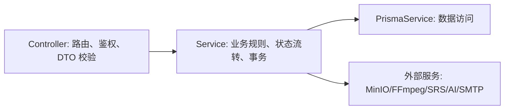

内部模块协作关系如下：

| 调用方 | 被调用方 | 数据接口 |
| --- | --- | --- |
| `VideoController` | `AuthService.requireUser` | Authorization header -> User |
| `VideoService` | `MinioService` | objectKey、buffer、filePath、mimeType |
| `VideoService` | `MediaService` | videoId、assetId、coverAssetId |
| `VideoService` | `UserProfileService` | userId -> 推荐画像 |
| `SearchService` | `VideoService` | 推荐和搜索参数 -> 视频列表 |
| `SearchService` | `LiveService` | keyword、category、status -> 直播间列表 |
| `CommentService` | `CommentAiService` | commentId、videoId、requesterId、content |
| `CommentAiService` | `VideoAiSummaryService` | videoId、prompt -> AI 回复 |
| `LiveService` | `VideoService` | 录播资源 -> 视频草稿 |
| `MessageService` | `FollowService` | 私信隐私判断 |
| `AdminController` | `PrismaService` | 审核、举报和治理数据 |
| `GiftService` | `PrismaService` | 钱包、领取和流水事务 |

#### 4.2.2 数据接口设计

核心数据模型如下：

| 模型 | 说明 | 关键字段 |
| --- | --- | --- |
| `User` | 用户账号和资料 | `username`, `email`, `password`, `role`, `nickname`, `coinBalance`, `messagePrivacy` |
| `Video` | 视频稿件 | `creatorId`, `title`, `category`, `coverUrl`, `playUrl`, `status`, `playCount`, `coinCount` |
| `VideoAsset` | 媒体资源 | `videoId`, `assetType`, `objectKey`, `bucket`, `mimeType`, `url` |
| `VideoReview` | 视频审核记录 | `videoId`, `reviewerId`, `status`, `reason`, `reviewedAt` |
| `Comment` | 评论和回复 | `videoId`, `userId`, `parentId`, `rootId`, `content`, `status`, `replyCount` |
| `VideoDanmaku` | 视频弹幕 | `videoId`, `userId`, `content`, `timeOffsetMs`, `color`, `status` |
| `VideoLike` | 视频点赞 | `videoId`, `userId` |
| `Favorite` | 收藏关系 | `videoId`, `userId`, `folderId` |
| `FavoriteFolder` | 收藏夹 | `userId`, `name`, `isDefault` |
| `FollowRelation` | 关注关系 | `followerId`, `followingId` |
| `Notification` | 通知 | `recipientId`, `actorId`, `type`, `isRead` |
| `DirectMessage` | 站内私信 | `senderId`, `recipientId`, `content`, `isRead` |
| `ReportRecord` | 举报记录 | `targetType`, `videoId`, `commentId`, `danmakuId`, `status` |
| `UserVideoWatch` | 观看记录 | `playCount`, `totalWatchDurationSeconds`, `maxWatchRatio` |
| `VideoAiSummary` | 视频摘要缓存 | `videoId`, `summary`, `frameCount`, `model` |
| `CommentAiTask` | 评论 AI 任务 | `commentId`, `videoId`, `prompt`, `status`, `attempts` |
| `CoinTransaction` | 礼物币流水 | `userId`, `type`, `amount`, `balanceAfter`, `videoId` |
| `DailyCoinClaim` | 每日领取 | `userId`, `claimDate`, `amount` |
| `CreatorPlayDaily` | 创作者播放日统计 | `creatorId`, `statDate`, `playCount` |
| `CreatorFollowerDaily` | 创作者粉丝日统计 | `creatorId`, `statDate`, `followerCount` |

### 4.3 用户界面设计

前端使用 Vue Router 组织页面，公共布局由 `MainLayout.vue` 和 `AppHeader.vue` 承担。主要页面如下：

| 页面 | 路由 | 界面内容 | 交互方式 |
| --- | --- | --- | --- |
| 首页推荐 | `/` | 推荐视频流、导航入口、搜索入口 | 下拉刷新/分页、点击视频进入详情 |
| 分区页 | `/entertainment`, `/study`, `/game`, `/tech` | 指定分区视频列表 | 分区切换、视频卡片点击 |
| 搜索页 | `/search` | 搜索框、联想词、热词、视频/直播/用户结果 | 关键词搜索、tab 切换、排序 |
| 视频详情 | `/video/:id` | 播放器、弹幕、评论、相关推荐、AI 摘要/问答 | 播放、点赞、收藏、投币、发弹幕、评论 |
| 上传页 | `/upload` | 视频上传、封面上传、标题、简介、分区、提交审核 | 文件选择、表单提交、状态反馈 |
| 创作者中心 | `/user/dashboard` | 作品状态、作品列表、播放趋势、粉丝趋势、钱包摘要 | 编辑作品、查看审核记录、跳转上传 |
| 用户主页 | `/users/:id` | 用户资料、公开视频、粉丝关注、私信入口 | 关注/取关、进入私信、播放作品 |
| 关注流 | `/following` | 已关注用户的公开视频列表 | 点击视频、跳转作者 |
| 通知中心 | `/notifications` | 未读通知、通知列表 | 单条已读、全部已读 |
| 私信页 | `/messages` | 会话列表、聊天记录、发送框 | 选择会话、发送消息、自动已读 |
| 直播间 | `/live/:id?` | 直播列表、直播播放区、聊天区、开播控制 | 创建房间、开播/停播、发送聊天、录播保存 |
| 管理后台 | `/admin/dashboard` | 审核队列、举报列表、文本治理、统计看板 | 审核通过/驳回、举报处理、内容隐藏/删除 |
| 登录页 | `/login` | 用户登录、管理员入口、忘记密码入口 | 密钥校验、验证码、邮箱验证码 |
| 注册页 | `/register` | 注册表单 | 账号、邮箱、密码和昵称填写 |

界面风格以视频平台为目标，顶部导航固定承载分区、搜索、上传、通知、私信、个人中心和管理员入口。游客可浏览和播放公开视频，登录用户可互动和创作，管理员登录后额外显示审核后台入口。

## 5 异常处理设计

### 5.1 出错信息管理

系统后端使用 NestJS 异常体系和全局 `ValidationPipe` 管理错误。当前统一响应成功结构为 `ok(data)`，异常由框架转换为 HTTP 错误响应。错误类型设计如下：

| 错误类型 | 触发场景 | 处理方式 |
| --- | --- | --- |
| 参数错误 | DTO 校验失败、空内容、投币数量非法、收藏夹名称非法 | 返回 400，前端提示具体字段或操作原因 |
| 未登录 | token 缺失、格式错误、session nonce 失效 | 返回 401，前端跳转登录或弹出登录框 |
| 无权限 | 非作者编辑视频、非主播操作直播间、普通用户访问后台 | 返回 403 或 401，前端隐藏入口并提示无权限 |
| 资源不存在 | 视频、用户、评论、弹幕、收藏夹、直播间不存在 | 返回 404，前端显示空状态或返回上一页 |
| 状态冲突 | 已审核视频重复提交、默认收藏夹删除、重复每日领取 | 返回 400/409，前端提示当前状态不可操作 |
| 外部服务不可用 | MinIO、FFmpeg、SRS、SMTP、AI 服务不可用 | 优先降级；无法降级时返回 400/500 并记录日志 |
| 数据唯一冲突 | 重复收藏、重复点赞、重复领取每日币 | 使用 upsert、唯一约束捕获或幂等返回 |

### 5.2 故障预防与补救

#### 5.2.1 认证故障

1. 登录 token 中包含 session nonce，用户重新登录或重置密码后旧 token 自动失效。
2. 管理员能力除 token 外还要求用户角色为 `ADMIN`，前端路由和后端接口双重控制。
3. 验证码一次性使用，过期自动清理。

#### 5.2.2 存储故障

1. MinIO 初始化时尝试创建 bucket 和公开只读策略。
2. MinIO 不可用时自动切换到本地 `storage/` 模式。
3. 本地模式通过 `/storage` 暴露静态资源。
4. 删除视频时同步删除对象存储或本地文件，减少残留资源。

#### 5.2.3 媒体处理故障

1. 启动或处理前检测 FFmpeg/FFprobe 可用性。
2. FFmpeg 不可用时跳过转码和抽帧，不阻断视频草稿创建。
3. 处理失败写入日志，保留原始播放地址。
4. 临时文件放在系统临时目录，处理完成后清理。

#### 5.2.4 直播故障

1. SRS 不可用时返回明确错误，前端可降级为房间信息和聊天互动。
2. SSE 设置 `retry: 3000` 和 15 秒心跳，降低长连接中断影响。
3. 停播时清理观众信令状态，向观众推送 `room-ended`。
4. 直播状态保存在内存中，系统重启后需要重新创建房间。

#### 5.2.5 AI 故障

1. 视频摘要优先使用缓存，减少重复调用。
2. @grok 任务有状态机 `PENDING/RUNNING/SUCCESS/FAILED`。
3. 失败任务按延迟和最大次数重试。
4. AI 返回信息不足时给出保守回复，避免无根据输出。

### 5.3 系统维护设计

1. 环境变量集中在 `backend/.env` 和 `.env` 中，数据库、MinIO、SMTP、SRS、AI Key 均通过配置注入。
2. 数据库结构通过 `backend/prisma/schema.prisma` 管理，迁移和同步使用 Prisma。
3. 演示数据通过 `backend/prisma/seed.js` 写入。
4. 前后端分别提供 lint 和 build 命令，根目录提供工作区统一脚本。
5. 管理后台提供总视频数、待审数、已发布数、被驳回数、待处理举报数、异常评论数和异常弹幕数，用于日常状态检查。
6. 关键行为保留持久化记录，包括视频审核、举报处理、通知、礼物币流水、观看记录和 AI 任务。

## 6 性能优化和安全设计

### 6.1 性能优化设计

#### 6.1.1 数据库性能

1. 高频查询字段建立索引，例如 `Video(creatorId, status)`, `VideoReview(status, createdAt)`, `ReportRecord(status, createdAt)`, `VideoDanmaku(videoId, timeOffsetMs, createdAt)`, `Notification(recipientId, isRead, createdAt)`。
2. 点赞、收藏、关注、每日领取等幂等关系使用联合唯一约束。
3. 首页推荐和搜索接口支持分页，`pageSize` 最大限制为 50。
4. 会话列表只取最近 200 条消息进行聚合，避免全量扫描。
5. 直播房间消息只保留最近 100 条，房间列表默认限制 20 条。

#### 6.1.2 推荐与搜索性能

1. 推荐候选集最多取 120 条，再在内存中做个性化排序和多样性重排。
2. 搜索候选召回限制为 `min(120, max(page * pageSize * 6, 60))`。
3. 用户画像在观看、互动行为发生后构建并落库，推荐时直接读取偏好索引。
4. 冷启动用户不计算复杂个性化偏好，直接使用基础热度和新鲜度。

#### 6.1.3 媒体和存储性能

1. 视频文件、封面、转码产物和录播文件存入对象存储，数据库只保存 URL 和元数据。
2. FFmpeg 媒体处理使用临时目录，处理完成后删除中间文件。
3. AI 摘要使用 `VideoAiSummary` 缓存，避免重复抽帧和重复调用模型。
4. 上传文件路径按日期分层，降低单目录文件数量。

#### 6.1.4 前端性能

1. Vue Router 按页面组织路由，页面组件职责清晰。
2. 视频卡片和列表接口采用分页数据，避免首屏加载过多内容。
3. 弹幕按时间范围查询，播放器可按播放时间窗口加载。
4. 通知、私信、推荐画像等使用单独接口，避免首页接口过重。

### 6.2 安全设计

#### 6.2.1 身份认证与权限

1. 所有写操作必须校验登录态，包括上传、评论、弹幕、点赞、收藏、投币、关注、私信、开播。
2. 管理后台接口统一执行 `requireAdmin`，必须为 `ADMIN` 角色。
3. 前端路由 `adminOnly` 拦截非管理员访问后台页面。
4. token 采用 session nonce 机制，支持重置密码后清理旧会话。

#### 6.2.2 输入校验

1. 后端启用全局 `ValidationPipe`，设置 `whitelist`, `transform`, `forbidNonWhitelisted`。
2. DTO 对标题、内容、分区、投币数量、弹幕时间、私信长度等进行约束。
3. 搜索分页参数统一归一化，防止异常分页导致过大查询。
4. 收藏夹名称、评论内容、私信内容等在服务层做 trim 和长度校验。

#### 6.2.3 数据安全

1. 敏感配置通过环境变量管理，不写入代码仓库。
2. 用户删除账号时在事务内处理关联数据，避免孤儿数据和外键冲突。
3. 礼物币扣减和投币使用数据库事务，避免余额和视频投币数不一致。
4. 审核、举报、通知和礼物币流水保留审计信息。

#### 6.2.4 内容安全

1. 公开视频必须经过 `PUBLISHED` 状态才能进入推荐、搜索、主页和互动接口。
2. 评论和弹幕具备 `NORMAL/HIDDEN/DELETED` 状态，管理员可隐藏或删除。
3. 举报可关联视频、评论和弹幕，并由管理员处理。
4. @grok 对非视频相关问题、个人运势类问题做限制性回复。

#### 6.2.5 外部服务安全

1. MinIO bucket 只配置公开读，写操作由后端服务执行。
2. SRS、SMTP、AI 服务地址和密钥均从环境变量读取。
3. 邮箱验证码有效期有限且一次性使用。
4. 图形验证码和邮箱验证码保存在后端内存，过期自动清理。

## 7 项目测试计划

| 序号 | 测试类型 | 对应部分 | 测试内容 | 计划测试时间 |
| ---- | -------- | -------- | -------- | ------------ |
| 1 | 单元测试 | AUTH-01, AUTH-02 | 注册唯一性、登录成功/失败、管理员密钥、token 解析、验证码过期和一次性校验 | 2026-05-22 |
| 2 | 单元测试 | VID-01, VID-02, VID-03 | 文件名归一化、资源入库、草稿创建、编辑状态回退、FFmpeg 不可用降级 | 2026-05-22 |
| 3 | 单元测试 | DIST-01, DIST-02 | 推荐分计算、冷启动推荐、个性化偏好加权、搜索相关性排序、分页边界 | 2026-05-23 |
| 4 | 单元测试 | COM-01, COM-02 | 评论树构建、回复计数、@grok 触发、频率限制、任务失败重试 | 2026-05-23 |
| 5 | 单元测试 | GIFT-01, MSG-01 | 每日领取唯一约束、投币事务、私信隐私策略、未读统计 | 2026-05-24 |
| 6 | 接口测试 | 认证与用户模块 | `/auth/register`, `/auth/login`, `/auth/me`, `/users/profile`, `/users/:id/homepage` | 2026-05-24 |
| 7 | 接口测试 | 视频内容模块 | `/videos/upload`, `/videos`, `/videos/:id`, `/videos/:id/submit-review`, `/videos/:id/play` | 2026-05-25 |
| 8 | 接口测试 | 互动模块 | 点赞、收藏夹、投币、评论、弹幕、举报、通知 | 2026-05-25 |
| 9 | 接口测试 | 搜索推荐模块 | 首页推荐、分区流、热门榜、搜索、热词、联想 | 2026-05-26 |
| 10 | 接口测试 | 直播模块 | 创建房间、开播、停播、观众加入、SSE 心跳、SRS SDP 失败处理、录播保存 | 2026-05-26 |
| 11 | 接口测试 | 管理后台 | 视频审核通过/驳回、文本隐藏/删除、举报处理、后台统计 | 2026-05-27 |
| 12 | 集成测试 | 投稿到审核发布链路 | 上传视频 -> 创建草稿 -> 媒体处理 -> 提交审核 -> 管理员通过 -> 首页可见 | 2026-05-27 |
| 13 | 集成测试 | 内容消费链路 | 首页推荐 -> 视频详情 -> 播放统计 -> 观看进度 -> 点赞收藏投币 -> 通知生成 | 2026-05-28 |
| 14 | 集成测试 | 社区互动链路 | 评论 -> 回复 -> @grok 任务 -> 机器人回复 -> 通知中心展示 | 2026-05-28 |
| 15 | 集成测试 | 用户关系和私信链路 | 关注 -> 关注流展示 -> 私信权限校验 -> 发送消息 -> 未读数变化 | 2026-05-29 |
| 16 | 集成测试 | 直播与录播链路 | 主播创建房间 -> 开播 -> 观众加入 -> 聊天 -> 停播 -> 上传录播 -> 转视频稿件 | 2026-05-29 |
| 17 | 系统测试 | 前端页面 | 首页、搜索、视频详情、上传、创作者中心、用户主页、通知、私信、直播、后台页面操作完整性 | 2026-05-30 |
| 18 | 安全测试 | 权限边界 | 游客写操作拦截、普通用户后台拦截、非作者编辑拦截、非主播直播操作拦截 | 2026-05-30 |
| 19 | 性能测试 | 推荐、搜索、评论、通知 | 小并发下接口响应时间、分页正确性、列表首屏加载速度 | 2026-05-31 |
| 20 | 回归测试 | 全系统 | 修复问题后复测主流程、数据库初始化、演示账号、MinIO/SRS/AI 降级路径 | 2026-05-31 |

### 7.1 测试通过标准

1. 核心主链路可连续演示：注册/登录、投稿、审核、播放、互动、搜索、直播、后台治理。
2. 所有需要登录的写操作在未登录时被拦截。
3. 所有管理员操作对普通用户不可见且不可调用。
4. 视频只有在 `PUBLISHED` 状态下进入推荐、搜索和公开主页。
5. 外部依赖不可用时，系统给出明确提示或进入降级模式，不导致主服务崩溃。
6. 数据库中关键计数字段与行为记录基本一致，如点赞数、收藏数、评论数、投币数和未读数。
7. 前端页面无明显阻塞、空白、重复提交或状态不同步问题。

### 7.2 重点回归用例

| 用例编号 | 用例名称 | 操作步骤 | 预期结果 |
| --- | --- | --- | --- |
| REG-01 | 普通用户注册登录 | 注册新用户后登录 | 返回 token，首页显示用户态入口 |
| REG-02 | 管理员登录 | 输入管理员密钥并登录管理员账号 | 可进入审核后台 |
| VID-01 | 投稿审核通过 | 上传视频、创建草稿、提交审核、管理员通过 | 视频状态为 `PUBLISHED`，首页可搜索 |
| VID-02 | 投稿审核驳回后重提 | 管理员驳回，作者修改并重新提交 | 新审核记录为 `PENDING` |
| INT-01 | 评论和 @grok | 用户评论中包含 `@grok 请总结这个视频` | 创建 AI 任务，稍后出现机器人回复 |
| INT-02 | 投币上限 | 对同一视频累计投币超过 5 个 | 第 6 个及以后被拒绝 |
| MSG-01 | 私信隐私 | 用户设置仅关注的人可私信，陌生人发送 | 返回不可发送提示 |
| LIVE-01 | 直播开播停播 | 主播创建房间、开播、观众进入、停播 | 房间状态从 `IDLE` 到 `LIVING` 再到 `ENDED` |
| ADMIN-01 | 举报处理 | 用户举报弹幕，管理员删除 | 弹幕状态为 `DELETED`，举报为 `PROCESSED` |
| AI-01 | 摘要缓存 | 同一视频连续请求摘要两次 | 第二次返回缓存结果 |
