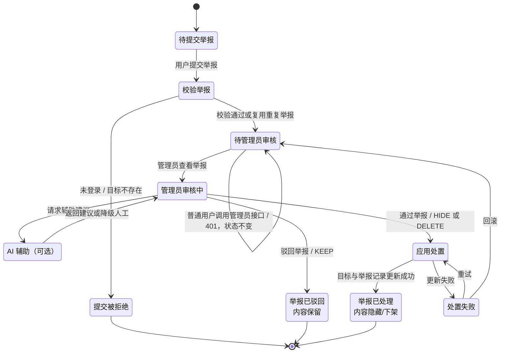
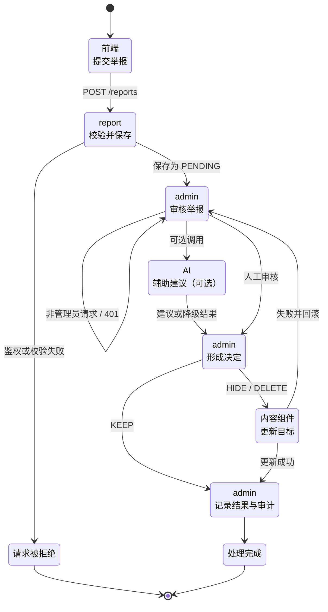
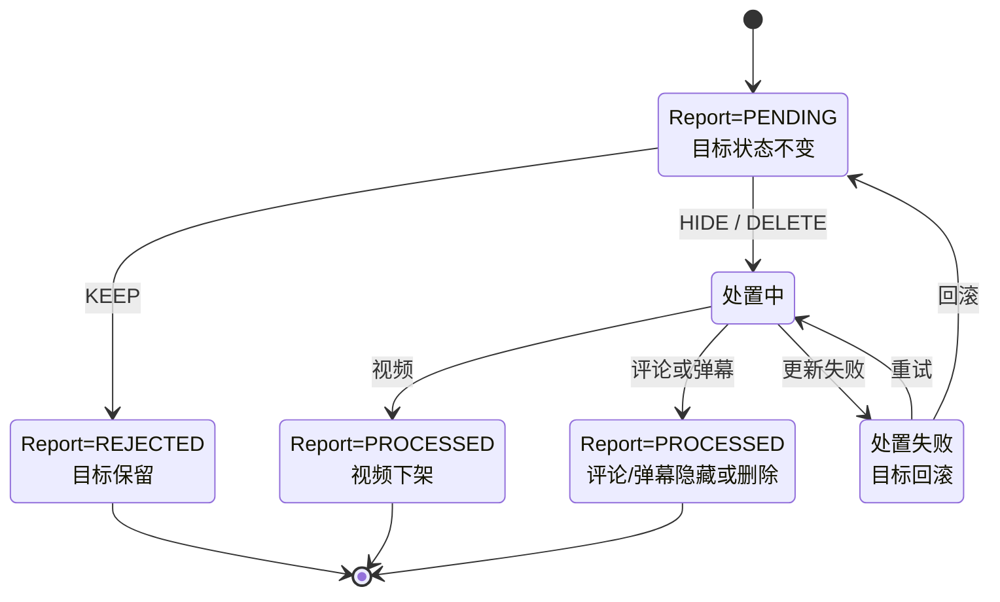

# UC06 举报、审核与治理处置：三层状态图

> 需求：`REQ06`；用例：`UC06`；模型：`SYS-STATE06`、`COMP-STATE06`、`OBJ-STATE06`。
>
> 追溯测试：`UNIT-TC06`、`INT-TC06`、`E2E-TC06`。原有 `SYS-SEQ06`、`COMP-SEQ06`、`OBJ-SEQ06` 保留给后续三层序列图，不与本状态图编号混用。

## 1. 建模口径

- 系统级状态图描述一次举报治理业务从提交到结果可验证的整体状态。
- 组件级状态图描述前端、`report`、`admin`、可选 AI 和内容处置组件之间的状态交接。
- 对象级状态图描述 `ReportRecord` 与目标视频、评论或弹幕形成的联合对象状态。
- 实线状态包含现有实现和本用例要求的目标设计；带“待实现”或“设计瞬态”的节点不得当作当前代码已经具备的能力。
- `KEEP` 表示举报不成立：举报记录进入 `REJECTED`，视频保持原状态，评论或弹幕按当前实现恢复为 `NORMAL`。
- `HIDE` / `DELETE` 表示举报成立：举报记录进入 `PROCESSED`；视频两种动作当前都映射为 `REJECTED`，评论或弹幕分别进入 `HIDDEN` / `DELETED`。

## 2. `SYS-STATE06` 系统级状态图

系统级只保留业务主状态。AI 不可用时回到人工审核；处置失败时可以重试或回滚到待审核。

## 3. `COMP-STATE06` 组件级状态图

组件级只表示状态交接，不展开每个组件内部的所有校验步骤。关键边界仍是内容更新与举报审计的一致性。

## 4. `OBJ-STATE06` 对象级状态图

对象级保留 `ReportRecord` 与目标内容的联合终态；操作者、时间和原因统一在终态写入，不再拆成额外节点。

## 5. 与当前代码的对应关系

| 能力 | 当前实现 | 图中位置 | 结论 |
| --- | --- | --- | --- |
| 举报者鉴权 | `ReportController` 调用 `AuthService.requireUser` | `ReportAccept` | 已实现 |
| 原因与目标校验 | DTO 校验原因长度；`ReportService` 查询视频/评论/弹幕是否存在 | `ReportAccept` | 已实现 |
| 保存待处理举报 | 创建 `ReportRecord`，默认 `PENDING` | `ReportAccept` → `AdminReview` | 已实现 |
| 管理员权限 | `AdminController.requireAdmin` 检查 `ADMIN` | `AdminReview` | 已实现 |
| 举报列表与目标摘要 | `GET /admin/reports` 关联举报者和目标内容 | `AdminReview` | 已实现 |
| 保留/隐藏/删除 | `POST /admin/reports/:id` 更新目标及举报记录 | `AdminDecision`、`ContentUpdate` | 已实现基础路径 |
| 操作者、时间、原因 | 写入 `handlerId`、`handledAt`、`handleNote` | `RecordResult` | 已实现，但原因在 DTO 中仍可选 |
| 重复举报治理 | 没有唯一约束或活跃举报查询 | `ReportAccept` | 待实现 |
| AI 辅助审核 | `agent/review-preview` 仅返回开发期 mock，未接入举报后台；`comment-ai` 用于 `@grok` 评论回复 | `AiAssist` | 可选能力，当前未接入 |
| 原子处置/回滚 | 目标与举报记录是两个顺序 `update`，无事务/补偿 | `ContentUpdate` → `RecordResult` | 关键一致性缺口 |
| 防止重复处置 | 接口未限制仅处理 `PENDING` 举报 | `PendingObject` | 待实现 |

## 6. 测试落点

| 追溯编号 | 建议验证重点 | 覆盖的关键转换 |
| --- | --- | --- |
| `UNIT-TC06` | 举报原因、目标类型与目标存在性；管理员动作映射；仅允许 `PENDING` 进入处置；重复举报策略 | `Validating`、`AdminDecision`、`PendingObject` |
| `INT-TC06` | 登录/管理员鉴权；Prisma 持久化；三个目标类型的 KEEP/HIDE/DELETE；注入第二次更新失败并验证事务或补偿 | `ReportAccept`、`AdminReview`、`ContentUpdate`、`RecordResult` |
| `E2E-TC06` | 普通用户提交举报，管理员查看并处置，随后查询举报状态、目标状态、原因、操作者和时间 | `Ready` → `Rejected` / `Processed` |

完成标准不是“接口返回 200”，而是终态组合正确、越权请求不改变状态、AI 失败可降级、处置中断后可重试或回滚，并且最终结果能够通过独立查询验证。
