# UC01–UC05 三层模型源文件

> Task：`DOC-01`；适用范围：UC01–UC05。UC06 的系统级、组件级和对象级状态模型见 [`10-uc06-state-diagrams.md`](10-uc06-state-diagrams.md)。
>
> 本文件使用 Mermaid 保存可版本化的模型源。模型描述的是已合并的 Gateway + 四服务边界；最终行为由 REG-01 的单体/Gateway 12/12 回归和对应 contract 测试验证。

## 1. UC01 账户访问与资料维护

### SYS-SEQ01 系统级交互

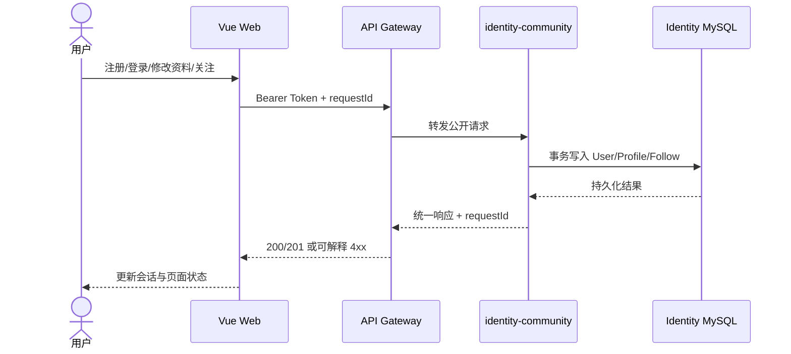

### COMP-SEQ01 组件级职责

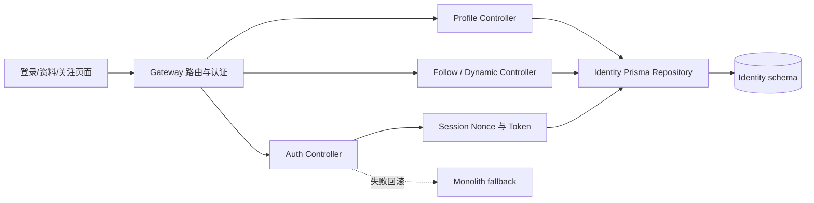

### OBJ-SEQ01 对象级模型

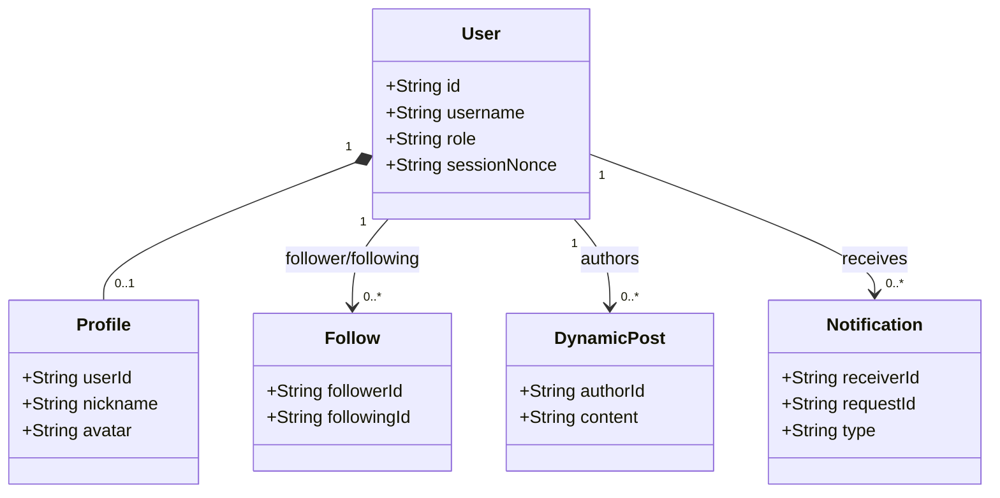

## 2. UC02 视频发现、播放与观看记录

### SYS-SEQ02 系统级交互

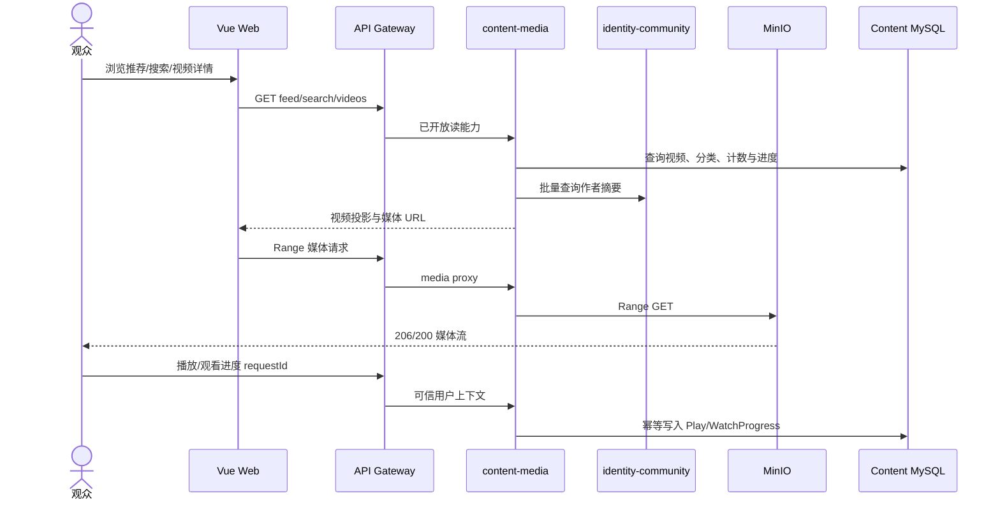

### COMP-SEQ02 组件级职责

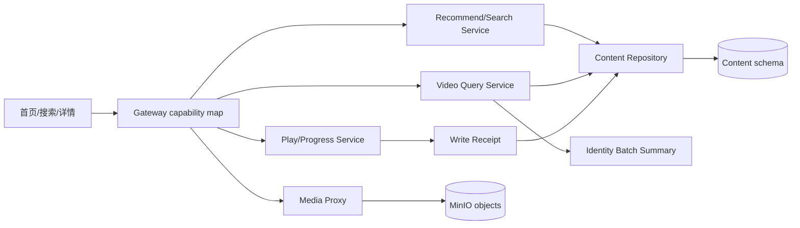

### OBJ-SEQ02 对象级模型

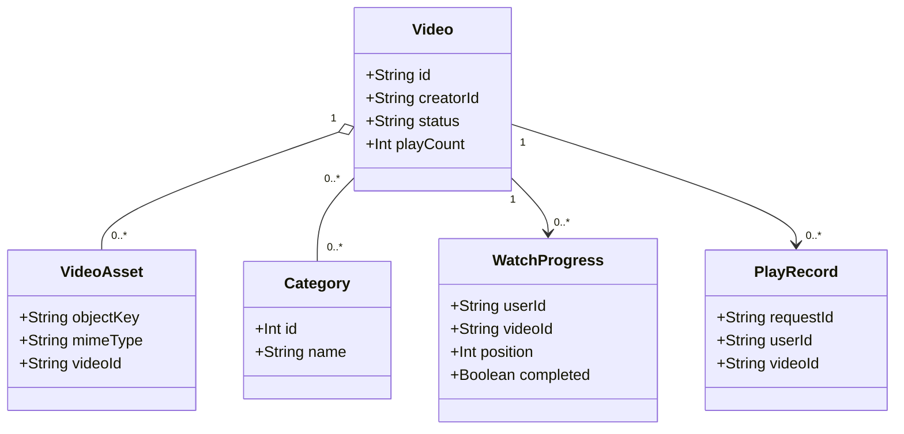

## 3. UC03 投稿、审核、发布与重提

### SYS-SEQ03 系统级交互

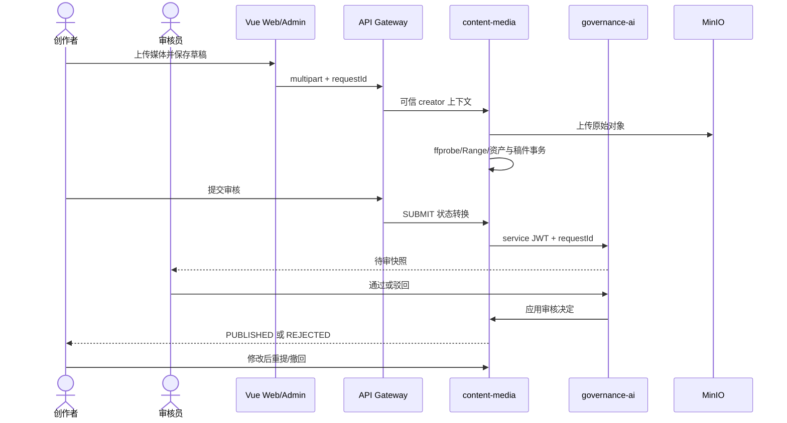

### COMP-SEQ03 组件级职责

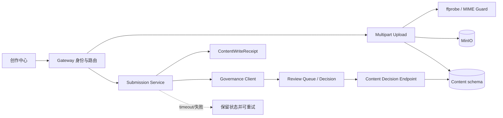

### OBJ-SEQ03 对象级模型

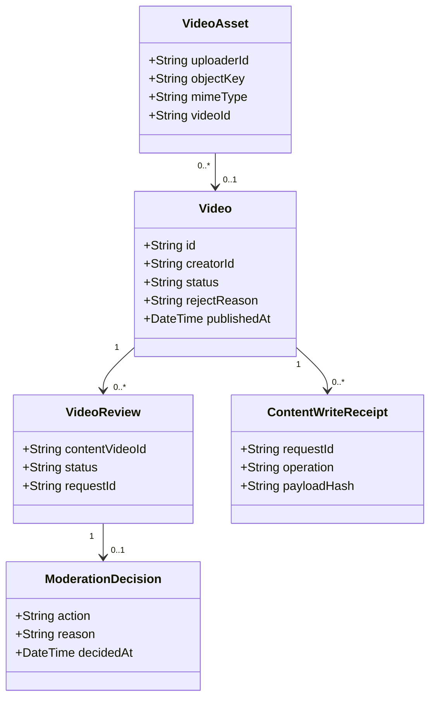

## 4. UC04 互动、通知与幂等

### SYS-SEQ04 系统级交互

```mermaid
sequenceDiagram
    actor Actor as 互动用户
    actor Creator as 内容作者
    participant Web as Vue Web
    participant Gateway as API Gateway
    participant Content as content-media
    participant Identity as identity-community
    participant DB as Content MySQL

    Actor->>Web: 评论/回复/点赞/收藏/弹幕
    Web->>Gateway: requestId + Bearer Token
    Gateway->>Content: gateway.user.forward JWT
    Content->>DB: 主体、计数、Receipt、Outbox 同事务
    DB-->>Content: COMMIT
    Content-->>Actor: 成功或 409 payload conflict
    Content->>Identity: Outbox 投递通知（有界重试）
    Identity-->>Creator: COMMENT/REPLY/LIKE/FAVORITE 通知
    Note over Content,Identity: 通知失败不回滚已提交的互动主体
```

### COMP-SEQ04 组件级职责

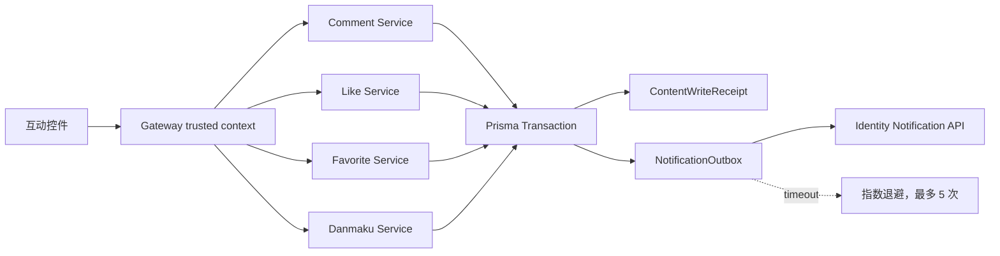

### OBJ-SEQ04 对象级模型

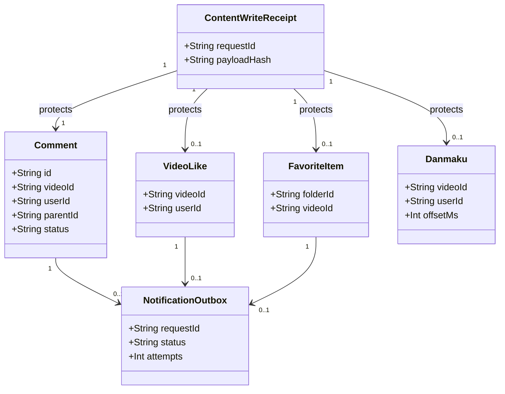

## 5. UC05 直播、录播与币账本

### SYS-SEQ05 系统级交互

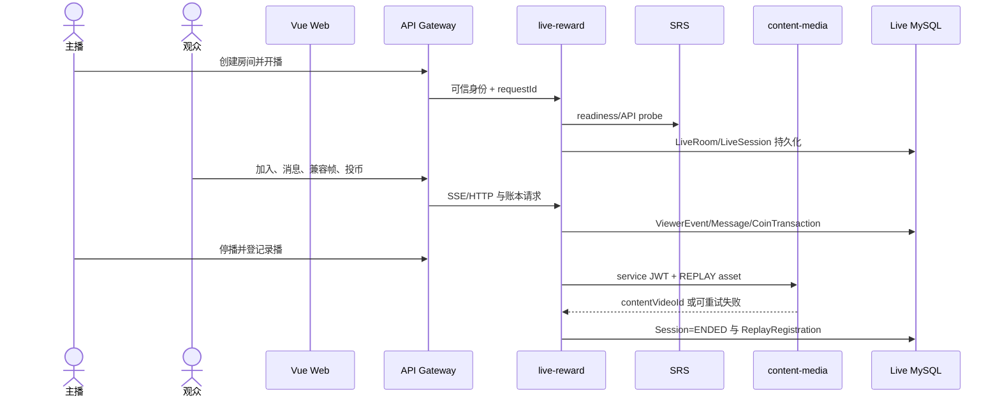

### COMP-SEQ05 组件级职责

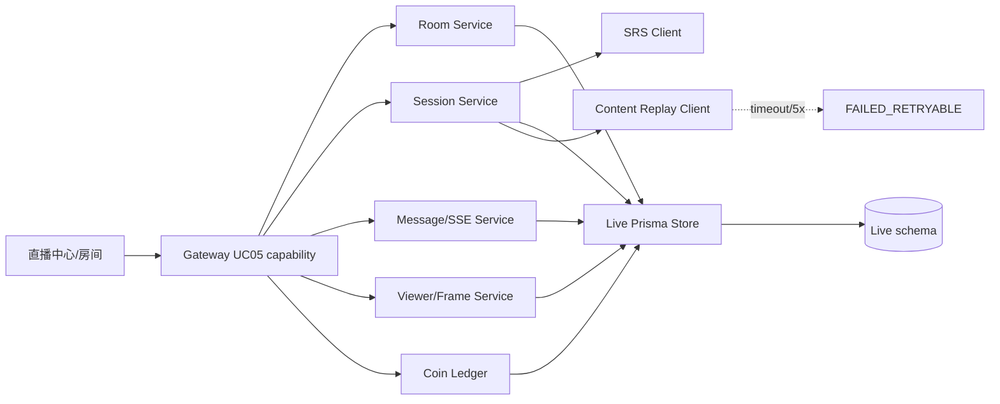

### OBJ-SEQ05 对象级模型

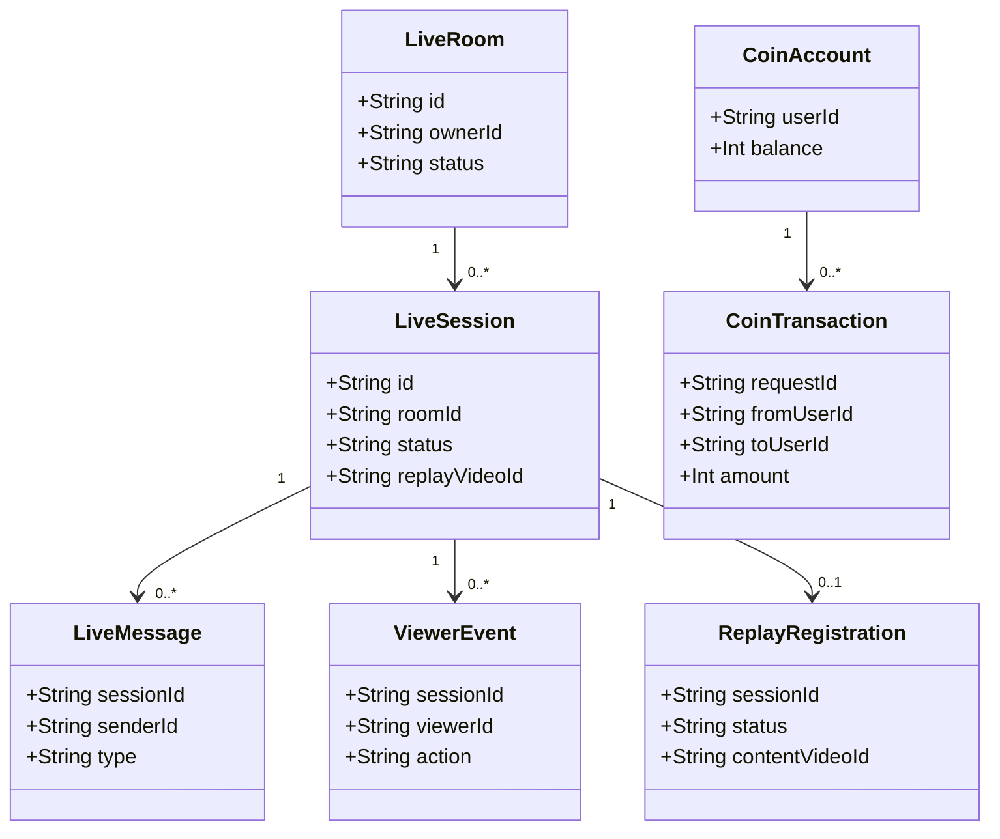

## 6. 追溯与验证

| UC | 代码边界 | 自动验证 | 最终结果 |
| --- | --- | --- | --- |
| UC01 | Gateway + identity-community | identity contract、REG-01 UC01（单体/Gateway） | PASS / PASS |
| UC02 | Gateway + content-media + MinIO | content contract、REG-01 UC02（单体/Gateway） | PASS / PASS |
| UC03 | content-media + governance-ai | publishing/review contract、REG-01 UC03（单体/Gateway） | PASS / PASS |
| UC04 | content-media + identity-community | receipt/outbox/notification contract、REG-01 UC04（单体/Gateway） | PASS / PASS |
| UC05 | live-reward + content-media + SRS | live/replay/ledger contract、REG-01 UC05（单体/Gateway） | PASS / PASS |

详细 endpoint 清单、真实运行值和对应 PR 见 [`06-evidence-and-dod.md`](06-evidence-and-dod.md)、[`00-progress.md`](00-progress.md) 与 REG-01 JSON 输出。
