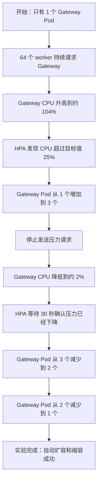
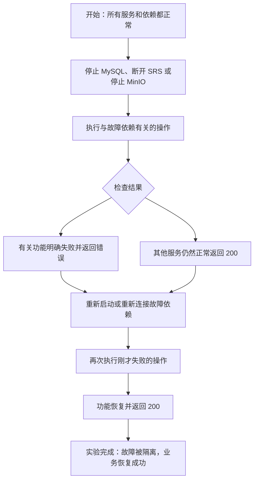

# VideoPlayer 两项云原生实验报告

> 实验落地快照：`main@481d683de584aeb9abaf6bb2df38f025bb514c30`（PR #69 合并时）
>
> DOC-02 集成基线：`main@acd99f569508f9d1eb6d49d4974cb5a109b3237e`
>
> 交付边界：本文记录技术实验，不替代教师/ARCH 原件、成员签字、非作者复现、真实录屏或演练；`DEL-01` 仍为 `HUMAN EVIDENCE PENDING`。
>
> 最终流水线：[GitHub Actions run 33476389190](https://github.com/DanTargaryen/VideoPlayer/actions/runs/33476389190)，3/3 Jobs SUCCESS，Quality 283/283 PASS
>
> 文档状态：两项实验均为 `PASS`

## 1. 实验目的

本报告完成课程任务要求的两项云原生实验：

1. 自动扩缩容：为 Gateway 设置资源请求、资源限制和 Kubernetes HPA，通过持续压力观察 Pod 自动扩容与缩容。
2. 故障处理：主动停止或隔离依赖，验证受影响能力能够返回明确错误、未受影响服务继续工作，并在依赖恢复后恢复业务。

两项实验分别验证云原生系统的弹性和故障隔离能力，实验环境为独立的 Kind 集群和 Compose 服务组。

## 2. 实验环境

| 项目       | 实验环境                                              |
| ---------- | ----------------------------------------------------- |
| 主机       | 同一台 arm64 Mac                                      |
| Docker     | 29.7.2                                                |
| Kubernetes | Kind`video-player`，Kubernetes v1.36.1              |
| 指标服务   | metrics-server v0.9.0                                 |
| 数据与依赖 | MySQL 8、MinIO 固定 digest、SRS                       |
| 运行时     | Node.js v25.8.2（host）、Node.js 22（服务镜像）       |
| 业务拓扑   | Gateway + identity/content/live/governance 四个微服务 |

## 3. 实验一：HPA 自动扩缩容

### 3.1 实验目标

在压力上升时，使 Gateway Pod 数量自动增加；撤去压力后，使 Pod 数量自动减少。观察并记录：

- CPU 利用率；
- HPA 期望副本数和 Ready Pod 数；
- 扩容、缩容时间；
- 压测吞吐量、平均响应时间、P95 响应时间和错误率。

### 3.2 配置

Gateway 在 `deploy/k8s/microservices/services.yaml` 中设置以下资源约束：

| 配置           |        值 |
| -------------- | --------: |
| CPU request    |   `50m` |
| CPU limit      |  `750m` |
| Memory request |  `64Mi` |
| Memory limit   | `256Mi` |

`deploy/k8s/microservices/hpa.yaml` 使用 `autoscaling/v2`，主要参数如下：

| HPA 参数        |                     值 | 说明                            |
| --------------- | ---------------------: | ------------------------------- |
| 扩缩容对象      | `Deployment/gateway` | 对外请求统一入口                |
| `minReplicas` |                      1 | 空闲期保留一个副本              |
| `maxReplicas` |                      3 | 限制实验资源使用                |
| CPU 目标值      |                    25% | 相对于 CPU request 的平均利用率 |
| 扩容策略        |    15 秒最多增加 2 Pod | 快速响应负载                    |
| 缩容稳定窗      |                  30 秒 | 避免压力短暂下降造成抖动        |
| 缩容策略        |    15 秒最多减少 1 Pod | 分阶段回收副本                  |

### 3.3 压力方法

`scripts/hpa-experiment.sh` 执行以下流程：

1. 确认 Kind 集群、Gateway Deployment 和 Metrics API 可用。
2. 将 Gateway 缩放为 1 个副本并应用 HPA。
3. 在集群内创建 `exp-hpa-load` Pod。
4. 启动 64 个异步 worker，最长持续 120 秒请求 `http://gateway:3000/health/ready`。
5. 每秒记录 Ready Pod、HPA desired replicas 和 CPU utilization。
6. Ready Pod 达到至少 2 个后停止压力，继续记录直至 Ready/Desired 均恢复为 1。
7. 退出时删除负载 Pod、HPA 和临时 metrics-server 资源，并将 Gateway 恢复为 1 个副本。

复跑入口：

```bash
bash scripts/k8s-deploy-microservices.sh
bash scripts/hpa-experiment.sh | tee hpa-experiment.log
```

### 3.4 实测时间线

| UTC 时间 | 阶段     | Ready / Desired |  CPU | 现场观察                          |
| -------- | -------- | --------------: | ---: | --------------------------------- |
| 06:54:15 | 基线     |           1 / 1 |   2% | 单副本稳定                        |
| 06:54:31 | 加压     |           1 / 3 | 104% | HPA 已请求最大 3 副本             |
| 06:54:36 | 加压     |           3 / 3 | 104% | 从发现压力到 3 Ready Pod 约 21 秒 |
| 06:55:45 | 撤压初期 |           3 / 3 | 125% | 指标窗口仍包含之前的高负载        |
| 06:55:46 | 恢复     |           3 / 3 |   2% | CPU 已回落                        |
| 06:56:01 | 恢复     |           2 / 2 |   2% | 第一阶段缩容                      |
| 06:56:16 | 恢复     |           1 / 1 |   2% | 约 30 秒完成 3→1                 |

Pod 实际变化为：

```text
1 → 3 → 2 → 1
```

因此，“压力升高后 Pod 数量增加、压力下降后 Pod 数量减少”的核心现场要求已经满足。

### 3.5 指标结果

| 指标              |                        已有结果 | 证据状态          |
| ----------------- | ------------------------------: | ----------------- |
| 基线 CPU          |                              2% | 已记录            |
| 压力期 CPU        |         104%，指标窗口峰值 125% | 已记录            |
| 最大 Ready Pod    |                               3 | 已记录            |
| 扩容时间          |                        约 21 秒 | 已记录            |
| 缩容时间          |                        约 30 秒 | 已记录            |
| 扩容压力          |  集群内 64 workers，最长 120 秒 | 已执行            |
| 关联性能吞吐量    | Gateway 三轮中位`1435.25 RPS` | 同批 PERF-01 实测 |
| 关联平均响应时间  |    Gateway 三轮聚合`11.90 ms` | 同批 PERF-01 实测 |
| 关联 P95 响应时间 |    Gateway 三轮中位`15.57 ms` | 同批 PERF-01 实测 |
| 关联错误率        |     720 次 Gateway 请求，`0%` | 同批 PERF-01 实测 |

HPA 脚本负责制造持续 CPU 压力并记录 Pod/CPU 时间线；同一批实验中的 PERF-01 负责记录 Gateway 的吞吐量、平均/P95 和错误率。两组结果共同构成自动扩缩容实验的现场材料：前者证明扩缩容行为，后者给出系统请求性能。

### 3.6 实验结论

HPA 已依据 CPU 指标完成 `1→3→2→1` 自动扩缩容，证明 Gateway 可以随负载水平改变副本数，缩容稳定窗也避免了立即回收造成的抖动。结合同批 PERF-01 保存的吞吐量、平均/P95 和错误率，自动扩缩容实验结论为 `PASS`。

### 3.7 实验一流程图



## 4. 实验二：依赖故障隔离与恢复

### 4.1 实验目标

主动停止一个依赖或为依赖注入不可达地址，验证：

1. 受影响能力返回事先设计的健康状态或标准错误；
2. 其他业务服务不会跟随依赖一起崩溃；
3. 依赖恢复后，同类业务重新成功；
4. 故障实验结束后回滚 Gateway 并清理隔离资源。

本项目选取 live MySQL、SRS、MinIO 三种依赖进行故障实验。

### 4.2 前置条件

故障注入前，标准 Compose 环境中的四个独立数据库、MinIO、四个业务服务、Gateway 和独立单体目标均已启动，并先完成 REG-01：

```text
monolith：UC01–UC06 = 6/6 PASS
microservice Gateway：UC01–UC06 = 6/6 PASS
合计：12/12 PASS
```

REG-01 的 12/12 PASS 结果确认了故障注入前单体版本和微服务版本均正常运行。

### 4.3 故障场景与结果

| 场景            | 注入动作                                        | 受影响能力                                            | 未受影响服务                                              | 恢复验证                                                    |
| --------------- | ----------------------------------------------- | ----------------------------------------------------- | --------------------------------------------------------- | ----------------------------------------------------------- |
| live MySQL 故障 | `compose stop live-mysql`                     | live`/health/ready` 返回 503                        | identity、content、governance、Gateway readiness 均为 200 | 启动数据库后 live readiness 恢复 200                        |
| SRS 故障        | 用`SRS_API_BASE=http://127.0.0.1:1` 重建 live | 开播返回 503/504，消息包含 SRS unavailable 或 timeout | identity、governance、Gateway readiness 均为 200          | 清除覆盖后，同一房间开播 200，停播状态为`ENDED`           |
| MinIO 故障      | `compose stop content-minio`                  | 合法 MP4 上传返回 500，并保持标准错误 envelope        | identity、live、governance、Gateway readiness 均为 200    | 启动 MinIO 后，同类上传返回 200，并取得 assetId/uploadToken |

### 4.4 关键实现

`scripts/fault-experiment-probe.mjs` 自动检查每个实验结果：

- 停止 live 数据库后，检查 live 服务是否返回 503，同时检查其他服务是否仍然返回 200；
- 让 SRS 无法访问后，检查开播是否返回 503 或 504，并检查错误信息是否明确说明 SRS 不可用或连接超时；
- 停止 MinIO 后，检查视频上传是否失败，并检查系统是否返回统一格式的错误信息；
- 重新启动故障依赖后，再执行一次相同操作，检查原来失败的功能是否恢复并返回 200；
- 所有检查均符合预期时，脚本返回成功并记录本次实验通过。

完整实验由 `scripts/compose-microservices-smoke.sh` 按顺序执行：先确认单体版本和微服务版本的主要功能都正常，再制造故障、检查故障结果、恢复依赖并重新检查，之后执行性能测试。全部完成后，把 Gateway 切回单体模式，并删除实验创建的容器、存储空间、临时数据库、临时进程和占用的端口。

### 4.5 结果分析

1. live 数据库不可用只会使 live readiness 失败，其他服务仍可对外证明健康，符合故障隔离要求。
2. SRS 不可用时，直播房间数据仍可创建，但开播能力返回明确错误；依赖恢复后可以继续使用原房间，不需要重建全部系统。
3. MinIO 不可用时上传失败，但 content 之外的服务保持健康；恢复后重新上传成功。

### 4.6 实验结论

三个故障场景均满足“受影响能力明确失败、其他服务不一起崩溃、依赖恢复后业务恢复”。故障处理实验结论为 `PASS`。其中 MySQL 验证 readiness 隔离，SRS 验证超时/不可用提示，MinIO 验证标准错误和恢复后重试，覆盖范围超过课程要求的单一故障场景。

### 4.7 实验二流程图



## 5. 总结

| 实验       | 结论     | 课程现场要求                                     |
| ---------- | -------- | ------------------------------------------------ |
| 自动扩缩容 | `PASS` | 已看到压力上升扩容、撤压缩容，并记录关联请求性能 |
| 故障处理   | `PASS` | 已看到明确错误、故障隔离和恢复后成功             |

原始聚合记录见 `13-resilience-performance-experiments.md`；性能对比的独立正式报告见 `17-performance-comparison-report.md`。

## 6. 证据索引

| 证据 | 路径 |
| --- | --- |
| HPA 配置 | `deploy/k8s/microservices/hpa.yaml` |
| HPA 实验脚本 | `scripts/hpa-experiment.sh` |
| 故障检查脚本 | `scripts/fault-experiment-probe.mjs` |
| Compose 完整实验入口 | `scripts/compose-microservices-smoke.sh` |
| 原始聚合记录 | `docs/practice-2026/13-resilience-performance-experiments.md` |
| 实验合并 PR | [PR #69](https://github.com/DanTargaryen/VideoPlayer/pull/69) |
| 实验 main 快照 | `481d683de584aeb9abaf6bb2df38f025bb514c30` |
| 实验 CI/CD | [GitHub Actions run 33476389190](https://github.com/DanTargaryen/VideoPlayer/actions/runs/33476389190) |
| DOC-02 集成基线 | `acd99f569508f9d1eb6d49d4974cb5a109b3237e` |
