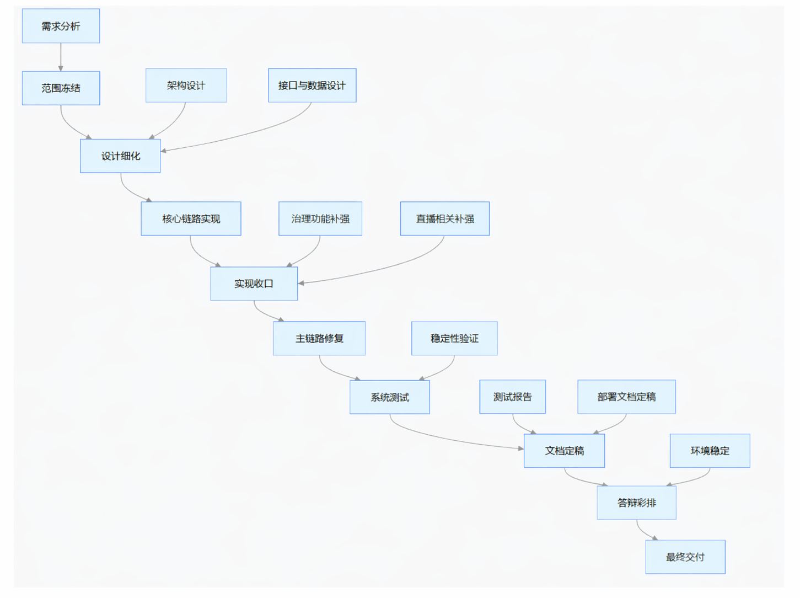

# 软件开发计划书

[TOC]

## 1 引言

### 1.1 标识

- 项目名称：观澜视频平台
- 项目标识号：VIDEO-PLATFORM-2026
- 文档名称：软件开发计划书
- 文档编号：VIDEO-PLATFORM-2026-SDP
- 版本号：v1.0
- 发布号：Release 1
- 编写日期：2026-04-16
- 项目性质：软件工程基础课程项目
- 项目形态：Web 端在线视频与直播网站
- 缩略语：
  - SDP：Software Development Plan，软件开发计划
  - SRS：Software Requirements Specification，软件需求规格说明书
  - SDD：Software Design Description，软件设计说明
  - API：Application Programming Interface，应用程序编程接口

### 1.2 系统概述

观澜视频平台面向游客、普通注册用户、内容创作者和平台管理员，提供视频消费、搜索推荐、视频投稿、内容审核、评论弹幕、关注订阅、直播互动、个人中心和后台治理等能力。项目定位为“B站式主站 + 抖音式推荐入口 + 真实推流直播 + 审核后台 + Agent 辅助治理”的综合型 Web 视频平台。

项目当前采用前后端分离架构建设。前端使用 Vue 3、TypeScript 和 Vite；后端使用 NestJS 和 Prisma；数据层采用 MySQL；基础设施包括 Redis、MinIO、FFmpeg 和 SRS。系统既强调内容消费体验，也强调创作者工作流、审核流程和平台治理能力，适合作为课程大作业中的综合软件工程实践项目。

本项目的主要相关方如下：

- 需求方：软件工程基础课程教学要求与答辩验收要求
- 开发方：AI说的都队
- 使用方：游客、注册用户、创作者、管理员
- 支持环境：本地开发环境与远程演示服务器环境
- 相关文档：项目计划书 V1/V2、软件需求规格说明书、软件概要设计说明书、软件详细设计说明书、数据库设计文档、API 文档、开发手册等

### 1.3 文档概述

本文档用于说明观澜视频平台在当前开发阶段的软件开发目标、组织方式、阶段安排、资源投入、质量要求、风险管理和交付策略。本文档的作用主要包括：

- 为团队提供统一的开发基线和执行依据
- 为课程验收提供可检查、可追踪的计划说明
- 为后续需求、设计、测试、部署和答辩准备提供约束与参照
- 为团队内部任务协同、里程碑控制和风险应对提供指导

本文档属于课程项目过程文档，可在项目组内部和课程指导范围内共享，但不应包含真实生产口令、私密密钥或敏感部署凭据。相关环境变量仅允许以占位或本地配置方式记录。

### 1.4 与其他计划之间的关系

本计划书与项目其他过程文档之间的关系如下：

- 本文档负责回答“做什么、何时做、谁来做、如何保证完成”。
- 软件需求规格说明书负责回答“系统需要实现什么能力、满足哪些业务规则”。
- 软件概要设计说明书负责回答“系统如何划分模块、采用什么总体架构和技术路线”。
- 软件详细设计说明书负责回答“关键模块如何细化实现、核心数据结构和流程如何设计”。
- 测试报告负责回答“系统是否满足计划和需求中定义的验收目标”。
- 部署文档和用户手册负责回答“系统如何安装、如何运行、如何演示和如何使用”。

本文档是上述文档的计划性上位文档之一，为其他文档的编写顺序、完成时间和衔接关系提供基线。

### 1.5 基线

本软件开发计划书编写所依据的基线如下：

- 课程大作业选题要求：在线视频与直播网站
- 当前代码仓库：`VideoPlayer`
- 当前项目计划：`docs/项目计划书-V1.md`、`docs/项目计划书-V2.md`
- 当前需求与设计资料：
  - `docs/软件需求规格说明书-V1.md`
  - `docs/软件概要设计说明书-V1.md`
  - `docs/软件详细设计说明书-V1.md`
  - `docs/数据库设计-V1.md`
  - `docs/API文档-V1.md`

---

## 2 引用文件

本开发计划书是项目第一版正式文档

---

## 3 交付产品

### 3.1 程序

本项目计划交付的程序产品包括：

- Web 前端应用
  - 首页推荐流
  - 搜索页与分类页
  - 视频详情页
  - 登录注册页
  - 创作者中心/用户中心
  - 管理员审核后台
  - 直播相关页面
- 后端服务程序
  - 用户认证与权限模块
  - 视频管理模块
  - 评论/点赞/收藏/关注模块
  - 搜索与推荐模块
  - 通知模块
  - 审核与举报处理模块
  - 直播模块
  - Agent 辅助模块
- 基础设施与部署脚本
  - Docker Compose 配置
  - MySQL 初始化脚本
  - 开发脚本与部署辅助脚本

### 3.2 文档

本项目计划交付的文档包括：

- 软件开发计划书
- 软件需求规格说明书
- 软件概要设计说明书
- 软件详细设计说明书
- 数据库设计文档
- API 文档
- 部署说明文档
- 开发手册
- 用户手册
- 答辩演示说明材料

### 3.3 服务

本项目课程范围内提供的服务包括：

- 本地开发环境搭建支持
- 远程演示环境初始化支持
- 课程答辩前的演示链路彩排支持
- 交付材料整理与使用说明支持

### 3.4 非移交产品

以下内容作为开发过程资产保留，不作为最终正式移交物：

- 个人临时调试脚本
- 本地缓存文件和本地日志
- 本地截图、草图和个人草稿
- 未纳入正式版本管理的试验性代码
- 本地 `.env` 文件和其他敏感配置

### 3.5 验收标准

本项目的主要验收标准如下：

- 功能验收：
  - 核心链路可运行：注册/登录、视频上传、审核、发布、推荐浏览、评论互动、通知查看、个人资料维护、后台审核
  - 直播链路达到可演示状态：可完成推流、观看、基础互动和回看展示
  - Agent 模块具备可说明、可演示的辅助治理能力
- 文档验收：
  - 计划、需求、设计、数据库、API、测试、部署和用户文档之间术语一致、接口一致、状态一致
  - 文档内容反映真实系统状态，不出现大面积“文档与实现脱节”
- 环境验收：
  - 项目可在指定本地环境或演示环境启动主要服务
  - MySQL、Redis、MinIO、SRS 与应用服务能够按文档说明协同运行
- 课程验收：
  - 满足课程要求的角色覆盖、模块覆盖、分工说明和答辩展示要求

### 3.6 最后交付期限

项目最终交付与答辩准备的目标完成日期定为：

- 计划最终收口日期：2026-06-08

---

## 4 所需工作概述

本项目后续工作围绕“功能收口、文档补齐、测试验证、环境稳定、答辩准备”五条主线展开。

#### 对系统和软件的需求与约束

- 系统必须支持游客、普通用户、创作者、管理员四类主要角色。
- 系统必须支持视频内容消费、投稿审核和后台治理三个基本方向。
- 系统首版仅交付 Web 端，不扩展原生移动端 App。
- 系统需支持真实推流直播，而不是仅用静态页面模拟直播。
- 审核策略采用“先审后发”，未通过审核内容不得进入公开推荐流。
- 推荐系统以规则版和画像增强为主，不引入复杂训练系统。

#### 对文档编制的需求与约束

- 文档必须与当前仓库代码和已实现功能保持一致。
- 文档必须使用统一术语描述模块、角色、状态和接口。
- 文档中不应写入真实数据库密码、对象存储密码、访问密钥等敏感信息。
- 文档既要满足课程规范，又要具备可操作性，避免只保留模板空话。

#### 项目在生命周期中的位置

项目已经完成立项、选题确认、初步规划、基础需求梳理和主要功能框架搭建，目前处于“功能整合与验收准备阶段”。这一阶段的核心不再是无限扩张功能，而是：

- 固化核心业务边界
- 提高链路稳定性
- 统一文档和实现
- 降低演示风险

#### 计划、采购和资源方面的需求与约束

- 项目组规模为五人，需在课程时间约束下完成开发、测试和文档。
- 团队以已有个人电脑、本地开发环境和课程允许的远程服务器资源为主。
- 所需软件和中间件优先选用开源组件，不另行采购商用大型平台。
- 本项目不存在复杂外购定制软件，不设专门采购流程。

### 4.5 其他需求与约束

- 安全约束：账户认证、角色区分、审核链路、环境变量管理要明确。
- 保密约束：敏感配置仅允许保存在 `.env` 等本地文件中，不进入仓库。
- 隐私约束：用户资料、通知、互动记录等仅在授权场景下展示和处理。
- 技术约束：前端和后端必须采用当前仓库既定技术栈，不在收尾期大规模换框架。
- 时间约束：必须服务于课程答辩，因此可演示性和稳定性优先于炫技型扩展。

---

## 5 实施整个软件开发活动的计划

### 5.1 软件开发过程

本项目采用“迭代增量开发 + 轻量 Scrum 管理”的过程模式。整体过程划分为以下阶段：

1. 规划阶段：明确产品定位、课程边界、角色范围和核心需求，输出计划书 V1。
2. 需求阶段：梳理业务流程、角色权限、模块边界和用例关系，输出需求规格说明。
3. 设计阶段：完成总体架构、数据库、接口规范和核心状态流转设计，输出设计文档。
4. 实现阶段：按模块完成功能开发、联调和初步测试。
5. 收口阶段：修复关键问题、完善文档、补齐测试和部署说明、准备答辩材料。

截至 2026-04-16，项目已处于第 5 阶段，即功能收口与验收准备阶段。该阶段重点活动包括：

- 核心主链路回归测试
- 直播链路稳定化
- 管理后台与审核链路补强
- 文档与代码一致性核对
- 演示环境配置与答辩彩排

主要风险与处理思路如下：

- 风险：功能边界继续扩张导致收尾失控
  - 处理：冻结非必要新增需求，优先完成 P0 主链路
- 风险：直播和媒体链路不稳定
  - 处理：先打通最小可用链路，并准备回看或录播兜底
- 风险：文档落后于实现
  - 处理：以当前仓库为准，统一在收口阶段批量对齐

### 5.2 软件开发总体状态

#### 5.2.1 软件开发方法

项目采用以下开发方法与协作方式：

- 需求与任务管理：按周拆分里程碑和任务清单
- 开发方法：小步提交、模块负责制、主链路优先
- 协作方式：Git 分支协作 + 合并前检查
- 沟通方式：组内例会、临时沟通、阶段性评审
- 联调方式：以前后端 API 约定和数据库状态为边界逐项核对

支持这些方法的主要工具包括：

- 代码仓库：Git
- 前端开发：Vue 3、TypeScript、Vite
- 后端开发：NestJS、TypeScript、Prisma
- 运行环境：Node.js、MySQL、Redis、MinIO、FFmpeg、SRS
- 文档编写：Markdown
- 接口验证：浏览器调试工具、手工接口调试和本地运行验证

#### 5.2.2 软件产品标准

项目采用的主要标准和约束如下：

- 文档标准：
  - 章节结构尽量遵循课程给出的标准模板
  - 同类文档的标题层级、术语、编号和格式统一
- 代码规范：
  - 前后端统一采用 TypeScript
  - 使用 ESLint 进行基础静态检查
  - 命名尽量做到模块名、接口名、字段名和文档名一致
- 接口规范：
  - API 路径、参数和返回结构应在前后端与文档之间保持一致
  - 错误场景要有稳定的状态表达
- 配置规范：
  - 环境变量与真实配置分离
  - 示例文件可保留变量名，不保留真实凭据
- 注释规范：
  - 关键流程保留必要注释，普通逻辑不过度注释
  - 文档重点描述设计理由、状态流转和模块责任边界

#### 5.2.3 可重用的软件产品

##### 5.2.3.1 吸纳可重用的软件产品

本项目吸纳的主要可重用软件产品如下：

- Vue 3、Vue Router、Pinia：前端页面和状态管理
- Element Plus：通用界面组件
- Axios：HTTP 请求封装
- NestJS：后端模块化框架
- Prisma：数据库访问层
- MySQL：关系数据存储
- Redis：缓存与辅助状态支持
- MinIO：对象存储
- FFmpeg：媒体处理
- SRS：直播推拉流服务

采用原则如下：

- 优先使用成熟、文档完善、社区活跃的开源组件
- 优先使用与当前技术栈自然契合的工具
- 对外部组件的使用保持在课程可掌控范围内

##### 5.2.3.2 开发可重用的软件产品

本项目拟沉淀的可重用资产包括：

- 通用 API 封装与响应处理逻辑
- 通用鉴权与角色控制逻辑
- 通用媒体存储和上传处理逻辑
- 通用审核状态流转逻辑
- 通用部署脚本与环境变量模板
- 统一的文档模板和答辩材料模板

#### 5.2.4 处理关键性需求

##### 5.2.4.1 安全性保证

- 所有角色能力均通过登录态和角色检查控制
- 管理员能力与普通用户能力分离
- 审核后台入口、审核操作和高权限接口要有明确权限边界
- 部署配置中的数据库和对象存储凭据通过本地环境变量管理

##### 5.2.4.2 保密性保证

- 不在仓库中保存真实数据库密码、对象存储密码和敏感密钥
- 示例配置文件仅保留变量名或占位值
- 演示账号与真实管理凭据分离

##### 5.2.4.3 私密性约束

- 用户个人资料、通知和创作记录仅面向授权用户显示
- 后台治理信息不向普通角色暴露
- 演示过程中的测试数据应避免包含真实隐私信息

##### 5.2.4.4 其他关键性需求

- 直播链路必须达到可解释、可展示、可复现状态
- 审核链路必须体现平台治理能力
- 推荐与搜索必须达到可运行和可说明状态，即便不是复杂智能算法

#### 5.2.5 计算机硬件资源利用

本项目主要使用以下硬件与环境资源：

- 开发设备：项目组成员个人电脑
- 本地运行：用于日常开发、调试、联调和文档验证
- 远程服务器：用于统一演示环境
- 媒体处理资源：依赖 FFmpeg 和对象存储配合

资源利用原则如下：

- 开发阶段优先使用本地环境，降低依赖外部服务器的不确定性
- 演示阶段优先使用统一服务器环境，降低成员机器差异带来的风险
- 对视频上传、转码、推流等资源消耗较大的流程实行重点验证

#### 5.2.6 记录原则

项目中的关键决策和重要变更遵循以下记录原则：

- 记录对象：
  - 需求边界变更
  - 数据库结构调整
  - 接口字段变更
  - 状态流转变更
  - 部署方式调整
  - 演示策略和兜底方案调整
- 记录方式：
  - 更新文档
  - Git 提交记录
  - 组内会议结论
  - TODO 或问题清单
- 记录要求：
  - 说明变更内容
  - 说明变更原因
  - 说明影响范围
  - 明确执行人和时间点

#### 5.2.7 需求方评审途径

课程项目中的评审对象主要包括项目组内部评审和指导教师评审。评审途径如下：

- 组内周评审：检查本周任务完成情况和下周计划
- 阶段性文档评审：确认计划、需求、设计和测试文档是否一致
- 演示评审：围绕主链路进行现场演示和彩排
- 指导教师评审：在课程节点提交并接受修改意见

---

## 6 实施详细软件开发活动的计划

### 6.1 项目计划和监督

#### 6.1.1 软件开发计划

软件开发计划采用“周计划 + 阶段里程碑 + 动态调整”的方式执行。

- 周计划：
  - 每周开始时明确本周目标、负责人和预期输出
  - 每周结束时检查完成情况和剩余问题
- 阶段计划：
  - 需求阶段完成需求文档
  - 设计阶段完成概要设计和详细设计
  - 实现阶段完成主功能链路
  - 收口阶段完成测试、部署和答辩准备
- 计划更新：
  - 出现需求变化、环境变化、关键缺陷或答辩安排变化时更新计划
  - 更新后的计划应体现具体调整内容和影响范围

#### 6.1.2 CSCI 测试计划

本项目中的软件配置项可按前端 CSCI、后端 CSCI 和基础设施配置项三类理解。测试计划如下：

- 前端 CSCI：
  - 重点验证页面路由、状态联动、角色切换和页面主流程
- 后端 CSCI：
  - 重点验证模块接口、业务流转、审核逻辑、通知逻辑和用户状态更新
- 配置项测试：
  - 重点验证环境变量、数据库连接、对象存储连接、直播服务连通性

#### 6.1.3 系统测试计划

系统测试围绕完整业务链路展开，重点覆盖：

- 注册/登录/角色进入链路
- 视频上传/处理/审核/发布链路
- 推荐浏览/搜索/详情/互动链路
- 用户中心/资料修改/作品管理链路
- 管理员审核/举报处理/复审链路
- 直播推流/观看/基础互动/回看链路

测试分为冒烟测试、回归测试和演示彩排测试三个层次。

#### 6.1.4 软件安装计划

安装计划包括本地开发安装和演示环境安装两类：

- 本地安装：
  - 安装 Node.js、npm、MySQL、Redis、Docker
  - 准备 `backend/.env`
  - 通过 `npm run db:init` 初始化数据库
  - 通过 `npm run dev` 启动本地开发环境
- 演示环境安装：
  - 准备数据库、对象存储和直播服务
  - 使用部署文档启动前后端服务
  - 验证关键接口和页面连通性

#### 6.1.5 软件移交计划

软件移交按以下顺序进行：

1. 提交整理后的源代码仓库
2. 提交完整课程文档
3. 提交部署说明和运行说明
4. 提交演示账号说明和演示脚本
5. 提交测试报告和主要验证结果

#### 6.1.6 跟踪和更新计划

项目跟踪和更新节奏如下：

- 每周至少一次组内进度同步
- 每完成一个阶段输出一次阶段性总结
- 每次核心链路变更后同步更新对应文档
- 每次演示前进行一次环境核查和风险排查

### 6.2 建立软件开发环境

#### 6.2.1 软件工程环境

项目开发环境如下：

- 操作系统：Windows 为主，可兼容 Linux
- Node.js：20+ 版本
- 包管理：npm
- 前端工程：Vue 3 + TypeScript + Vite
- 后端工程：NestJS + TypeScript + Prisma
- 数据库：MySQL 8
- 缓存：Redis 7
- 存储：MinIO
- 媒体处理：FFmpeg
- 直播服务：SRS
- 版本控制：Git

#### 6.2.2 软件测试环境

测试环境分为：

- 本地测试环境：
  - 用于单功能调试和联调
- 集中演示环境：
  - 用于统一答辩演示和最终验证
- 测试数据：
  - 使用演示账号、种子数据、样例视频文件和测试推流源

#### 6.2.3 软件开发库

开发库管理如下：

- 根仓库采用 Git 管理
- 前端依赖通过 `frontend/package.json` 管理
- 后端依赖通过 `backend/package.json` 管理
- 数据模型通过 Prisma schema 管理
- 文档统一放置于 `docs/` 目录

#### 6.2.4 软件开发文档

开发阶段需持续维护以下文档：

- 计划书
- 需求规格说明书
- 概要设计说明书
- 详细设计说明书
- 数据库设计
- API 文档
- 开发手册
- 测试报告
- 部署文档

#### 6.2.5 非交付文件

以下文件仅用于开发过程，不作为正式交付的一部分：

- 临时测试脚本
- 截图和草图
- 本地调试日志
- 个人会议记录
- 本地凭据文件

### 6.3 系统需求分析

#### 6.3.1 用户输入分析

系统的用户输入主要包括：

- 认证输入：
  - 用户名、密码、管理员密钥
- 内容输入：
  - 视频标题、简介、分类、封面、视频文件
- 互动输入：
  - 评论、回复、弹幕、关注操作、点赞和收藏操作
- 直播输入：
  - 开播参数、直播标题、推流地址相关信息
- 后台治理输入：
  - 审核意见、复审结果、举报处理结论

这些输入要求具备基本的合法性校验、角色限制和状态约束。

#### 6.3.2 运行概念

系统的运行概念如下：

- 游客访问首页、搜索页和公开视频详情页
- 注册用户登录后获得互动能力
- 创作者上传视频、编辑信息并提交审核
- 管理员在后台查看待审核内容并执行治理动作
- 审核通过的内容进入公开推荐和搜索范围
- 直播内容通过外部直播服务接入，并在平台页面中观看和互动

#### 6.3.3 系统需求

系统级需求可概括为以下几类：

- 功能需求：
  - 视频消费、视频发布、内容审核、互动通知、直播互动、个人中心、后台治理
- 非功能需求：
  - 系统可演示、可部署、可复现、可说明
- 安全需求：
  - 权限区分、配置隔离、管理员能力隔离
- 文档需求：
  - 过程文档和实现保持一致

### 6.4 系统设计

#### 6.4.1 系统设计决策

项目的关键设计决策如下：

- 采用前后端分离架构，而非服务端模板渲染
- 采用 NestJS 单体模块化结构，而非微服务
- 采用 MySQL 作为主数据存储
- 采用 MinIO 存储视频与封面对象
- 采用 FFmpeg 处理视频转码和封面抽帧
- 采用 SRS 支持直播推拉流
- 采用规则推荐和画像增强策略，而非复杂训练系统

#### 6.4.2 系统体系结构设计

系统总体可分为四层：

- 表现层：
  - Vue 前端页面和交互逻辑
- 业务层：
  - NestJS 模块服务、角色控制、业务流转
- 数据层：
  - Prisma、MySQL、Redis
- 基础设施层：
  - MinIO、FFmpeg、SRS、Docker Compose

### 6.5 软件需求分析

软件需求细分为以下模块需求：

- 认证与用户模块
- 视频模块
- 搜索与推荐模块
- 评论与弹幕模块
- 关注与通知模块
- 审核与举报模块
- 直播模块
- Agent 辅助模块

每个模块都应有明确输入、输出、状态边界和错误处理方式。

### 6.6 软件设计

#### 6.6.1 CSCI 级设计决策

CSCI 级设计遵循以下原则：

- 前端与后端接口边界明确
- 模块职责单一，避免跨模块直接耦合
- 状态流转可追踪，如草稿、待审、通过、驳回、重投
- 直播链路单独管理，避免和普通视频投稿链路混淆

#### 6.6.2 系统体系结构设计

软件层面主要模块结构如下：

- 前端：
  - 视图层、状态层、API 调用层、通用组件层
- 后端：
  - 模块控制器、服务层、数据访问层、存储与直播集成层

#### 6.6.3 CSCI 详细设计

详细设计的重点对象包括：

- 用户登录与角色判断流程
- 视频上传和媒体处理流程
- 审核状态机和后台处理流程
- 评论、通知和未读计数同步流程
- 直播开播、观看、互动和回看流程
- Agent 辅助判定与人工处理衔接流程

### 6.7 软件实现和配置项测试

#### 6.7.1 软件实现

实现阶段遵循以下原则：

- 主链路优先
- 模块功能逐项闭环
- 每次修改尽量伴随手工验证
- 功能实现与文档同步推进

#### 6.7.2 配置项测试准备

测试前准备内容包括：

- 准备数据库和对象存储环境
- 准备演示账号和种子数据
- 准备视频样例文件和直播推流源
- 准备回归测试清单

#### 6.7.3 配置项测试执行

执行内容包括：

- 验证环境变量读取
- 验证数据库连接和对象存储连接
- 验证前后端启动
- 验证媒体处理可达
- 验证直播服务可达

#### 6.7.4 修改和再测试

对于配置项或实现中的问题，按“发现问题、定位原因、修复、重复验证”的流程处理，并记录关键问题及影响范围。

#### 6.7.5 配置项测试结果分析与记录

每轮测试应至少记录：

- 测试环境
- 测试对象
- 测试步骤
- 测试结果
- 异常说明
- 后续处理措施

### 6.8 配置项集成和测试

#### 6.8.1 配置项集成和测试准备

需要完成以下准备：

- 前后端接口联调清单
- 数据库初始化
- 静态资源和视频资源准备
- 直播服务联通性检查

#### 6.8.2 配置项集成和测试执行

重点测试以下集成场景：

- 登录后进入主站和个人中心
- 视频上传后进入审核和发布
- 评论和通知之间的联动
- 审核后台与前台状态同步
- 直播页面与外部直播服务的联动

#### 6.8.3 修改和再测试

集成问题修复后必须重新覆盖受影响的主链路，避免修一处坏多处。

#### 6.8.4 配置项集成和测试结果分析与记录

集成测试应形成问题清单，标记优先级和责任人，并在阶段总结中说明关闭情况。

### 6.9 CSCI 合格性测试

#### 6.9.1 CSCI 合格性测试的独立性

本项目不设置完全独立于开发团队之外的专门测试团队，因此合格性测试由项目组交叉执行，并结合指导教师评审意见进行校核。

#### 6.9.2 在目标计算机系统上测试

合格性测试应尽量在最终演示环境或与其一致的环境中执行，避免仅在个人机器上通过而在演示环境失效。

#### 6.9.3 CSCI 合格性测试准备

准备内容包括：

- 冻结测试版本
- 冻结测试账号和测试数据
- 准备标准操作脚本
- 准备测试记录表

#### 6.9.4 CSCI 合格性测试演练

在正式验收前至少组织一次完整演练，覆盖各主要角色和主链路。

#### 6.9.5 CSCI 合格性测试执行

执行对象包括前端主界面、后端主要模块以及基础服务连接状态。

#### 6.9.6 修改和再测试

对合格性测试中发现的问题进行修复后，需重新验证对应功能点和受影响链路。

#### 6.9.7 CSCI 合格性测试结果分析与记录

结果需汇总到测试报告中，用于支撑课程验收。

### 6.10 CSCI/HWCI 集成和测试

#### 6.10.1 CSCI/HWCI 集成和测试准备

本项目无专用硬件控制接口，HWCI 不适用。此处重点指软件与基础设施服务的集成准备，包括：

- MySQL 连通性检查
- Redis 连通性检查
- MinIO 连通性检查
- FFmpeg 执行可用性检查
- SRS 推拉流可用性检查

#### 6.10.2 CSCI/HWCI 集成和测试执行

执行目标为验证系统与外部服务的协作是否稳定。

#### 6.10.3 修改和再测试

若外部服务配置有变，应重新验证上传、播放、审核、直播等关键能力。

#### 6.10.4 CSCI/HWCI 集成和测试结果分析与记录

记录内容包括服务版本、连接方式、测试结果和问题说明。

### 6.11 系统合格性测试

#### 6.11.1 系统合格性测试的独立性

系统合格性测试由项目组交叉执行并接受教师审阅，强调“链路视角”而非单点功能视角。

#### 6.11.2 在目标计算机系统上测试

正式答辩前，系统级测试应在最终演示环境上完成一轮。

#### 6.11.3 系统合格性测试准备

- 准备环境
- 准备账号
- 准备样例视频和直播素材
- 准备脚本和测试表单

#### 6.11.4 系统合格性测试演练

建议至少进行一次全流程彩排和一次故障兜底彩排。

#### 6.11.5 系统合格性测试执行

重点执行以下用例：

- 普通用户观看、互动、关注、通知
- 创作者上传、提审、查看审核结果
- 管理员后台审核、举报处理、复审
- 直播开播、观看和回看展示

#### 6.11.6 修改和再测试

系统级问题修复后需按主链路重新演练。

#### 6.11.7 系统合格性测试结果分析与记录

系统级测试结果作为测试报告和答辩材料的重要输入。

### 6.12 软件使用准备

#### 6.12.1 可执行软件的准备

在答辩前准备可运行的前后端程序和所需基础服务。

#### 6.12.2 用户现场的版本说明准备

准备面向答辩教师和评审的版本说明，包括：

- 当前版本号
- 新增功能
- 已知限制
- 演示范围

#### 6.12.3 用户手册的准备

准备简要用户手册，说明主要角色的基本操作路径。

#### 6.12.4 在用户现场安装

课程场景下通常不要求在用户现场重新安装，原则上以提前部署好的演示环境为主。

### 6.13 软件移交准备

#### 6.13.1 可执行软件的准备

准备最终演示版本和必要的部署文件。

#### 6.13.2 源文件准备

源代码、文档源文件、数据库脚本和部署脚本统一整理。

#### 6.13.3 支持现场的版本说明准备

准备对评审可讲解的版本说明和演示边界。

#### 6.13.4 已完成的 CSCI 设计和其他支持信息准备

确保主要模块的设计文档、接口文档和数据库说明齐备。

#### 6.13.5 系统设计说明的更新

若收口阶段有实际设计变更，需同步更新设计文档。

#### 6.13.6 支持手册的准备

准备开发手册、部署手册和用户手册。

#### 6.13.7 到指定支持现场的移交

课程项目中通常指提交至指定仓库、课堂平台或教师要求位置。

### 6.14 软件配置管理

#### 6.14.1 配置标识

配置项包括：

- 前端源码
- 后端源码
- 数据库 schema
- 部署脚本
- 文档
- 测试资料

#### 6.14.2 配置控制

- 通过 Git 进行版本控制
- 通过分支和合并审查控制变更
- 对关键文档进行版本标注

#### 6.14.3 配置状态统计

每个阶段需明确：

- 当前代码版本
- 当前文档版本
- 当前演示环境版本
- 当前测试版本

#### 6.14.4 配置审核

阶段性检查代码、文档、环境是否一致，防止出现多套口径。

#### 6.14.5 发布管理和交付

以阶段稳定版本为交付候选版本，正式交付时冻结版本和文档。

### 6.15 软件产品评估

#### 6.15.1 中间阶段和最终软件产品评估

产品评估分为阶段评估和最终评估：

- 阶段评估关注功能完整度和联调稳定性
- 最终评估关注验收能力、演示能力和文档一致性

#### 6.15.2 软件产品评估记录

评估记录应包含问题、优先级、责任人和关闭情况。

#### 6.15.3 软件产品评估的独立性

本项目无独立第三方评估组织，由项目组交叉评估并结合教师意见执行。

### 6.16 软件质量保证

#### 6.16.1 软件质量保证评估

质量保证围绕以下方面展开：

- 功能是否跑通
- 接口是否一致
- 页面是否可用
- 文档是否一致
- 环境是否可复现

#### 6.16.2 软件质量保证记录

质量记录包括：

- 测试记录
- 问题单
- 回归清单
- 演示彩排记录
- 文档核对记录

#### 6.16.3 软件质量保证的独立性

由项目组交叉执行，不设专门 QA 机构。

### 6.17 问题解决过程（更正活动）

#### 6.17.1 问题/变更报告

问题报告至少应记录：

- 问题编号
- 发现时间
- 发现人
- 涉及模块
- 问题描述
- 影响范围
- 优先级
- 负责人
- 状态
- 解决方案

#### 6.17.2 更正活动系统

更正活动遵循以下流程：

1. 发现问题
2. 定位原因
3. 评估影响
4. 实施修复
5. 回归验证
6. 同步文档

### 6.18 联合评审

#### 6.18.1 联合技术评审

技术评审面向架构、数据库、接口、状态流转和直播链路。

#### 6.18.2 联合管理评审

管理评审面向进度、资源、风险、交付和答辩准备情况。

### 6.19 文档编制

项目文档编制遵循以下原则：

- 先有框架，后逐步细化
- 文档与实现同步更新
- 避免只复制模板，不写项目事实
- 每份文档都明确版本、日期和适用范围

### 6.20 其他软件开发活动

#### 6.20.1 风险管理

详见第 11 章。

#### 6.20.2 软件管理指标

主要管理指标包括：

- 关键链路完成数
- 阶段性缺陷数
- 文档完成度
- 演示通过率

#### 6.20.3 保密性和私密性

敏感配置和真实凭据不得进入仓库；测试数据不使用真实个人隐私数据。

#### 6.20.4 承包方管理

本项目不涉及外部承包，不适用。

#### 6.20.5 与独立验证确认机构的接口

课程项目中无独立 IV&V 机构，不适用。

#### 6.20.6 和有关开发方的协调

项目内部按模块分工协调，统一接口口径和环境说明。

#### 6.20.7 项目过程的改进

通过每周复盘和阶段总结持续改进协作流程、文档同步方式和测试清单。

#### 6.20.8 计划中未提及的其他活动

包括答辩 PPT、演示讲稿、演示视频和现场故障兜底方案准备。

---

## 7 进度表和活动网络图

### 7.1 进度表
| 活动           | 开始时间 | 结束时间 | 持续时间 |
| -------------- | -------- | -------- | -------- |
| 需求分析与确认 | 第1周    | 第2周    | 1周      |
| 系统设计       | 第2周    | 第3周    | 1周      |
| 编码实现       | 第3周    | 第5周    | 2周      |
| 系统集成与测试 | 第5周    | 第6周    | 1周      |
| 部署上线与维护 | 第6周    | 第7周    | 1周      |

### 7.2 活动网络关系

---

## 8 项目组织和资源

### 8.1 项目组织

项目采用五人小组协作方式，组织结构可概括为：

- 项目协调与合并统筹1人
- 前端开发1人
- 后端开发2人
- 测试与部署负责1人

实际执行中允许成员承担复合角色，但必须保证每位成员有明确主责模块和可展示成果。

### 8.2 项目资源

#### 8.2.1 人力资源

- 团队规模：5 人
- 投入方式：课程周期内并行投入
- 分工原则：
  - 每位成员至少负责一个核心模块
  - 关键链路必须有明确主责人
  - 文档和测试工作不能全部留到最后阶段

#### 8.2.2 开发设施

- 个人电脑开发环境
- 本地数据库与中间件环境
- Docker 运行环境
- 远程服务器演示环境

#### 8.2.3 需求方提供的支持资源

- 课程要求说明
- 答辩时间安排
- 指导意见和阶段反馈

#### 8.2.4 其他资源

- 演示视频样本
- 测试账号
- 直播测试推流源
- 项目图示和答辩材料模板

---

## 9 培训

### 9.1 项目的技术要求

项目组成员需要掌握以下技术或知识：

- Vue 3 基础开发
- TypeScript 基础
- NestJS 模块化开发
- Prisma 数据建模与数据库操作
- MinIO 对象存储使用
- FFmpeg 基础媒体处理
- SRS 基础推流和播放链路
- Markdown 文档协作

### 9.2 培训计划

本项目采用“边开发边培训”的方式，不单独安排大型集中培训，但要求在关键技术点上完成必要预研：

- 前端成员：补齐页面状态管理、路由和组件联调能力
- 后端成员：补齐 Prisma、模块划分和接口设计能力
- 直播链路成员：补齐 SRS、FFmpeg、推流调试能力
- 文档成员：熟悉课程模板、文档结构和术语一致性要求

---

## 10 项目估算

### 10.1 估算规模

项目为中等规模课程软件工程项目，包含前端应用、后端服务、数据库、对象存储、媒体处理、直播服务和多类过程文档。

### 10.2 工作量估算

按功能类别估算工作量如下：

- 需求与文档：20%
- 前端开发与联调：25%
- 后端开发与联调：25%
- 媒体处理与直播链路：15%
- 测试、部署和答辩准备：15%

若以总投入约 220 至 280 人小时估算，则平均每位成员约需投入 44 至 56 人小时。

### 10.3 成本估算

本项目为课程项目，不以商业盈利为目的，直接资金成本较低。若按虚拟估算口径计入：

- 人力成本：按课程项目模拟估值核算
- 基础环境成本：主要为服务器、网络和中间件使用成本
- 其他成本：文档整理、演示准备、打印和会议沟通成本

综合估算成本控制在低成本范围内，以“完成课程项目并达成答辩效果”为目标。

### 10.4 关键计算机资源估算

- 开发电脑：5 台
- 数据库与中间件：1 套本地开发配置 + 1 套远程演示配置
- 存储与媒体：需要满足样例视频上传和处理
- 直播服务：至少满足小规模演示推拉流

### 10.5 管理预留

建议预留约 10% 至 15% 的时间缓冲，用于：

- 关键缺陷修复
- 环境问题处理
- 文档补齐
- 答辩演练和故障兜底

---

## 11 风险管理

### 11.1 风险识别

| 风险编号 | 风险名称 | 描述 |
| --- | --- | --- |
| RK-01 | 直播链路风险 | 直播推流、观看、互动和回看链路涉及外部服务，容易在演示阶段失稳 |
| RK-02 | 文档脱节风险 | 文档多、版本多，容易与当前实现不一致 |
| RK-03 | 进度压缩风险 | 课程节点固定，收尾阶段时间紧张 |
| RK-04 | 环境不一致风险 | 本地和远程环境配置不同，可能导致“本地能跑、现场失效” |
| RK-05 | 联调回归风险 | 连续修改多个模块后，旧链路可能被破坏 |
| RK-06 | 权限与治理风险 | 管理后台、审核状态和角色边界如果处理不严，会影响演示可信度 |

### 11.2 风险对策

| 风险编号 | 应对措施 |
| --- | --- |
| RK-01 | 优先打通最小直播闭环，准备录播/回看兜底方案 |
| RK-02 | 以当前代码仓库为准统一更新文档，冻结术语和接口口径 |
| RK-03 | 冻结非必要新需求，集中力量完成 P0 主链路 |
| RK-04 | 固化 `.env` 变量、部署步骤和演示环境检查清单 |
| RK-05 | 建立固定回归清单，每次修复后重新验证主链路 |
| RK-06 | 对登录、管理员入口、审核后台和复审流程进行专项检查 |

### 11.3 风险管理计划

风险管理采用“每周检查 + 关键节点专项排查”的方式：

- 每周例会检查新增风险和风险状态变化
- 演示前进行专项风险排查
- 对高风险项指定责任人和兜底方案
- 风险关闭后记录处理结果，供最终复盘使用

---

## 12 支持条件

### 12.1 计算机系统支持

项目顺利实施需要以下系统支持条件：

- 可用的 Node.js 开发环境
- 可用的 MySQL、Redis、MinIO 和 SRS 环境
- 可执行 FFmpeg 的媒体处理环境
- 可访问的本地或远程演示服务器

### 12.2 需要需求方承担的工作和提供的条件

课程场景下，需求方或指导方需提供：

- 明确的验收方向和答辩时间安排
- 对阶段性文档和实现的反馈意见
- 对项目边界和重点的确认

### 12.3 需要承包方承担的工作和提供的条件

本项目组作为承包执行方，需要承担：

- 完成系统开发、联调和测试
- 完成全部课程过程文档
- 准备演示环境和答辩材料
- 处理关键缺陷、环境问题和版本收口问题

---

## 13 注解

### 13.1 术语说明

- 游客：未登录用户，仅能访问公开内容
- 普通用户：具备互动能力的登录用户
- 创作者：可投稿和管理作品的用户角色
- 管理员：可执行审核和治理动作的高权限角色
- 投稿：用户上传视频并提交审核的过程
- 回看：直播结束后保存的可再次观看内容
- Agent：用于辅助内容审核、文本判断或治理提示的智能模块

### 13.2 缩略语

| 缩略语 | 含义 |
| --- | --- |
| SDP | Software Development Plan |
| SRS | Software Requirements Specification |
| SDD | Software Design Description |
| API | Application Programming Interface |
| SPA | Single Page Application |
| CI | Continuous Integration |
| JWT | JSON Web Token |

---

## 附录

