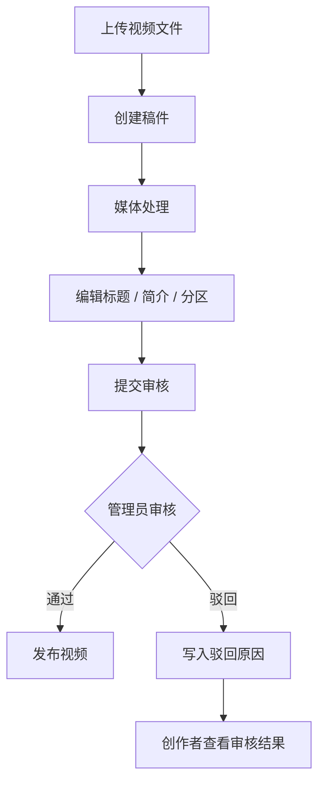
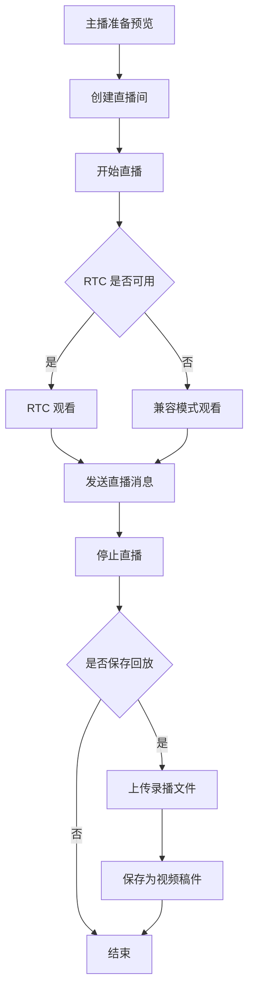

# 软件需求规格说明


[TOC]

## 1 范围

### 1.1 标识

- 文档名称：软件需求规格说明书
- 项目名称：观澜视频平台 / `VideoPlayer`
- 文档标识：视频平台-SRS-代码归纳版
- 文档版本：v2.0
- 编写日期：2026-04-24

### 1.2 系统概述

观澜视频平台是一个面向 Web 端的视频主站与直播平台课程项目。系统当前由 Vue 3 前端和 NestJS 风格后端组成，后端通过 Prisma 访问 MySQL，并结合 MinIO、FFmpeg、SRS 与 DashScope/Qwen 等外部能力完成媒体处理、直播与 AI 辅助功能。

当前代码已形成的主要业务闭环包括：

- 首页推荐、分区浏览、搜索、搜索联想、相关推荐
- 视频详情播放、点赞、收藏、评论、回复、视频弹幕、举报
- 用户注册登录、资料维护、用户主页、关注关系、关注流、通知中心
- 创作者投稿、真实文件上传、自动媒体处理、提交审核、撤回审核、查看审核记录
- 管理员审核后台，包括视频审核、文本审核、举报处理和统计看板
- 直播间创建、开播、观众观看、聊天室互动、录播保存为稿件
- 视频 AI 问答、视频摘要缓存、评论区 `@grok` 机器人回复

当前系统角色分为：

- 游客：浏览公开内容和直播
- 普通用户：观看、互动、关注、投稿、开播、管理个人资料
- 管理员：审核视频、处理举报、处置异常文本、查看后台统计


### 1.3 文档概述

本文档用于说明当前代码基线下系统的业务目标、用户需求、系统需求、接口需求、数据需求、运行环境、质量要求和验收方式，为后续概要设计、详细设计、测试提供统一依据。

### 1.4 基线

本文档基于以下内容编写：

- 前端代码：`frontend/src/`
- 后端代码：`backend/src/`
- 数据模型：`backend/prisma/schema.prisma`
- 初始化数据：`backend/prisma/seed.js`
- 项目说明：`README.md`
- 既有课程文档模版：`软件需求规格说明书.md`


## 2 引用文件

| 编号 | 标题 | 时间 | 来源 |
| --- | --- | --- | --- |
| 引-01 | 软件工程基础2026春大作业要求 | 2026年2月 | 课程文档参考 |
| 引-02 | 软件需求规格说明书 | 2026年4月 | 课程文档参考结构 |
| 引-03 | IEEE 830–1998 《软件需求规格说明》标准 | IEEE 官方网站 |

## 3 需求

### 3.1 所需的状态和方式

系统当前存在以下运行状态和方式：

- 游客浏览方式：未登录用户可访问首页、搜索页、视频详情页、用户主页和直播页，但不能执行需要鉴权的写操作。
- 登录用户方式：普通用户登录后可进行点赞、收藏、评论、弹幕、关注、通知查看、投稿、直播和账号维护。
- 创作者投稿方式：普通用户进入用户中心后，可上传文件、创建稿件、编辑稿件、提交审核、撤回审核、查看审核记录。
- 管理审核方式：管理员通过独立入口登录审核后台，处理视频审核、文本审核、举报记录和统计看板。
- 直播运行方式：用户创建直播间后，可在主播端开播；观众端通过 RTC 或兼容模式观看，并通过消息流互动。
- AI 异步处理方式：评论中的 `@grok` 会生成 AI 任务并由后台轮询处理；视频问答和视频摘要在请求时动态调用 AI 能力。

### 3.2 需求概述

## 3.2.1 目标

### （1）开发背景与目标

当前主流视频平台系统通常具备内容分发、用户互动和平台治理等功能，但其系统复杂度高、实现成本大，不适用于课程项目环境。同时，现有教学项目往往仅覆盖单一功能（如视频播放或上传），缺乏对完整视频平台业务链路的系统性实现。

因此，本系统旨在设计并实现一个**轻量级但功能完整的视频内容消费平台**，在保证可运行与可演示的前提下，覆盖视频平台的核心业务流程，包括：

* 内容生产（上传、编辑、审核、发布）
* 内容消费（推荐、搜索、播放）
* 社区互动（评论、弹幕、关注）
* 平台治理（审核、举报处理）
* 扩展能力（直播、AI 辅助交互）

系统定位为**独立运行的 Web 应用系统**，用于课程项目展示与视频平台系统设计能力验证。

---

### （2）系统功能与处理流程概述

本系统主要功能包括：

#### 1. 视频内容消费功能

* 提供推荐流、搜索、关注流等内容发现方式
* 支持视频播放及相关推荐

#### 2. 内容生产与管理功能

* 支持视频上传、稿件管理与状态流转（草稿 / 审核 / 发布）
* 提供管理员审核机制

#### 3. 社区互动功能

* 支持点赞、收藏、评论、回复、弹幕
* 提供关注关系与通知机制

#### 4. 平台治理功能

* 支持举报提交与后台处理
* 管理员可执行删除、隐藏等操作

#### 5. 直播与回放功能

* 支持直播间创建、实时互动与录播保存

#### 6. AI 辅助功能

* 支持基于视频内容的问答
* 支持评论机器人自动回复

---


#### 3.2.2 运行环境

- 客户端环境：现代浏览器
- 前端运行环境：Vue 3 + TypeScript + Vite
- 后端运行环境：Node.js + NestJS 风格框架 + TypeScript
- 数据持久化：MySQL + Prisma
- 对象存储：MinIO，也可切换为本地存储
- 媒体处理：FFmpeg / FFprobe
- 直播服务：SRS
- AI 外部能力：DashScope Qwen 兼容 API

#### 3.2.3 用户的特点

- 游客：不登录即可浏览内容，对访问速度和内容发现效率敏感。
- 普通用户：以观看、互动、关注和收取通知为主，期望操作结果即时可见。
- 管理员：关注待审队列、异常文本、举报记录和平台统计。

#### 3.2.4 关键点

- 首页推荐是“互动热度 + 时间衰减 + 用户画像 + 多样性重排”的可解释规则。
- 投稿审核是系统核心闭环，只有审核通过的视频才会进入公开分发。
- 用户画像由点赞、收藏、评论、弹幕、关注、创作和观看进度共同计算。
- 直播链路采用 RTC 优先、兼容模式兜底。
- AI 功能分为同步视频问答与异步评论机器人回复。

#### 3.2.5 约束条件

- 系统当前仅开发 Web 端，不包含原生 App。
- 认证机制为课程演示级实现，使用 mock token 和本地存储，不满足生产级安全要求。
- 管理员入口采用独立密钥控制。
- 直播房间及会话状态保存在后端内存中，服务重启后不保证恢复
- 若需完整演示上传、直播和 AI，还需准备 MySQL、MinIO、FFmpeg、SRS 与 AI API Key。

### 3.3 需求规格

#### 3.3.1 软件系统总体功能/对象结构

本系统采用前后端分离架构，前端基于 Vue 进行页面组织，后端按照模块化 Controller / Service / ORM 方式实现业务逻辑。系统总体按照 MVC / 分层思想划分为：

- **Model（持久层 / 数据对象）**：
  - **实体类/数据对象**：`User`、`Video`、`VideoAsset`、`VideoReview`、`Comment`、`VideoDanmaku`、`VideoLike`、`Favorite`、`FollowRelation`、`Notification`、`ReportRecord`、`UserProfileSummary`、`UserVideoWatch`、`VideoAiSummary`、`CommentAiTask`。
  - **关系**：
    - `User` 与 `Video`：一对多；一个用户可以发布多个视频。
    - `User` 与 `Comment`：一对多；一个用户可以发表多条评论。
    - `Video` 与 `Comment`：一对多；一个视频下可以存在多条评论与回复。
    - `User` 与 `VideoDanmaku`、`VideoLike`、`Favorite`：一对多；分别记录用户弹幕、点赞与收藏行为。
    - `User` 与 `User`：通过 `FollowRelation` 形成关注关系。
    - `Video` 与 `VideoAsset`：一对多；用于关联原视频、转码文件、封面和录播资源。
    - `Video` 与 `VideoReview`：一对多；用于保存视频审核记录。
    - `Video` 与 `VideoAiSummary`：一对一；用于保存视频摘要结果。
    - `Video` 与 `UserVideoWatch`：一对多；用于记录用户观看与进度上报。
    - `Comment` 与 `Comment`：通过 `parentId`、`rootId` 构成评论树。
    - `ReportRecord` 可关联 `Video`、`Comment` 或 `VideoDanmaku`，用于举报与治理处理。
    - `Notification` 用于保存关注、评论、回复等消息提醒。

- **View（前端 SPA）**：
  - 基于 Vue 的单页面应用，按真实路由分区：
    - `/`：首页推荐页，展示推荐视频流与站点主入口。
    - `/search`：搜索页，展示视频、用户、直播三类结果。
    - `/video/:id`：视频详情页，提供播放、互动、弹幕、评论、相关推荐与 AI 问答。
    - `/live`、`/live/:id?`：直播广场与直播间页面，支持开播、观看、消息互动与录播保存。
    - `/user/dashboard`、`/creator/dashboard`：用户中心与创作者中心页面，用于资料维护、投稿和稿件管理。
    - `/admin/dashboard`：审核后台页面，用于视频审核、文本审核、举报处理和统计展示。
    - `/login`：登录页，支持普通用户登录和管理员密钥登录入口。
    - `/register`：注册页，用于创建普通用户账号。
    - `/notifications`：通知中心页。
    - `/following`：关注流页面。
    - `/users/:id`：用户主页页面。

- **Controller（RESTful API 层）**：
  - 后端统一以 `/api/v1` 作为接口前缀，按业务模块划分接口路由：
    - `/api/v1/auth/register`、`/api/v1/auth/login`、`/api/v1/auth/me`：用户注册、登录、当前登录态获取。
    - `/api/v1/users/avatar`、`/api/v1/users/profile`、`/api/v1/users/:id/homepage`：头像上传、资料维护、用户主页查询。
    - `/api/v1/feeds/recommend`、`/api/v1/feeds/categories/:code/videos`、`/api/v1/feeds/hot`、`/api/v1/feeds/following`：首页推荐、分区浏览、热门内容、关注流。
    - `/api/v1/search/all`、`/api/v1/search/hotwords`、`/api/v1/search/suggest`：全局搜索、热词、联想词。
    - `/api/v1/videos/upload`、`/api/v1/videos`、`/api/v1/videos/:id`、`/api/v1/videos/:id/recommendations`：视频上传、稿件管理、视频详情与相关推荐。
    - `/api/v1/videos/:id/submit-review`、`/api/v1/videos/:id/withdraw-review`、`/api/v1/videos/:id/reviews`：提交审核、撤回审核、查看审核记录。
    - `/api/v1/videos/:id/like`、`/api/v1/videos/:id/favorite`、`/api/v1/videos/:id/comments`、`/api/v1/videos/:id/danmaku`：点赞、收藏、评论、弹幕等互动接口。
    - `/api/v1/videos/:id/play`、`/api/v1/videos/:id/watch-progress`：播放与观看进度记录。
    - `/api/v1/users/:id/follow`、`/api/v1/users/:id/followers`、`/api/v1/users/:id/following`：关注/取关、粉丝列表、关注列表。
    - `/api/v1/notifications`、`/api/v1/notifications/unread-count`、`/api/v1/notifications/read-all`：通知查询、未读数量、全部已读。
    - `/api/v1/creator/dashboard`、`/api/v1/creator/videos`：创作者中心看板与本人稿件列表。
    - `/api/v1/reports`：提交举报。
    - `/api/v1/admin/reviews/videos`、`/api/v1/admin/reviews/videos/:id`：视频审核队列查询与审核处理。
    - `/api/v1/admin/reviews/text-content`、`/api/v1/admin/reviews/text-content/:targetType/:id`：评论/弹幕文本审核查询与处理。
    - `/api/v1/admin/reports`、`/api/v1/admin/reports/:id`、`/api/v1/admin/dashboard`：举报记录处理与审核后台统计看板。
    - `/api/v1/lives/rooms`、`/api/v1/lives/rooms/:id`、`/api/v1/lives/sessions/:id`：直播间创建、列表、详情与会话查询。
    - `/api/v1/lives/rooms/:id/publish`、`/api/v1/lives/rooms/:id/play`、`/api/v1/lives/rooms/:id/start`、`/api/v1/lives/rooms/:id/stop`、`/api/v1/lives/rooms/:id/messages`、`/api/v1/lives/rooms/:id/replay`：直播推流、观看、开停播、消息互动与录播保存。
    - `/api/v1/ai/video-summary`、`/api/v1/ai/video-chat`：视频摘要生成与视频问答。
    - `/api/v1/agent/review-preview`、`/api/v1/agent/results`：审核辅助相关接口。
    - `/api/v1/gift-coins/wallet`、`/api/v1/gift-coins/daily-claim`、`/api/v1/gift-coins/send`：礼物币相关接口。
  - 请求/响应格式：
    - 接口返回 JSON 数据。
    - 成功响应统一封装为 `{ code, message, data }`。
    - 前端通过 `Authorization: Bearer <token>` 传递登录令牌。
  - 异常处理：
    - 后端启用全局参数校验，包含 `whitelist`、`transform` 与 `forbidNonWhitelisted`。
    - 业务层通过 `BadRequestException`、`UnauthorizedException`、`ForbiddenException`、`NotFoundException` 等异常返回错误状态码及错误信息。
    - 当代码中未单独封装业务错误对象时，由后端异常机制直接返回错误响应。

- **总体流程示意**：
  1. 用户访问浏览器页面，前端路由匹配组件后调用后端 REST API；后端 Controller 调用 Service 完成业务处理，再通过 Prisma 访问数据库或调用对象存储、直播、AI 服务，最终返回 JSON 结果供前端渲染。
  2. 视频内容流程：用户上传视频文件并创建稿件草稿，系统保存视频与资源信息；用户提交审核后，视频进入待审状态；管理员审核通过后，视频进入发布状态并出现在首页推荐、搜索结果和详情页面中。
  3. 互动流程：用户可对视频执行点赞、收藏、评论、回复、弹幕和关注操作；系统将互动行为写入对应数据表，并在需要时生成通知消息。
  4. 扩展流程：系统支持直播间创建、开播、观看、消息互动和录播保存；支持视频摘要、视频问答以及评论区 `@grok` 回复；支持举报提交、文本审核和后台治理处理。

#### 3.3.2 软件子系统功能/对象结构

各子系统内部进一步细化：

1. **认证与用户子系统**：
   - **对象**：`User`、`UserProfileSummary`、`UserCategoryPreference`、`UserCreatorPreference`、`UserVideoWatch`；
   - **关键流程**：
     - 用户注册/登录 → 后端校验用户名、密码或管理员密钥 → 返回访问令牌与角色信息 → 前端保存登录态；
     - 用户资料维护 → 上传头像或修改昵称、简介 → 更新 `User` 相关记录 → 返回最新用户信息；
     - 用户主页访问 → 根据用户 ID 查询用户资料、已发布视频、粉丝与关注关系 → 前端展示主页内容；
     - 推荐画像构建 → 根据点赞、收藏、评论、弹幕、关注、创作与观看行为 → 生成用户画像摘要与偏好数据。

2. **分发与搜索子系统**：
   - **对象**：`Video`、`User`、`UserProfileSummary`、`UserCategoryPreference`、`UserCreatorPreference`；
   - **关键流程**：
     - 首页推荐 → 前端请求推荐接口 → 后端筛选已发布视频，并结合分区、热度和用户画像生成视频列表；
     - 分区浏览 → 根据分区编码查询已发布视频 → 返回对应内容列表；
     - 搜索请求 → 关键词匹配视频、用户和直播信息 → 返回搜索结果、联想词与热词。

3. **视频内容子系统**：
   - **对象**：`Video`、`VideoAsset`、`VideoReview`、`UserVideoWatch`、`VideoAiSummary`；
   - **关键流程**：
     - 视频上传 → 前端提交视频或封面文件 → 后端保存媒体资源 → 创建 `VideoAsset` 记录；
     - 稿件创建 → 用户填写标题、简介、分区、封面等信息 → 后端创建 `Video` 草稿并关联资源；
     - 媒体处理 → 稿件创建后触发视频处理 → 更新视频时长、转码资源或封面信息；
     - 视频播放 → 前端请求视频详情 → 后端返回视频元数据、播放地址、作者信息和相关推荐；
     - 观看上报 → 前端上报播放行为或观看进度 → 后端记录 `UserVideoWatch` 数据。

4. **社区互动子系统**：
   - **对象**：`Comment`、`VideoDanmaku`、`VideoLike`、`Favorite`、`FollowRelation`、`Notification`、`ReportRecord`；
   - **关键流程**：
     - 点赞/收藏 → 用户触发互动 → 后端写入或取消对应记录 → 同步更新视频统计数据；
     - 评论/回复 → 用户提交评论 → 写入 `Comment`，回复通过 `parentId`、`rootId` 形成评论树；
     - 弹幕发送 → 用户发送弹幕 → 写入 `VideoDanmaku` → 前端按视频时间轴展示；
     - 关注用户 → 写入 `FollowRelation` → 被关注者收到 `Notification`；
     - 举报处理 → 用户提交举报 → 后端生成 `ReportRecord` → 管理员后续处理。

5. **创作者中心子系统**：
   - **对象**：`Video`、`VideoReview`、`VideoAsset`、`FollowRelation`；
   - **关键流程**：
     - 创作者查看稿件列表 → 后端按当前用户查询其创建的视频 → 返回稿件状态与基础统计；
     - 提交审核 → 用户将草稿提交至审核队列 → 创建 `VideoReview` 记录 → 视频状态变为待审核；
     - 撤回/修改稿件 → 创作者撤回待审稿件或修改稿件信息 → 稿件恢复为可编辑状态；
     - 数据看板查看 → 聚合粉丝数、关注数、获赞数、收藏数、评论数及驳回稿件信息 → 前端展示创作者中心概览。

6. **平台治理子系统**：
   - **对象**：`VideoReview`、`ReportRecord`、`Comment`、`VideoDanmaku`、`Video`；
   - **关键流程**：
     - 视频审核 → 管理员查看待处理视频 → 执行通过或驳回 → 更新视频状态与审核记录；
     - 文本审核 → 对评论和弹幕内容执行保留、隐藏或删除 → 更新文本状态；
     - 举报处置 → 管理员查看举报记录 → 处理相关视频、评论或弹幕 → 回写处理结果；
     - 后台看板 → 汇总视频数量、待审数量、举报数量和异常文本数量 → 展示平台运行数据。

7. **直播子系统**：
   - **对象**：直播房间、直播会话、观众信令、直播消息、录播资源；
   - **关键流程**：
     - 创建直播间 → 主播创建直播房间 → 后端生成直播会话与推流信息；
     - 开始直播 → 主播端推流或发起信令交换 → 后端维护房间状态 → 观众端拉流观看；
     - 直播互动 → 用户发送消息或加入观看 → 后端更新直播消息与会话状态，并向在线端推送事件；
     - 录播保存 → 直播结束后保存回放资源 → 必要时转存为视频稿件。

8. **AI 子系统**：
   - **对象**：`VideoAiSummary`、`CommentAiTask`、AI 回复评论；
   - **关键流程**：
     - 视频摘要 → 用户请求视频摘要 → 后端读取视频资源或元数据 → 调用 AI 服务生成摘要并写入 `VideoAiSummary`；
     - 视频问答 → 用户围绕视频内容提问 → 后端调用 AI 服务生成回答；
     - 评论 `@grok` 回复 → 用户在评论中触发 AI 任务 → 系统异步生成机器人回复 → 写入评论并通知相关用户。

9. **礼物币子系统**：
   - **对象**：礼物币钱包信息、每日领取结果、送礼请求；
   - **关键流程**：
     - 钱包查询 → 前端请求礼物币余额接口 → 后端返回当前余额与累计数据；
     - 每日领取 → 用户触发领取操作 → 后端返回领取结果与新的余额信息；
     - 发送礼物 → 提交直播会话、接收方和礼物数量 → 后端返回送礼结果与余额变化。

#### 3.3.3 描述约定

为保证文档一致性与可读性，规定如下约定：

- **角色约定**：系统数据库角色采用 `USER` 与 `ADMIN`；“游客”由未登录状态体现；“创作者”是普通用户在投稿与内容管理场景下的业务身份；

- **状态枚举约定**：
  - 视频状态采用 `DRAFT`、`PENDING_REVIEW`、`PUBLISHED`、`REJECTED`；
  - 审核状态采用 `PENDING`、`APPROVED`、`REJECTED`；
  - 文本状态采用 `NORMAL`、`HIDDEN`、`DELETED`；
  - 举报状态采用 `PENDING`、`PROCESSED`、`REJECTED`；

- **接口约定**：
  - 后端统一使用 `/api/v1` 作为 REST 接口前缀；
  - 接口成功响应统一封装为 `{ code, message, data }` JSON 结构；
  - 需要登录的接口通过 `Authorization: Bearer <token>` 传递身份信息；

- **异常处理约定**：
  - 后端启用全局参数校验，包含 `whitelist`、`transform` 与 `forbidNonWhitelisted`；
  - 业务异常通过框架异常机制返回错误状态码及错误信息；

- **前端组织约定**：
  - 前端采用 Vue 单页面应用结构，页面由 `vue-router` 统一管理；
  - 页面与组件文件采用 PascalCase 命名方式，如 `HomeView.vue`、`VideoDetailView.vue`、`AppHeader.vue`；
  - 受限页面通过路由元信息控制访问，如管理后台使用 `adminOnly` 标记；

- **后端组织约定**：
  - 后端按模块划分为 `Controller`、`Service`、`Module` 等结构；
  - 接口层负责接收请求与参数校验，业务逻辑由 `Service` 完成，数据访问通过 Prisma 实现；

- **数据库命名约定**：
  - Prisma 模型名称采用 PascalCase，如 `User`、`Video`、`Comment`；
  - 模型字段名称采用 camelCase，如 `createdAt`、`uploadToken`、`favoriteCount`；

- **路由与资源约定**：
  - 前端路由采用以资源和页面功能为中心的路径方式，如 `/video/:id`、`/live/:id?`、`/users/:id`；
  - 后端接口按资源划分，如 `videos`、`users`、`notifications`、`lives`、`admin` 等；


### 3.4 CSCI能力需求

#### 3.4.1 能力一：账号与权限

- `系统需求-认证-01` 系统应支持基于用户名和密码的普通用户注册。
- `系统需求-认证-02` 系统应支持普通用户通过用户名或邮箱登录。
- `系统需求-认证-03` 系统应支持管理员通过管理密钥进入后台登录路径。
- `系统需求-认证-04` 系统应返回当前登录用户信息，并在前端保存登录态、角色和昵称。
- `系统需求-认证-05` 系统应支持用户修改昵称、头像和个人简介。
- `系统需求-认证-06` 系统应支持用户在输入正确密码后注销账户，并级联清理相关数据。
- `系统需求-认证-07` 系统应限制未登录用户执行点赞、收藏、评论、弹幕、关注、投稿、开播等写操作。

#### 3.4.2 能力二：视频内容生产与播放

- `系统需求-视频-01` 系统应支持用户上传原始视频文件、封面文件和录播文件。
- `系统需求-视频-02` 系统应支持用户基于已上传文件创建视频稿件，稿件至少包含标题、简介、分区、封面和播放地址。
- `系统需求-视频-03` 系统应在创建稿件后触发媒体处理，包括时长探测、自动封面生成和基础转码。
- `系统需求-视频-04` 系统应允许稿件在草稿、驳回、待审核、已发布状态下被编辑；待审核和已发布稿件一旦编辑，应退回草稿状态。
- `系统需求-视频-05` 系统应支持创作者提交审核与撤回审核。
- `系统需求-视频-06` 系统应只允许已发布视频出现在公开详情页、推荐流、搜索结果和用户主页中。
- `系统需求-视频-07` 系统应支持详情页展示创作者信息、点赞数、收藏数、评论数和相关推荐。
- `系统需求-视频-08` 系统应记录登录用户的视频播放行为和观看进度。

#### 3.4.3 能力三：内容分发与搜索

- `系统需求-分发搜索-01` 系统应提供首页推荐流，并支持综合、最新、热度三类排序模式。
- `系统需求-分发搜索-02` 系统应支持按分区筛选内容，当前分区包括娱乐、学习、游戏、科技和直播。
- `系统需求-分发搜索-03` 系统应提供热门内容接口；视频热门基于热度排序，直播热门基于当前直播房间列表。
- `系统需求-分发搜索-04` 系统应提供统一搜索入口，并按视频、用户、直播三个标签输出结果。
- `系统需求-分发搜索-05` 系统应提供搜索联想词和热词能力。
- `系统需求-分发搜索-06` 系统应在视频详情页提供相关推荐，并优先关联相同作者或相同分区内容。
- `系统需求-分发搜索-07` 系统应在用户已登录时，将用户画像纳入推荐和搜索排序。

#### 3.4.4 能力四：社区互动与社交

- `系统需求-互动社交-01` 系统应支持对已发布视频进行点赞和取消点赞，并维护点赞计数。
- `系统需求-互动社交-02` 系统应支持对已发布视频进行收藏和取消收藏，并维护收藏计数。
- `系统需求-互动社交-03` 系统应支持视频评论和评论回复，评论结构应保持树状关系。
- `系统需求-互动社交-04` 系统应支持视频弹幕发送和按时间区间查询。
- `系统需求-互动社交-05` 系统应支持用户对视频、评论和视频弹幕发起举报。
- `系统需求-互动社交-06` 系统应支持关注、取关、粉丝列表、关注列表和关注流。
- `系统需求-互动社交-07` 系统应在点赞、收藏、评论、回复、关注等事件发生时生成通知，并支持未读数与全部已读。
- `系统需求-互动社交-08` 系统应提供用户主页，展示基础资料、粉丝/关注统计和已发布视频列表。

#### 3.4.5 能力五：创作者中心与审核治理

- `系统需求-创作者-01` 系统应提供用户中心首页，展示基础信息、粉丝数、获赞数、作品统计和最近被驳回稿件。
- `系统需求-创作者-02` 系统应提供“我的稿件”列表，展示标题、简介、状态、时长和驳回原因。
- `系统需求-创作者-03` 系统应支持创作者查看指定稿件的审核记录。
- `系统需求-创作者-04` 系统应支持创作者预览稿件内容。
- `系统需求-创作者-05` 系统应支持用户中心展示“我的收藏”和“最近点赞”列表。
- `系统需求-审核治理-01` 系统应提供管理员视频审核队列，并允许执行通过或驳回。
- `系统需求-审核治理-02` 系统应在视频审核通过时将稿件状态改为已发布；驳回时写入驳回原因。
- `系统需求-审核治理-03` 系统应提供管理员文本审核能力，可对评论和视频弹幕执行保留、隐藏、删除。
- `系统需求-审核治理-04` 系统应提供举报列表和处理能力，并将处理结果回写到举报记录与目标内容。
- `系统需求-审核治理-05` 系统应提供后台统计看板，至少展示总视频数、待审视频数、待处理举报数、异常评论数和异常弹幕数。

#### 3.4.6 能力六：直播与回放

- `系统需求-直播-01` 系统应支持登录用户创建直播间，并记录标题、封面、推流地址、播放地址、房间状态和主播信息。
- `系统需求-直播-02` 系统应支持主播从浏览器获取摄像头或屏幕共享预览。
- `系统需求-直播-03` 系统应支持主播开始直播和结束直播，并向观众广播会话状态。
- `系统需求-直播-04` 系统应支持观众进入正在直播的房间观看直播。
- `系统需求-直播-05` 系统应在 RTC 可用时优先使用 WebRTC/SRS 观看；RTC 不可用时应提供兼容模式。
- `系统需求-直播-06` 系统应支持直播间消息流展示，主播与观众均可发送消息。
- `系统需求-直播-07` 系统应展示直播广场，并列出当前房间。
- `系统需求-直播-08` 系统应在直播结束后支持将浏览器本地录制内容上传并保存为视频稿件。

#### 3.4.7 能力七：推荐画像与 AI 辅助

- `系统需求-画像-01` 系统应根据用户点赞、收藏、评论、弹幕、关注、创作和观看记录构建推荐画像。
- `系统需求-画像-02` 系统应存储用户活动等级、冷启动状态、分区偏好和创作者偏好。
- `系统需求-AI-01` 系统应提供视频问答接口，能够基于视频帧回答用户问题。
- `系统需求-AI-02` 系统应提供视频摘要缓存机制，避免对同一视频重复执行高成本摘要生成。
- `系统需求-AI-03` 系统应在评论中识别 `@grok` 提及，并为其创建异步 AI 回复任务。
- `系统需求-AI-04` 系统应由后台轮询器消费评论 AI 任务，并以机器人评论回复形式返回结果。
- `系统需求-AI-05` 系统应对与视频无关、运势类或信息不足的问题返回受限回复，而不是伪造答案。
- `系统需求-AI-06` 系统应记录评论 AI 任务状态、错误信息、重试次数和生成回复的关联关系。

### 3.5 CSCI外部接口需求

#### 3.5.1 接口标识和接口图

| 接口标识符 | 接口类型 | 接口实体 | 描述 |
| --- | --- | --- | --- |
| IF-001 | 用户接口 | Web 前端 | 浏览器页面、表单输入、文件上传、视频播放、直播页面与后台页面交互入口 |
| IF-002 | 软件接口 | MySQL / Prisma | 用户、视频、评论、审核、通知、举报、画像等核心业务数据持久化接口 |
| IF-003 | 通信接口 | REST API / SSE / WebRTC | 前后端业务请求、事件推送、直播信令交换与数据传输接口 |
| IF-004 | 硬件接口 | 浏览器摄像头、麦克风、屏幕共享、本地文件系统 | 直播采集、屏幕共享预览与本地视频/图片文件选择接口 |
| IF-005 | 软件接口 | MinIO / 本地存储、FFmpeg、SRS | 媒体文件存储、视频处理、直播推流与播放相关接口 |
| IF-006 | 软件接口 | Qwen AI 接口 | 视频摘要、视频问答、评论区 `@grok` 回复所调用的外部 AI 接口 |

#### 3.5.2 IF-001（用户接口）

- **数据元素特性**
  - 用户登录信息：
    - 类型：字符串；
    - 格式：用户名或邮箱 + 密码，管理员登录可使用管理密钥；
  - 用户注册信息：
    - 类型：字符串；
    - 格式：用户名、密码、可选昵称；
  - 用户资料信息：
    - 类型：字符串；
    - 格式：昵称、头像地址、个人简介；
  - 视频文件与封面文件：
    - 类型：文件；
    - 格式：浏览器文件上传，服务端记录文件名、MIME 类型、对象路径；
  - 评论内容：
    - 类型：字符串；
    - 长度限制：评论内容不超过 1000 字符；
  - 弹幕内容：
    - 类型：字符串；
    - 长度限制：弹幕内容不超过 255 字符；
  - 举报原因：
    - 类型：字符串；
    - 长度限制：2 至 255 字符；
  - 直播消息：
    - 类型：字符串；
    - 处理规则：服务端按消息内容截取并保存最近消息列表；

- **通信方法**
  - 浏览器页面通过 Vue 单页面路由组织用户操作入口；
  - 前端通过 REST API 与后端交换 JSON 数据；
  - 文件上传使用 `multipart/form-data`；
  - 登录成功后以前端本地存储保存访问令牌、用户编号、角色和昵称；
  - 管理后台页面通过路由权限控制，仅管理员角色进入；

#### 3.5.3 IF-002（软件接口）

- **数据元素特性**
  - 用户数据：
    - 类型：关系型数据；
    - 输入：用户名、邮箱、密码、角色、昵称、头像、简介；
    - 输出：用户主键、基础资料、角色信息、关联统计信息；
  - 视频数据：
    - 类型：关系型数据；
    - 输入：标题、简介、分区、封面地址、播放地址、状态、审核信息；
    - 输出：视频元数据、统计字段、作者信息、审核状态；
  - 评论与弹幕数据：
    - 类型：关系型数据；
    - 输入：视频编号、用户编号、文本内容、父评论编号、时间偏移；
    - 输出：评论树、弹幕列表、状态字段；
  - 关系数据：
    - 类型：关系型数据；
    - 输入：点赞、收藏、关注、通知、举报、观看记录、画像偏好；
    - 输出：关系记录、统计结果、未读数、画像摘要；
  - 调用方式：
    - 类型：ORM 接口；
    - 方式：后端通过 Prisma 模型访问 MySQL；

- **通信方法**
  - 数据源采用 MySQL，访问方式由 Prisma 统一封装；
  - 输入数据以 Prisma 模型字段形式写入数据库；
  - 输出数据以模型对象或查询结果返回给业务层；
  - 接口调用发生在后端 `Service` 与 Prisma 之间，不直接暴露给前端；

#### 3.5.4 IF-003（通信接口）

- **数据元素特性**
  - REST 请求数据：
    - 类型：JSON；
    - 前缀：`/api/v1`；
    - 内容：认证、推荐、搜索、视频、评论、关注、通知、审核、直播、AI 等业务请求；
  - REST 响应数据：
    - 类型：JSON；
    - 格式：`{ code, message, data }`；
  - SSE 事件数据：
    - 类型：文本事件流；
    - 内容：直播房间快照、主播端事件、观众端事件、消息更新；
  - WebRTC 信令数据：
    - 类型：JSON；
    - 内容：SDP `offer` / `answer`；
  - 鉴权数据：
    - 类型：HTTP Header；
    - 格式：`Authorization: Bearer <token>`；

- **通信方法**
  - 前后端普通业务交互采用 HTTP REST；
  - 直播房间状态同步与消息推送采用 SSE；
  - 直播观看与推流协商采用 WebRTC 信令交换；
  - 文件上传使用 `multipart/form-data`；
  - 通信数据主格式为 JSON；

#### 3.5.5 IF-004（硬件接口）

- **数据元素特性**
  - 摄像头采集数据：
    - 类型：音视频设备流；
    - 输入：浏览器授权后的摄像头画面；
    - 输出：主播预览流或直播采集源；
  - 麦克风采集数据：
    - 类型：音频设备流；
    - 输入：浏览器授权后的麦克风音频；
    - 输出：直播采集音频；
  - 屏幕共享数据：
    - 类型：桌面或窗口采集流；
    - 输入：浏览器授权后的屏幕共享内容；
    - 输出：直播采集画面；
  - 本地文件数据：
    - 类型：文件；
    - 输入：用户选择的视频文件、图片文件、录播文件；
    - 输出：上传请求中的文件流；

- **通信方法**
  - 浏览器通过标准媒体设备接口获取摄像头、麦克风和屏幕共享；
  - 本地文件通过浏览器文件选择器读取后上传到后端；
  - 硬件采集数据先进入浏览器端，再通过 HTTP 上传或 WebRTC 直播链路传输；

#### 3.5.6 IF-005（软件接口）

- **数据元素特性**
  - MinIO / 本地存储：
    - 数据类型：文件对象；
    - 输入：视频原文件、封面图片、录播文件；
    - 输出：对象路径、访问地址、文件元数据；
    - 调用方式：MinIO SDK 或本地文件系统访问；
  - FFmpeg：
    - 数据类型：文件路径与媒体处理结果；
    - 输入：原始视频文件路径；
    - 输出：视频时长、抽帧封面、转码后视频文件；
    - 调用方式：命令行子进程；
  - SRS：
    - 数据类型：JSON、SDP、播放地址；
    - 输入：直播房间信息、推流信令、播放信令；
    - 输出：推流/播放协商结果、会话信息、播放地址；
    - 调用方式：HTTP 请求与 SDP 交换；

- **通信方法**
  - 媒体上传后，后端将文件写入 MinIO 或本地存储，并返回对象地址；
  - 视频处理阶段，后端以子进程方式调用 FFmpeg 执行时长探测、封面抽帧和转码；
  - 直播阶段，后端通过 HTTP 与 SRS 交换 WebRTC/SRS 相关信令与播放信息；

#### 3.5.7 IF-006（软件接口）

- **数据元素特性**
  - 视频摘要请求：
    - 数据类型：JSON；
    - 输入：视频编号、视频帧信息、摘要提示词；
    - 输出：摘要文本、帧数、模型信息；
  - 视频问答请求：
    - 数据类型：JSON；
    - 输入：视频编号、用户问题、视频帧或摘要上下文；
    - 输出：回答文本；
  - 评论 `@grok` 任务：
    - 数据类型：JSON；
    - 输入：评论内容、视频编号、任务提示词；
    - 输出：AI 回复文本、任务状态、错误信息或回复评论编号；
  - 调用方式：
    - 类型：HTTP JSON；
    - 方式：后端服务同步调用摘要与问答接口，异步轮询消费评论 AI 任务；

- **通信方法**
  - 后端通过 HTTP JSON 请求调用 Qwen 兼容 AI 接口；
  - 视频摘要与视频问答采用同步调用，结果直接返回前端或写入摘要缓存；
  - 评论区 `@grok` 采用异步任务方式，结果写入评论表并更新任务状态；
  - 同一视频已有摘要缓存时，优先读取缓存记录，避免重复生成；

### 3.6 CSCI内部接口需求
#### 3.6.1 内部数据交换接口

目的：  
定义系统内部模块之间的数据交换要求，保证推荐、播放、评论、直播和 AI 数据的一致性。

- **视频数据接口**
  - `SearchService` 调用 `VideoService` 获取推荐流、搜索结果和相关推荐数据；
  - 交换数据包括标题、封面、播放地址、作者信息和统计字段；
  - 公开场景下仅交换状态为 `PUBLISHED` 的视频数据；

- **用户画像数据接口**
  - `VideoService` 在记录播放行为和观看进度后调用 `UserProfileService` 重建用户画像；
  - 交换数据包括点赞、收藏、评论、弹幕、关注、创作和观看记录；
  - 画像结果写回用户画像相关数据表，并参与推荐排序；

- **评论与 AI 任务接口**
  - `CommentService` 在评论写入后调用 `CommentAiService` 判断是否创建 `@grok` 任务；
  - 交换数据包括评论编号、视频编号、用户编号和评论内容；
  - AI 任务状态通过 `CommentAiTask` 统一维护；

- **媒体资源数据接口**
  - `VideoService`、`MediaService` 和 `MinioService` 之间交换上传资源、转码资源、封面资源和录播资源数据；
  - 交换数据包括对象键、访问地址、资源类型、文件大小和视频时长；
  - 资源记录统一写入 `VideoAsset`；

#### 3.6.2 内部服务接口

目的：  
定义系统内部服务之间的交互规范，保证模块协作和数据同步。

- **搜索与视频服务接口**
  - `SearchService` 调用 `VideoService` 完成推荐流、热门视频、搜索和相关推荐装配；
  - 输入为关键词、分区、排序方式和分页参数；
  - 输出为可直接展示的视频结果集；

- **视频与媒体处理接口**
  - `VideoService` 在稿件创建后调用 `MediaService` 执行时长探测、封面生成和基础转码；
  - 输入为视频编号和原始资源编号；
  - 输出为视频时长、封面地址和转码后播放地址；

- **视频与存储服务接口**
  - `VideoService`、`VideoAiSummaryService` 通过 `MinioService` 完成文件上传、下载和对象访问；
  - 输入为文件缓冲区、对象键或本地文件路径；
  - 输出为对象路径、访问地址和文件元数据；

- **评论与 AI 回复接口**
  - `CommentService` 调用 `CommentAiService` 创建评论 AI 任务；
  - `CommentAiService` 再调用 `VideoAiSummaryService` 生成摘要或问答结果；
  - 输出为机器人回复评论、任务状态和通知信息；

- **直播与视频服务接口**
  - `LiveService` 在录播转稿件场景下调用 `VideoService` 创建新视频；
  - 输入为录播资源、标题、简介、分区和封面信息；
  - 输出为录播地址和新生成的视频编号；

#### 3.6.3 系统状态与日志接口

目的：  
提供系统运行状态和关键日志接口，便于运行检查与问题定位。

- **日志接口**
  - 媒体处理模块记录 FFmpeg 可用性、资源缺失和处理失败日志；
  - 评论模块记录 AI 任务入队失败日志；
  - AI 任务模块记录轮询启动、任务失败、限流和机器人创建日志；
  - AI 摘要模块记录摘要生成和问答调用异常日志；

- **状态接口**
  - 系统提供 `/api/v1/health` 健康检查接口，返回后端服务状态；
  - `LiveService` 在内存中维护房间状态、观众数量、消息列表和回放信息；
  - `CommentAiTask` 保存 AI 任务状态、错误信息、尝试次数和回复关联关系；

- **监控说明**
  - 当前代码未实现独立的 CPU、内存、请求量和错误率监控接口；
  - 系统运行状态主要通过健康检查接口、直播房间状态和 AI 任务状态进行观察。

### 3.7 CSCI内部数据需求

1. User

| 字段 | 类型 | 描述 | 约束 |
| --- | --- | --- | --- |
| id | BIGINT | 用户主键标识 | 主键，非空，唯一 |
| username | VARCHAR(64) | 用户名 | 非空，唯一 |
| email | VARCHAR(255) | 邮箱地址 | 可空，唯一 |
| phone | VARCHAR(32) | 手机号 | 可空，唯一 |
| passwordHash | VARCHAR(255) | 密码哈希 | 非空 |
| role | VARCHAR(32) | 角色标识 | 非空，默认值 `USER`，枚举：`USER`、`ADMIN`、`AUDITOR` |
| status | VARCHAR(32) | 账号状态 | 非空，默认值 `ACTIVE`，枚举：`ACTIVE`、`BANNED`、`DEACTIVATED` |
| createdAt | DATETIME | 创建时间 | 非空 |
| updatedAt | DATETIME | 更新时间 | 非空 |

2. Video

| 字段 | 类型 | 描述 | 约束 |
| --- | --- | --- | --- |
| id | BIGINT | 视频主键标识 | 主键，非空，唯一 |
| creatorId | BIGINT | 投稿用户标识 | 外键，关联 `User.id`，非空 |
| title | VARCHAR(255) | 视频标题 | 非空 |
| description | TEXT | 视频简介 | 可空 |
| category | VARCHAR(64) | 分区分类 | 非空 |
| coverUrl | VARCHAR(255) | 封面地址 | 可空 |
| durationSeconds | INT | 视频时长（秒） | 非空，默认值 `0` |
| status | VARCHAR(32) | 稿件状态 | 非空，默认值 `DRAFT`，枚举：`DRAFT`、`PENDING_REVIEW`、`PUBLISHED`、`REJECTED` |
| playCount | BIGINT | 播放次数统计 | 非空，默认值 `0` |
| likeCount | BIGINT | 点赞次数统计 | 非空，默认值 `0` |
| favoriteCount | BIGINT | 收藏次数统计 | 非空，默认值 `0` |
| commentCount | BIGINT | 评论次数统计 | 非空，默认值 `0` |
| publishedAt | DATETIME | 发布时间 | 可空 |
| createdAt | DATETIME | 创建时间 | 非空 |
| updatedAt | DATETIME | 更新时间 | 非空 |

3. VideoAsset

| 字段 | 类型 | 描述 | 约束 |
| --- | --- | --- | --- |
| id | BIGINT | 资源主键标识 | 主键，非空，唯一 |
| videoId | BIGINT | 视频标识 | 外键，关联 `Video.id`，非空 |
| assetType | VARCHAR(32) | 资源类型 | 非空，枚举：`SOURCE_VIDEO`、`TRANSCODED_VIDEO`、`COVER_IMAGE`、`SUBTITLE`、`PLAYLIST` |
| objectKey | VARCHAR(255) | 对象存储键 | 非空，唯一 |
| url | VARCHAR(255) | 资源访问地址 | 非空 |
| format | VARCHAR(32) | 文件格式 | 可空 |
| sizeBytes | BIGINT | 文件大小（字节） | 非空，默认值 `0` |
| bitrateKbps | INT | 码率（Kbps） | 可空 |
| width | INT | 视频宽度 | 可空 |
| height | INT | 视频高度 | 可空 |
| metadata | JSON | 扩展元数据 | 可空 |
| createdAt | DATETIME | 创建时间 | 非空 |
| updatedAt | DATETIME | 更新时间 | 非空 |

4. VideoReview

| 字段 | 类型 | 描述 | 约束 |
| --- | --- | --- | --- |
| id | BIGINT | 审核记录主键标识 | 主键，非空，唯一 |
| videoId | BIGINT | 视频标识 | 外键，关联 `Video.id`，非空 |
| reviewerId | BIGINT | 审核人标识 | 外键，关联 `User.id`，非空 |
| status | VARCHAR(32) | 审核状态 | 非空，枚举：`PENDING`、`APPROVED`、`REJECTED` |
| reason | TEXT | 审核意见或驳回原因 | 可空 |
| reviewedAt | DATETIME | 审核完成时间 | 可空 |
| createdAt | DATETIME | 创建时间 | 非空 |
| updatedAt | DATETIME | 更新时间 | 非空 |

5. Comment

| 字段 | 类型 | 描述 | 约束 |
| --- | --- | --- | --- |
| id | BIGINT | 评论主键标识 | 主键，非空，唯一 |
| videoId | BIGINT | 视频标识 | 外键，关联 `Video.id`，非空 |
| userId | BIGINT | 评论用户标识 | 外键，关联 `User.id`，非空 |
| parentId | BIGINT | 父评论标识 | 外键，关联 `Comment.id`，可空 |
| rootId | BIGINT | 根评论标识 | 外键，关联 `Comment.id`，可空 |
| content | TEXT | 评论内容 | 非空 |
| status | VARCHAR(32) | 评论状态 | 非空，默认值 `NORMAL`，枚举：`NORMAL`、`HIDDEN`、`DELETED` |
| likeCount | BIGINT | 评论点赞数 | 非空，默认值 `0` |
| replyCount | BIGINT | 子评论数 | 非空，默认值 `0` |
| createdAt | DATETIME | 创建时间 | 非空 |
| updatedAt | DATETIME | 更新时间 | 非空 |

6. VideoDanmaku

| 字段 | 类型 | 描述 | 约束 |
| --- | --- | --- | --- |
| id | BIGINT | 弹幕主键标识 | 主键，非空，唯一 |
| videoId | BIGINT | 视频标识 | 外键，关联 `Video.id`，非空 |
| userId | BIGINT | 发送用户标识 | 外键，关联 `User.id`，非空 |
| content | VARCHAR(255) | 弹幕内容 | 非空 |
| color | VARCHAR(16) | 弹幕颜色编码 | 非空，默认值 `#FFFFFF` |
| mode | VARCHAR(32) | 弹幕模式 | 非空，默认值 `SCROLL`，枚举：`SCROLL`、`TOP`、`BOTTOM` |
| timeOffsetMs | INT | 弹幕时间偏移（毫秒） | 非空，默认值 `0` |
| status | VARCHAR(32) | 弹幕状态 | 非空，默认值 `NORMAL`，枚举：`NORMAL`、`HIDDEN`、`DELETED` |
| createdAt | DATETIME | 创建时间 | 非空 |
| updatedAt | DATETIME | 更新时间 | 非空 |

7. FollowRelation

| 字段 | 类型 | 描述 | 约束 |
| --- | --- | --- | --- |
| id | BIGINT | 关注关系主键标识 | 主键，非空，唯一 |
| followerId | BIGINT | 关注发起用户标识 | 外键，关联 `User.id`，非空 |
| followingId | BIGINT | 被关注用户标识 | 外键，关联 `User.id`，非空 |
| createdAt | DATETIME | 创建时间 | 非空 |
| updatedAt | DATETIME | 更新时间 | 非空 |

8. Notification

| 字段 | 类型 | 描述 | 约束 |
| --- | --- | --- | --- |
| id | BIGINT | 通知主键标识 | 主键，非空，唯一 |
| recipientId | BIGINT | 接收用户标识 | 外键，关联 `User.id`，非空 |
| actorId | BIGINT | 触发用户标识 | 外键，关联 `User.id`，可空 |
| type | VARCHAR(32) | 通知类型 | 非空，枚举：`LIKE`、`FAVORITE`、`COMMENT`、`REPLY`、`FOLLOW`、`SYSTEM` |
| relatedType | VARCHAR(32) | 关联对象类型 | 非空，枚举：`VIDEO`、`COMMENT`、`USER`、`REPORT` |
| relatedId | BIGINT | 关联对象标识 | 非空 |
| content | VARCHAR(255) | 通知文本 | 非空 |
| isRead | BOOLEAN | 已读标记 | 非空，默认值 `false` |
| readAt | DATETIME | 已读时间 | 可空 |
| createdAt | DATETIME | 创建时间 | 非空 |
| updatedAt | DATETIME | 更新时间 | 非空 |

9. ReportRecord

| 字段 | 类型 | 描述 | 约束 |
| --- | --- | --- | --- |
| id | BIGINT | 举报记录主键标识 | 主键，非空，唯一 |
| reporterId | BIGINT | 举报用户标识 | 外键，关联 `User.id`，非空 |
| targetType | VARCHAR(32) | 举报对象类型 | 非空，枚举：`VIDEO`、`COMMENT`、`DANMAKU`、`USER` |
| targetId | BIGINT | 举报对象标识 | 非空 |
| reasonType | VARCHAR(32) | 举报原因类型 | 非空，枚举：`PORN`、`VIOLENCE`、`SPAM`、`INFRINGEMENT`、`OTHER` |
| reasonDetail | TEXT | 举报补充说明 | 可空 |
| status | VARCHAR(32) | 处理状态 | 非空，默认值 `PENDING`，枚举：`PENDING`、`PROCESSING`、`RESOLVED`、`REJECTED` |
| handlerId | BIGINT | 处理人标识 | 外键，关联 `User.id`，可空 |
| handleNote | TEXT | 处理备注 | 可空 |
| handledAt | DATETIME | 处理完成时间 | 可空 |
| createdAt | DATETIME | 创建时间 | 非空 |
| updatedAt | DATETIME | 更新时间 | 非空 |

10. UserVideoWatch

| 字段 | 类型 | 描述 | 约束 |
| --- | --- | --- | --- |
| id | BIGINT | 观看记录主键标识 | 主键，非空，唯一 |
| userId | BIGINT | 观看用户标识 | 外键，关联 `User.id`，非空 |
| videoId | BIGINT | 视频标识 | 外键，关联 `Video.id`，非空 |
| playCount | INT | 播放次数 | 非空，默认值 `0` |
| totalWatchDurationSeconds | BIGINT | 累计观看时长（秒） | 非空，默认值 `0` |
| maxWatchRatio | INT | 最大观看进度千分比（0-1000） | 非空，默认值 `0` |
| completedCount | INT | 完整观看次数 | 非空，默认值 `0` |
| lastWatchAt | DATETIME | 最近观看时间 | 可空 |
| createdAt | DATETIME | 创建时间 | 非空 |
| updatedAt | DATETIME | 更新时间 | 非空 |

11. UserProfileSummary

| 字段 | 类型 | 描述 | 约束 |
| --- | --- | --- | --- |
| id | BIGINT | 用户画像摘要主键标识 | 主键，非空，唯一 |
| userId | BIGINT | 用户标识 | 外键，关联 `User.id`，非空，唯一 |
| activityScore | INT | 活跃度评分 | 非空，默认值 `0` |
| activityLevel | VARCHAR(32) | 活跃等级 | 非空，默认值 `LOW`，枚举：`LOW`、`MEDIUM`、`HIGH` |
| viewerScore | INT | 观看偏好评分 | 非空，默认值 `0` |
| creatorScore | INT | 创作偏好评分 | 非空，默认值 `0` |
| isColdStart | BOOLEAN | 冷启动标记 | 非空，默认值 `true` |
| topCategories | JSON | 高频分区统计 | 可空 |
| updatedByJobAt | DATETIME | 最近离线任务更新时间 | 可空 |
| createdAt | DATETIME | 创建时间 | 非空 |
| updatedAt | DATETIME | 更新时间 | 非空 |

12. VideoAiSummary

| 字段 | 类型 | 描述 | 约束 |
| --- | --- | --- | --- |
| id | BIGINT | AI摘要主键标识 | 主键，非空，唯一 |
| videoId | BIGINT | 视频标识 | 外键，关联 `Video.id`，非空，唯一 |
| summary | TEXT | 视频摘要文本 | 非空 |
| highlights | JSON | 关键片段列表 | 可空 |
| frameCount | INT | 处理帧数 | 非空，默认值 `0` |
| model | VARCHAR(64) | 模型标识 | 非空 |
| version | VARCHAR(32) | 摘要版本号 | 非空，默认值 `v1` |
| generatedAt | DATETIME | 摘要生成时间 | 非空 |
| createdAt | DATETIME | 创建时间 | 非空 |
| updatedAt | DATETIME | 更新时间 | 非空 |

13. CommentAiTask

| 字段 | 类型 | 描述 | 约束 |
| --- | --- | --- | --- |
| id | BIGINT | 评论AI任务主键标识 | 主键，非空，唯一 |
| commentId | BIGINT | 触发评论标识 | 外键，关联 `Comment.id`，非空 |
| videoId | BIGINT | 关联视频标识 | 外键，关联 `Video.id`，非空 |
| requesterId | BIGINT | 请求用户标识 | 外键，关联 `User.id`，非空 |
| prompt | TEXT | 模型输入提示词 | 非空 |
| status | VARCHAR(32) | 任务状态 | 非空，默认值 `PENDING`，枚举：`PENDING`、`RUNNING`、`SUCCESS`、`FAILED` |
| replyCommentId | BIGINT | 机器人回复评论标识 | 外键，关联 `Comment.id`，可空 |
| errorMessage | TEXT | 错误信息 | 可空 |
| retryCount | INT | 重试次数 | 非空，默认值 `0` |
| startedAt | DATETIME | 任务开始时间 | 可空 |
| finishedAt | DATETIME | 任务结束时间 | 可空 |
| createdAt | DATETIME | 创建时间 | 非空 |
| updatedAt | DATETIME | 更新时间 | 非空 |
### 3.8 适应性需求

- 系统应支持在 `minio` 与 `local` 两种存储模式间切换。
- 系统应支持通过环境变量调整 MinIO、FFmpeg、SRS 与 AI 服务地址和参数。
- 系统应支持通过配置调整评论机器人轮询周期和批量大小。

### 3.9 保密性需求

- 系统应限制用户仅可访问其有权限的数据资源，禁止越权读取他人私有信息。
- 用户敏感信息（如密码、邮箱、手机号）在接口返回中应按最小暴露原则提供。
- 审核记录、举报处理记录和管理操作结果仅对具备相应权限的角色开放访问。
- 直播推流密钥、对象存储访问凭据和 AI 服务密钥应通过环境变量管理，不得写入前端代码或公开接口。
- 日志输出不得包含明文密码、密钥或完整鉴权凭据。

### 3.10 保密性和私密性需求

- 除注册、登录和直播观看端匿名信令接口外，核心业务写操作都应依赖登录态或管理员身份。
- 管理后台接口必须校验 `ADMIN` 角色。
- 当前版本使用本地存储 token 与明文密码比较，仅满足课程演示环境，不满足生产级保密性要求。

### 3.11 CSCI环境需求

- 前端需运行在支持现代媒体接口的浏览器中。
- 后端需运行在 Node.js 环境中。
- 若使用完整功能链路，部署环境需同时具备 MySQL、对象存储、FFmpeg 和 SRS。
- 若启用 AI 能力，运行环境还需具备访问外部大模型接口的网络条件。

### 3.12 计算机资源需求

#### 3.12.1 计算机硬件需求

- 前端演示设备需要常规 CPU、内存、显示器与网络连接。
- 若演示直播推流，需要摄像头、麦克风或屏幕共享能力。
- 后端主机需要具备足够磁盘空间以暂存上传视频、转码结果和 AI 抽帧临时文件。

#### 3.12.2 计算机硬件资源利用需求

- 视频上传、转码和 AI 抽帧会产生较高磁盘 IO 和 CPU 占用。
- 直播兼容模式会周期性上传与拉取截图帧，对网络带宽与浏览器绘制有额外消耗。

#### 3.12.3 计算机软件需求

- Node.js、npm
- MySQL 8
- Prisma Client
- FFmpeg / FFprobe
- MinIO（或本地存储模式）
- SRS

#### 3.12.4 计算机通信需求

- 前后端之间需要 HTTP 通信能力。
- 直播场景需要浏览器与 SRS/API 的网络连通性。
- AI 场景需要后端与外部大模型接口连通。

### 3.13 软件质量因素

- 功能性：系统应覆盖主站浏览、创作者投稿、审核后台和直播演示主链路。
- 可靠性：当外部依赖不可用时，系统应尽可能退化运行，例如直播退回兼容模式。
- 可维护性：后端采用模块化组织；前端按页面、组件、API 和类型拆分。
- 可测试性：大多数能力可通过接口调用、页面演示与数据库状态检查验证。

### 3.14 设计和实现的约束

- 前端基于 Vue 3、TypeScript、Pinia 和 Vue Router。
- 后端基于 NestJS 风格模块化组织和 Prisma 数据访问。
- 视频与封面资源以 MinIO / 本地文件为主要存储方式。
- 视频处理依赖 FFmpeg/FFprobe。
- 直播链路围绕 SRS 组织。
- 直播房间状态当前不入库，系统重启后房间会丢失。

### 3.15 数据

- 输入数据：注册信息、登录信息、用户资料、视频文件、封面文件、录播文件、评论、回复、弹幕、举报原因、直播消息、AI 问题
- 输出数据：推荐视频列表、搜索结果、视频详情、评论树、弹幕列表、关注流、通知列表、审核队列、直播房间信息、AI 回复结果
- 管理数据：视频状态、审核记录、举报记录、观看进度、用户画像、AI 任务状态、对象资源地址

### 3.16 操作

- 初始化操作：创建数据库、推送 Prisma Schema、写入种子数据、启动前后端及依赖服务
- 常规操作：注册登录、浏览推荐、观看视频、互动、搜索、进入用户中心、投稿、审核、观看直播
- 特殊操作：管理员密钥登录、账号注销、直播兼容模式观看、录播保存为稿件

### 3.17 故障处理

- 上传文件缺失时，系统应拒绝创建上传记录并提示错误。
- FFmpeg/FFprobe 不可用时，系统仍可创建稿件，但会跳过时长探测、自动封面和转码。
- SRS RTC 链路不可用时，前端应提示并自动退回兼容模式观看。
- AI API Key 缺失、超时或调用失败时，系统应返回明确错误信息。
- 评论 AI 任务处理失败时，系统应将任务标记为失败，并保留错误信息用于重试。

### 3.18 算法说明

#### 3.18.1 首页推荐排序

首页默认推荐使用如下规则分数：

```text
互动分 = 点赞数 + 2 * 收藏数 + 3 * 评论数
时间衰减 = 1 / (1 + 发布时间距今小时数 / 48)
新鲜度加成 = max(0, 6 - 发布时间距今小时数 / 24)
基础分 = 互动分 * 时间衰减 + 新鲜度加成
```

若用户已登录且非冷启动，则叠加分区偏好、创作者偏好、活跃度系数和观看者/创作者倾向分数。

推荐完成后，还会做多样性重排：

- 不允许连续出现同一作者
- 严格模式下同一分区连续数量小于 2
- 放宽模式下同一分区连续数量小于 3

#### 3.18.2 搜索排序

综合排序搜索会根据标题、简介、作者昵称和分区匹配度打分，再叠加用户个性化分数。

#### 3.18.3 相关推荐

相关推荐在个性化推荐分数基础上，对“同作者”“同分区”内容进行额外加权。

#### 3.18.4 用户画像

用户画像由点赞、收藏、评论、弹幕、关注、创作和观看记录共同构建，输出活跃度、观看者分数、创作者分数、分区偏好和创作者偏好。

#### 3.18.5 观看进度

- 前端仅累加小步前进时间差，避免拖动进度条造成虚假观看时长。
- `pause`、`leave`、`ended` 三类事件会上报观看进度。
- 完播阈值为观看比例达到 `0.9`。

### 3.19 有关人员需求

- 普通用户需要具备基础网页操作能力。
- 主播需要知道如何授权摄像头、麦克风或屏幕共享权限。
- 管理员需要理解稿件状态、文本状态和举报处理动作。

### 3.20 有关培训需求

- 对普通用户，系统通过页面结构和按钮命名即可完成基础引导。
- 对管理员，应提供至少一次后台审核流程说明。
- 对直播演示者，应说明摄像头/屏幕共享授权、兼容模式表现和录播保存流程。

### 3.21 有关后勤需求

- 需要维护 MySQL 数据库和 MinIO 存储内容。
- 需要确保 FFmpeg、SRS 与 AI 配置在演示前可用。

### 3.22 其他需求

- 文档中所有需求应能回溯到当前代码或已有配置，不得凭空扩展。
- 应明确区分“已实现核心能力”和“占位能力”。

### 3.23 包装需求

系统交付应至少包括：

- 前端源码 `frontend/`
- 后端源码 `backend/`
- 部署与初始化脚本 `scripts/`、`deploy/`
- 数据库模式与种子数据
- 课程设计文档 `docs/`

### 3.24 需求的优先次序和关键程度

| 优先级 | 说明 | 对应范围 |
| --- | --- | --- |
| 一级优先 | 课程答辩主链路，必须可运行 | 登录、推荐、搜索、视频详情、评论、弹幕、投稿审核、管理员后台、直播开播/观看 |
| 二级优先 | 强化演示效果的重要能力 | 相关推荐、通知、关注流、用户画像、回放保存为稿件、视频 AI 问答、`@grok` 回复 |
| 三级优先 | 已存在但仍属演示或预留能力 | 礼物币接口、Agent 审核接口 |

## 4 合格性规定

| 需求范围 | 对应编号 | 合格性方法 | 验证说明 |
| --- | --- | --- | --- |
| 账号与权限 | `系统需求-认证-*` | 演示 + 测试 + 审查 | 注册、登录、管理员登录、资料修改、注销账号 |
| 视频生产与播放 | `系统需求-视频-*` | 演示 + 测试 + 审查 | 上传视频、创建稿件、媒体处理、提交审核、详情播放 |
| 分发与搜索 | `系统需求-分发搜索-*` | 演示 + 分析 + 审查 | 推荐流、分类筛选、搜索结果、联想词、相关推荐 |
| 互动与社交 | `系统需求-互动社交-*` | 演示 + 测试 | 点赞、收藏、评论、回复、弹幕、关注、通知、举报 |
| 创作者与审核 | `系统需求-创作者-*`、`系统需求-审核治理-*` | 演示 + 测试 + 审查 | 创作者中心操作、管理员后台和举报处置 |
| 直播与回放 | `系统需求-直播-*` | 演示 + 测试 | 创建房间、开播、观看、消息互动、停播、保存录播 |
| 画像与 AI | `系统需求-画像-*`、`系统需求-AI-*` | 演示 + 分析 + 审查 | 画像重建、视频问答、评论机器人任务与回复 |

## 5 需求可追踪性

### 5.1 业务需求到用户需求追踪

| 业务需求 | 对应用户需求 |
| --- | --- |
| `业务需求-01` | `用户需求-01`、`用户需求-02`、`用户需求-08` |
| `业务需求-02` | `用户需求-04`、`用户需求-05` |
| `业务需求-03` | `用户需求-02`、`用户需求-03`、`用户需求-09` |
| `业务需求-04` | `用户需求-05` |
| `业务需求-05` | `用户需求-06`、`用户需求-07`、`用户需求-08` |

### 5.2 用户需求到系统需求追踪

| 用户需求 | 对应系统需求 |
| --- | --- |
| `用户需求-01` | `系统需求-分发搜索-*`、`系统需求-视频-06`、`系统需求-直播-07` |
| `用户需求-02` | `系统需求-认证-01` 至 `系统需求-认证-05`、`系统需求-互动社交-01` 至 `系统需求-互动社交-04` |
| `用户需求-03` | `系统需求-互动社交-05` 至 `系统需求-互动社交-08` |
| `用户需求-04` | `系统需求-视频-01` 至 `系统需求-视频-05`、`系统需求-创作者-01` 至 `系统需求-创作者-04` |
| `用户需求-05` | `系统需求-审核治理-01` 至 `系统需求-审核治理-05` |
| `用户需求-06` | `系统需求-直播-01`、`系统需求-直播-02`、`系统需求-直播-03`、`系统需求-直播-08` |
| `用户需求-07` | `系统需求-直播-04`、`系统需求-直播-05`、`系统需求-直播-06`、`系统需求-直播-07` |
| `用户需求-08` | `系统需求-AI-01` 至 `系统需求-AI-06` |
| `用户需求-09` | `系统需求-互动社交-07`、`系统需求-认证-06`、`系统需求-创作者-05` |

### 5.3 核心用例到系统需求追踪

| 核心用例 | 对应系统需求 |
| --- | --- |
| 观看视频并互动 | `系统需求-视频-06` 至 `系统需求-视频-08`、`系统需求-互动社交-01` 至 `系统需求-互动社交-04`、`系统需求-互动社交-07` |
| 创作者投稿并提交审核 | `系统需求-视频-01` 至 `系统需求-视频-05`、`系统需求-创作者-01` 至 `系统需求-创作者-04` |
| 管理员审核视频 | `系统需求-审核治理-01` 至 `系统需求-审核治理-03` |
| 主播开播并保存回放 | `系统需求-直播-01` 至 `系统需求-直播-08` |

## 6 尚未解决的问题

1. 礼物币模块当前只有固定返回值接口，尚未与直播和钱包扣减形成真实闭环。
2. `agent` 模块当前返回 mock 审核结果，尚未接入实际后台审核链路。
3. 直播房间、观众列表和消息状态保存在内存中，服务重启后会丢失。
4. 当前认证机制使用 mock token 与明文密码比较，未实现 JWT、密码哈希、刷新令牌和安全审计。
5. 前端存在“弹幕点赞高亮”本地交互，但后端没有相应持久化接口，因此不应视为正式业务能力。

## 7 注解

### 7.1 术语表

| 术语 | 含义 |
| --- | --- |
| 稿件 | 用户已创建但尚未或刚完成审核的视频记录 |
| 关注流 | 当前用户所关注创作者最近发布的视频列表 |
| 兼容模式 | RTC 失败时，通过轮询截图帧展示直播画面的退化方案 |
| 用户画像 | 由用户互动与观看行为计算出的偏好和倾向摘要 |
| `@grok` | 评论区中触发 AI 机器人回复的特定提及模式 |

### 7.2 编号说明

为便于阅读，本文档统一采用中文编号方式：

- `业务需求-01`：第 1 条业务需求
- `用户需求-01`：第 1 条用户需求
- `系统需求-认证-01`：认证模块第 1 条系统需求
- `系统需求-视频-01`：视频模块第 1 条系统需求
- `系统需求-直播-01`：直播模块第 1 条系统需求

## 附录

### 附录 A 核心代码证据清单

- `backend/prisma/schema.prisma`
- `backend/src/modules/video/video.service.ts`
- `backend/src/modules/search/search.service.ts`
- `backend/src/modules/user/user-profile.service.ts`
- `backend/src/modules/live/live.service.ts`
- `backend/src/modules/admin/admin.controller.ts`
- `backend/src/modules/comment-ai/comment-ai.service.ts`
- `frontend/src/views/home/HomeView.vue`
- `frontend/src/views/video/VideoDetailView.vue`
- `frontend/src/views/creator/CreatorDashboardView.vue`
- `frontend/src/views/admin/AdminDashboardView.vue`
- `frontend/src/views/live/LiveRoomView.vue`

### 附录 B 关键流程活动图

1. 投稿审核活动图



2. 直播与回放活动图


